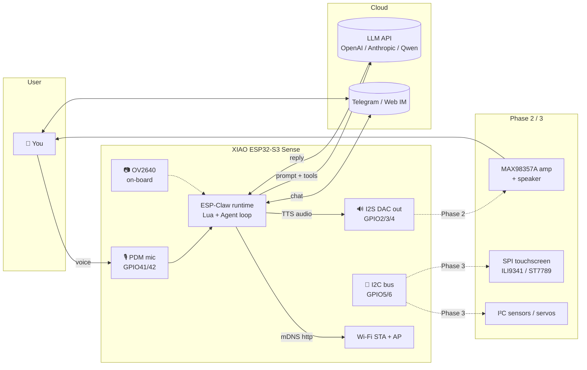
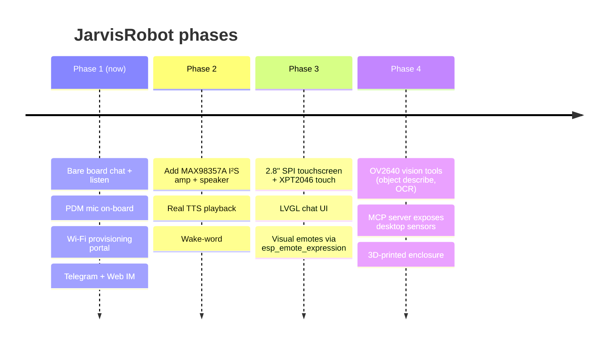

# JarvisRobot — XIAO ESP32-S3 Sense × ESP-Claw

> A pocket-sized desktop AI agent that listens, talks, and runs Lua skills locally on a $14 chip.

JarvisRobot is a board adaptation + reference build that brings Espressif's
[ESP-Claw](https://github.com/espressif/esp-claw) "Chat Coding" agent
framework to the **Seeed Studio XIAO ESP32-S3 Sense** — the smallest
Wi-Fi/BLE board with an on-board MEMS PDM microphone and an OV2640 camera.

The bare board, plugged into USB-C, gives you:
- 🎙️ on-device PDM mic capture
- 💬 LLM-driven chat over Telegram / Web IM
- 🧠 dynamic Lua skill loading (no reflash to teach new behaviors)
- 🔌 MCP server + client over LAN
- 🛜 self-hosted Wi-Fi provisioning portal on first boot

Add a `MAX98357A` I²S amp later for voice replies, then a small SPI
touchscreen, and the same firmware grows into a desktop concierge.

---

## Hero shot — system at a glance



---

## Why this exists

The official [esp-claw](https://github.com/espressif/esp-claw) repository
ships board configs for the M5Stack CoreS3, LilyGo T-Display-S3, DFRobot
K10, and a few Espressif breadboards — but **not the XIAO ESP32-S3 Sense**,
which is the cheapest and most accessible S3 board with a built-in
microphone.

This repo:
1. Provides the board adaptation (`boards/seeed/xiao_esp32s3_sense/`)
2. Patches an upstream [codegen bug](#upstream-bug-fix) we hit on the way
3. Ships a Docker-only build/flash flow so you don't need to install ESP-IDF locally
4. Documents the hardware story with [schematics](docs/HARDWARE.md), the
   firmware story with [architecture diagrams](docs/ARCHITECTURE.md), and
   a [roadmap](docs/ROADMAP.md) for the touchscreen + speaker upgrades

---

## Quick start

You need: Docker, the XIAO Sense, a USB-C cable, and Python 3.

```bash
git clone git@github.com:PascalAI2024/JarvisRobot.git
cd JarvisRobot

# 1. Bootstrap: clones esp-claw, applies the codegen patch, copies our board files
./scripts/bootstrap.sh

# 2. Build the firmware in Docker (~10 min the first time)
./scripts/bootstrap.sh build

# 3. Plug in the XIAO and flash from the host
./scripts/flash.sh
```

Then plug in, open the captive Wi-Fi `esp-claw-XXXXXX`, and visit
`http://192.168.4.1/` to set Wi-Fi + LLM credentials.

Detailed walk-through in [docs/BUILD.md](docs/BUILD.md).

---

## Boot log proof

```
I (568) PERIPH_I2S: I2S[0] PDM-RX, clk: 42, din: 41
I (568) PERIPH_I2S: I2S[1] STD,  TX, ws: 3, bclk: 2, dout: 4, din: -1
I (568) BOARD_MANAGER: All peripherals initialized
I (1948) claw_skill: Initialized registry with 34 skill(s)
I (1958) cap_mcp_srv: MCP server ready: http://esp-claw.local:18791/mcp_server
W (1958) wifi_manager: *** Provisioning AP active: esp-claw-119ECD @ 192.168.4.1 ***
```

---

## Roadmap



Full detail in [docs/ROADMAP.md](docs/ROADMAP.md).

---

## Upstream bug fix

While bringing this board up, we found a bug in the
[`esp_board_manager`](https://github.com/espressif/esp-gmf/tree/main/packages/esp_board_manager)
codegen: it emits PDM RX HP-filter struct fields (`hp_en`,
`hp_cut_off_freq_hz`, `amplify_num`) for **any chip with `SOC_I2S_HW_VERSION_2`**,
but those fields are gated by `SOC_I2S_SUPPORTS_PDM_RX_HP_FILTER` — which
is only set on the ESP32-P4. ESP32-S3, S2, C3, etc. fail to compile.

Patch: [`patches/0001-fix-pdm-rx-hp-filter-cap.patch`](patches/0001-fix-pdm-rx-hp-filter-cap.patch).
Upstream issue: [espressif/esp-gmf#44](https://github.com/espressif/esp-gmf/issues/44).

`scripts/bootstrap.sh` applies the patch automatically until upstream merges.

---

## Layout

```
JarvisRobot/
├── boards/seeed/xiao_esp32s3_sense/   # board adaptation (5 files)
├── docs/                              # architecture, hardware, build, roadmap
├── patches/                           # upstream codegen fix
├── scripts/                           # bootstrap.sh + flash.sh
└── README.md
```

---

## License

[Apache-2.0](LICENSE) — same as upstream esp-claw.

## Credits

- [Espressif ESP-Claw](https://github.com/espressif/esp-claw) — agent framework
- [Seeed Studio XIAO ESP32-S3 Sense](https://wiki.seeedstudio.com/xiao_esp32s3_getting_started/) — hardware
- ESP-Claw is inspired by the OpenClaw concept
