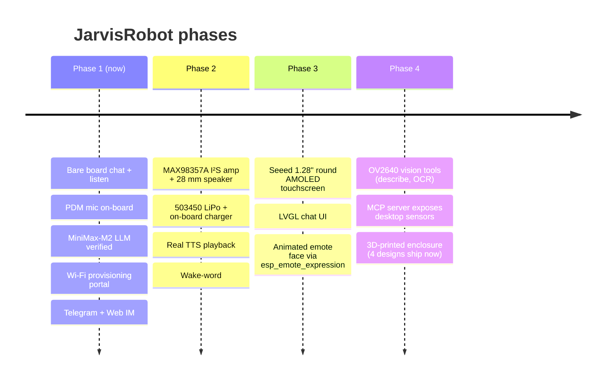

<p align="center">
  
</p>

<p align="center">
  
</p>

<p align="center">
  <em>Pocket desktop AI agent that listens, talks, and runs Lua skills locally on a $14 chip.</em>
</p>

<p align="center">
  <a href="https://github.com/PascalAI2024/JarvisRobot/stargazers"></a>
  <a href="LICENSE"></a>
  
  
</p>

---

JarvisRobot is a board adaptation + reference build that brings Espressif's
[ESP-Claw](https://github.com/espressif/esp-claw) "Chat Coding" agent
framework to the **Seeed Studio XIAO ESP32-S3 Sense** — the smallest
Wi-Fi/BLE board with an on-board MEMS PDM microphone and an OV2640 camera.

The bare board, plugged into USB-C, gives you:
- 🎙️ on-device PDM mic capture
- 💬 LLM-driven chat (OpenAI / Anthropic / **MiniMax-M2** / Qwen / DeepSeek / custom)
- 🧠 dynamic Lua skill loading (no reflash to teach new behaviors)
- 🔌 MCP server + client over LAN
- 🛜 self-hosted Wi-Fi provisioning portal on first boot

Add a `MAX98357A` I²S amp, a 503450 LiPo, and a 1.28" Seeed Round Display, and the same firmware grows into a battery-powered desktop concierge.

---

## Meet The J.A.R.V.I.S. — Voice Companion

<p align="center">
  
</p>

<p align="center"><em>The 6th member of the <a href="https://ingeniousdigital.com">Ingenious Digital</a> mascot lineup.</em></p>

---

## System at a glance

```mermaid
flowchart LR
    subgraph User
        U[🧑 You]
    end

    subgraph XIAO[XIAO ESP32-S3 Sense]
        MIC[🎙️ PDM mic<br/>GPIO41/42]
        I2S[🔊 I2S DAC out<br/>GPIO2/3/4]
        CAM[📷 OV2640<br/>on-board]
        I2C[🧩 I2C bus<br/>GPIO5/6]
        CORE[ESP-Claw runtime<br/>Lua + Agent loop]
        WIFI[Wi-Fi STA + AP]
    end

    subgraph Cloud
        LLM[(LLM API<br/>MiniMax-M2 / GPT / Claude)]
        IM[(Telegram / Web IM)]
    end

    subgraph Future[" Phase 2 / 3 "]
        AMP[MAX98357A amp<br/>+ speaker + LiPo]
        SCR[Seeed Round Display<br/>1.28" GC9A01]
        SENS[I²C sensors / servos]
    end

    U -->|voice| MIC
    MIC --> CORE
    CORE -->|prompt + tools| LLM
    LLM -->|reply| CORE
    CORE -->|TTS audio| I2S
    I2S -.->|Phase 2| AMP --> U
    CORE <-->|chat| IM <--> U
    CORE -->|mDNS http| WIFI
    I2C -.->|Phase 3| SCR
    I2C -.->|Phase 3| SENS
    CAM -.-> CORE
```

---

## Why this exists

The official [esp-claw](https://github.com/espressif/esp-claw) repository
ships board configs for the M5Stack CoreS3, LilyGo T-Display-S3, DFRobot
K10, and a few Espressif breadboards — but **not the XIAO ESP32-S3 Sense**,
the cheapest accessible S3 board with a built-in microphone.

This repo:
1. Provides the board adaptation (`boards/seeed/xiao_esp32s3_sense/`)
2. Patches an upstream [codegen bug](#upstream-bug-fix) we hit on the way
3. Ships a Docker-only build/flash flow so you don't need to install ESP-IDF locally
4. Documents the hardware story with [schematics](docs/HARDWARE.md), the
   firmware story with [architecture diagrams](docs/ARCHITECTURE.md), and
   four parametric [enclosure designs](hardware/enclosure/) ready to print

---

## Quick start

You need: Docker, the XIAO Sense, a USB-C cable, and Python 3.

```bash
git clone git@github.com:PascalAI2024/JarvisRobot.git
cd JarvisRobot

# 1. Bootstrap: clones esp-claw, applies the codegen patch, copies our board files
./scripts/bootstrap.sh

# 2. Build the firmware in Docker (~10 min the first time)
./scripts/bootstrap.sh build

# 3. Plug in the XIAO and flash from the host
./scripts/flash.sh
```

Then plug in, open the captive Wi-Fi `esp-claw-XXXXXX`, and visit
`http://192.168.4.1/` to set Wi-Fi + LLM credentials.

Detailed walk-through in [docs/BUILD.md](docs/BUILD.md).

---

## Verified boot log

```
I (568) PERIPH_I2S: I2S[0] PDM-RX, clk: 42, din: 41
I (568) PERIPH_I2S: I2S[1] STD,  TX, ws: 3, bclk: 2, dout: 4, din: -1
I (568) BOARD_MANAGER: All peripherals initialized
I (1948) claw_skill: Initialized registry with 34 skill(s)
I (1958) cap_mcp_srv: MCP server ready: http://esp-claw.local:18791/mcp_server
I (14808) claw_core: Initialized
I (14808) claw_core: Started worker task
I (24948) claw_core: context_loaded request=1 provider=cap Tools context_kind=tools context_len=8015
I (57968) claw_core: completion request=1 status=done
```

LLM round-trip verified end-to-end on hardware (XIAO ESP32-S3R8 / 8 MB octal PSRAM / IDF v5.5.4) with MiniMax-M2 over a custom OpenAI-compatible endpoint.

---

## Hardware — desktop enclosure

<p align="center">
  
</p>

Four parametric OpenSCAD enclosure concepts ship in [`hardware/enclosure/`](hardware/enclosure/), each with a `PLAN.md` (mermaid front/top/cross-section views), a `technical-drawing.svg` (dimensioned multi-view engineering drawing), and a printable `enclosure.scad`.

**Recommended:** the Monolith — 78 × 68 × 66 mm, matte charcoal PETG/ASA, 4× M2 brass-insert screws, lid off in under 60 s, ~4.5 h print on a 0.4 mm nozzle. See [`hardware/enclosure/COMPARISON.md`](hardware/enclosure/COMPARISON.md) for the full matrix and pick rationale.

The case is sized to fit the XIAO ESP32-S3 Sense, an audio amp + speaker module (PAM8002A combo or MAX98357A I²S — both fit), a 503040/503450 LiPo with foam shim, and a 39 mm round cutout from day one for the future [Seeed Round Display for XIAO](https://wiki.seeedstudio.com/get_start_round_display/).

---

## Roadmap



Full detail in [docs/ROADMAP.md](docs/ROADMAP.md).

---

## Upstream bug fix

While bringing this board up, we found a bug in
[`esp_board_manager`](https://github.com/espressif/esp-gmf/tree/main/packages/esp_board_manager)'s
PDM RX codegen: it emits HP-filter struct fields (`hp_en`,
`hp_cut_off_freq_hz`, `amplify_num`) for **any chip with `SOC_I2S_HW_VERSION_2`**,
but those fields are gated by `SOC_I2S_SUPPORTS_PDM_RX_HP_FILTER` — only set
on the ESP32-P4. ESP32-S3, S2, C3 fail to compile.

- 🐛 **Upstream issue:** [espressif/esp-gmf#44](https://github.com/espressif/esp-gmf/issues/44)
- 🔧 **Upstream PR:** [espressif/esp-gmf#45](https://github.com/espressif/esp-gmf/pull/45)
- 🩹 **Our patch:** [`patches/0001-fix-pdm-rx-hp-filter-cap.patch`](patches/0001-fix-pdm-rx-hp-filter-cap.patch) (applied automatically by `scripts/bootstrap.sh` until upstream merges)

---

## Layout

```
JarvisRobot/
├── boards/seeed/xiao_esp32s3_sense/   # 5-file board adaptation
├── hardware/enclosure/                # 4 parametric enclosures + drawings
├── docs/                              # architecture · hardware · build · roadmap
├── images/                            # mascot · wordmark · renders · early concepts
├── patches/                           # upstream codegen fix
├── scripts/                           # bootstrap.sh · flash.sh
└── README.md
```

---

## License

[Apache-2.0](LICENSE) — same as upstream esp-claw.

## Credits

- [Espressif ESP-Claw](https://github.com/espressif/esp-claw) — agent framework
- [Seeed Studio XIAO ESP32-S3 Sense](https://wiki.seeedstudio.com/xiao_esp32s3_getting_started/) — hardware
- [Ingenious Digital](https://ingeniousdigital.com) — brand & mascot family
- ESP-Claw is inspired by the OpenClaw concept

<p align="center">
  
</p>
