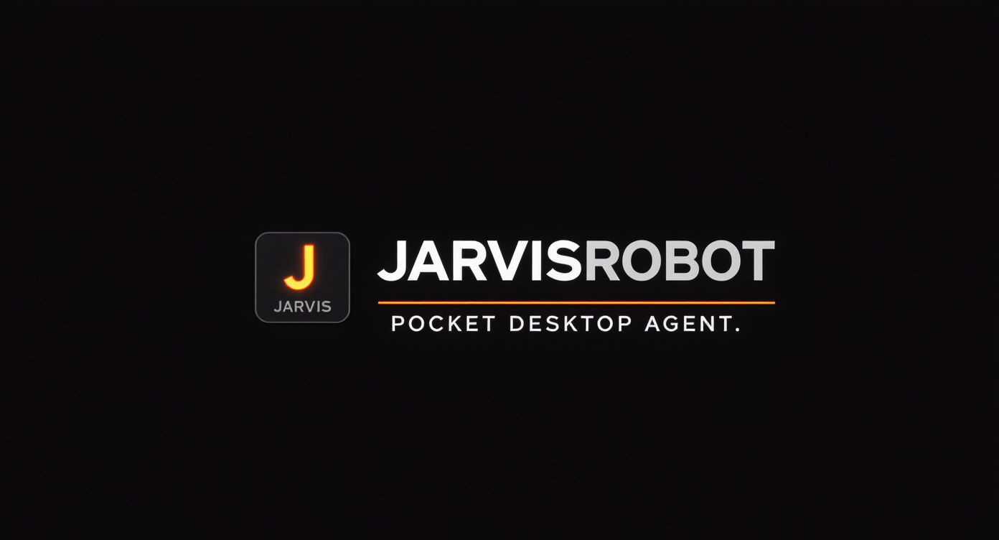
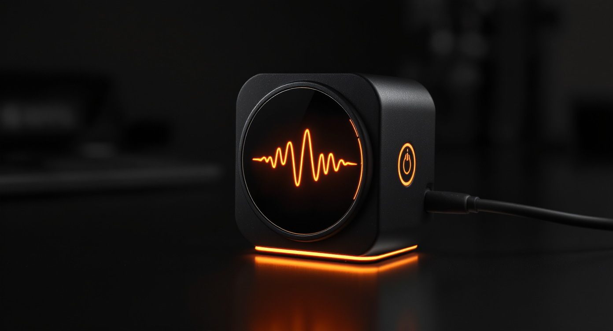
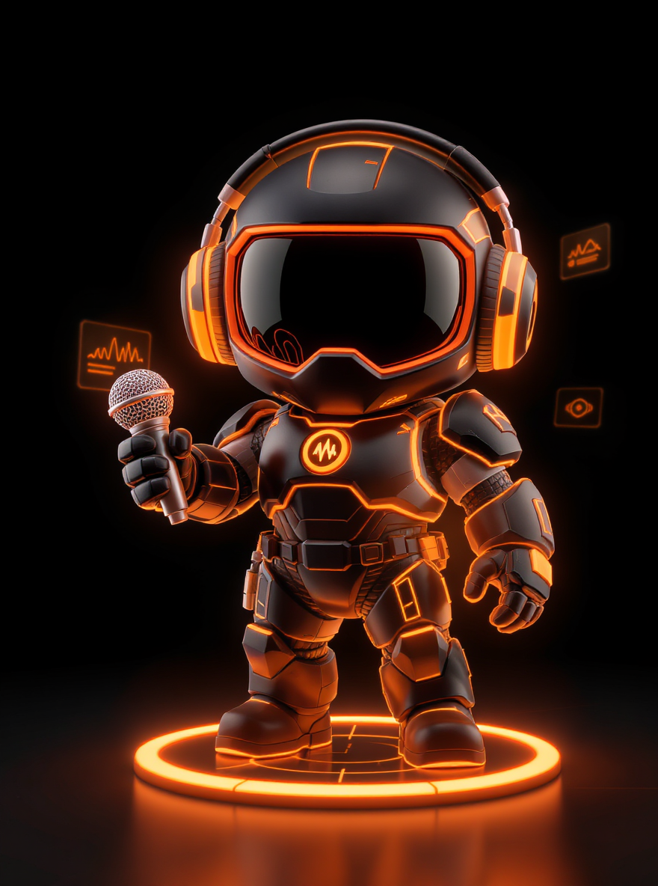
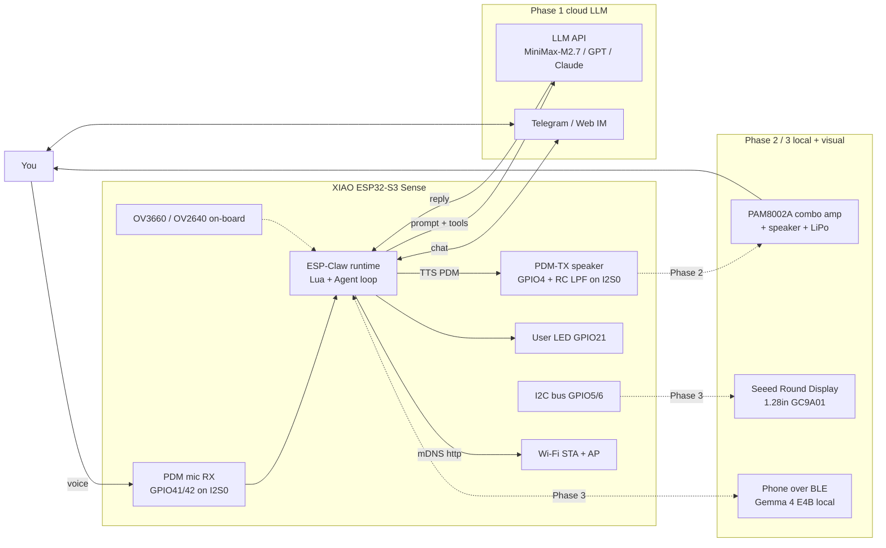
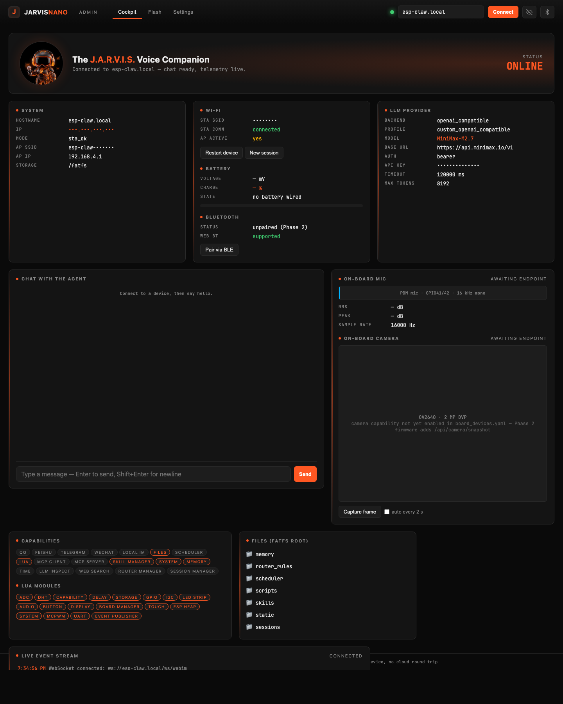
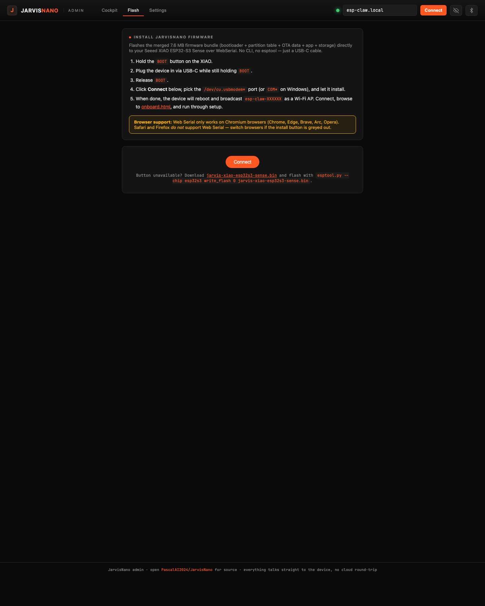
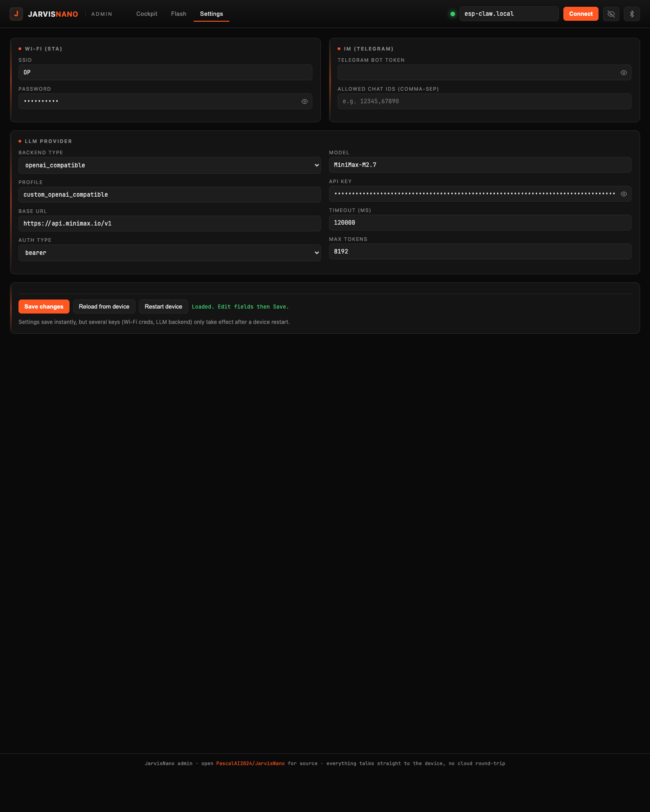
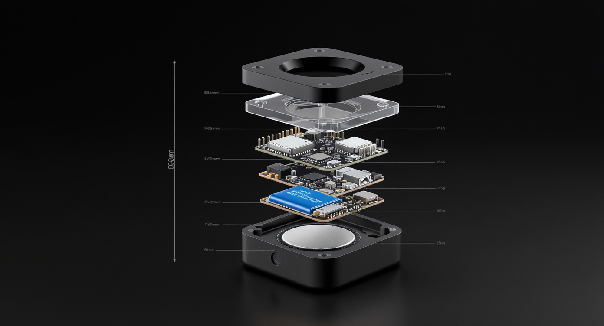
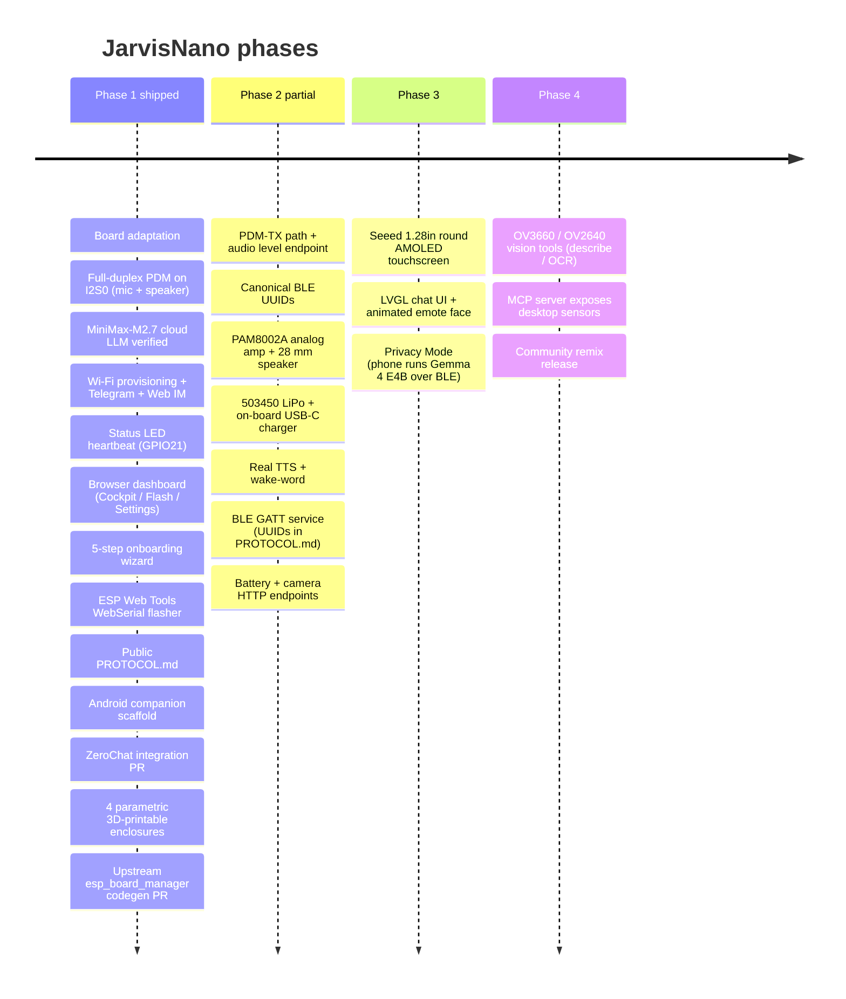

<p align="center">
  
</p>

<p align="center">
  
</p>

<p align="center">
  <em>Pocket desktop AI agent that listens, talks, and runs Lua skills locally on a $14 chip.</em>
</p>

<p align="center">
  <a href="https://github.com/PascalAI2024/JarvisNano/stargazers"></a>
  <a href="LICENSE"></a>
  
  
  
</p>

---

JarvisNano is a board adaptation + reference build that brings Espressif's
[ESP-Claw](https://github.com/espressif/esp-claw) "Chat Coding" agent
framework to the **Seeed Studio XIAO ESP32-S3 Sense** — the smallest
Wi-Fi/BLE board with an on-board MEMS PDM microphone and an on-board camera
(OV3660 on 2026 batches; OV2640 on older units — see [CAMERA.md](docs/CAMERA.md)).

The bare board, plugged into USB-C, gives you:
- 🎙️ on-device PDM mic capture (full-duplex on I²S0)
- 💬 LLM-driven chat (OpenAI / Anthropic / **MiniMax-M2.7** / Qwen / DeepSeek / custom)
- 🧠 dynamic Lua skill loading (no reflash to teach new behaviors)
- 🟧 visible heartbeat on the on-board user LED — boot flash + idle wink
- 🔌 MCP server + client over LAN
- 🛜 self-hosted Wi-Fi provisioning portal on first boot
- 🎛️ browser admin / onboarding / WebSerial flasher (no esptool install)

Add a **PAM8002A** analog speaker, a 503450 LiPo, and a 1.28" Seeed Round Display, and the same firmware grows into a battery-powered desktop concierge.

---

## Meet The J.A.R.V.I.S. — Voice Companion

<p align="center">
  
</p>

<p align="center"><em>The 6th member of the <a href="https://ingeniousdigital.com">Ingenious Digital</a> mascot lineup.</em></p>

---

## System at a glance



---

## Why this exists

The official [esp-claw](https://github.com/espressif/esp-claw) repository
ships board configs for the M5Stack CoreS3, LilyGo T-Display-S3, DFRobot
K10, and a few Espressif breadboards — but **not the XIAO ESP32-S3 Sense**,
the cheapest accessible S3 board with a built-in microphone.

This repo:
1. Provides the **board adaptation** at [`boards/seeed/xiao_esp32s3_sense/`](boards/seeed/xiao_esp32s3_sense/) — board info, peripherals (full-duplex PDM on I²S0), devices, sdkconfig, setup C.
2. Patches an [upstream codegen bug](#upstream-bug-fix) that broke ESP32-S3 builds.
3. Ships a Docker-only build/flash flow so you don't need to install ESP-IDF locally.
4. Adds a native **status LED** heartbeat on GPIO21 that gives the physical board a boot flourish and alive pulse without consuming Lua heap.
5. Provides a **browser admin** ([`dashboard/`](dashboard/)) — three-tab cockpit + onboarding wizard + ESP Web Tools flasher.
6. Provides an **open-source Android companion** ([`android/`](android/)) — Kotlin + Compose, mDNS discovery, BLE skeleton, Gemma 4 stub.
7. Ships **four parametric 3D-printable enclosures** ([`hardware/enclosure/`](hardware/enclosure/)) with mermaid plans + dimensioned drawings.
8. Documents the **public protocol** ([`docs/PROTOCOL.md`](docs/PROTOCOL.md)) so any client (web, Android, ZeroChat, third-party) can integrate cleanly.

---

## Quick start

You need: Docker, the XIAO Sense, a USB-C cable, and Python 3.

```bash
git clone git@github.com:PascalAI2024/JarvisNano.git
cd JarvisNano

# 1. Bootstrap: clones esp-claw, applies patches, copies board + FATFS assets
./scripts/bootstrap.sh

# 2. Build the firmware in Docker (~10 min the first time)
./scripts/bootstrap.sh build

# 3. Plug in the XIAO and flash from the host
./scripts/flash.sh
```

**Or no-CLI install:** open [`dashboard/index.html`](dashboard/index.html) in Chrome / Edge → **Flash** tab → click *Install* → ESP Web Tools programs the merged `.bin` over WebSerial. No esptool, no Docker for the user.

Then plug in, open the captive Wi-Fi `esp-claw-XXXXXX`, visit `http://192.168.4.1/` (or [`dashboard/onboard.html`](dashboard/onboard.html)) to set Wi-Fi + LLM credentials.

Detailed walk-through in [docs/BUILD.md](docs/BUILD.md).

---

## Cockpit — browser admin + onboarding + flashing

<p align="center">
  
</p>

[`dashboard/index.html`](dashboard/index.html) is a single-file vanilla-JS admin that talks straight to the device. Three tabs:

| Tab | What it does |
| --- | --- |
| **Cockpit** | Live system telemetry, Wi-Fi + LLM state, mic / camera / battery / Bluetooth tiles, full chat with the agent (with `<think>` reasoning collapsed), capability + Lua module index, FATFS browser, live event stream, restart + new-session controls. |
| **Flash** | One-click [ESP Web Tools](https://esphome.github.io/esp-web-tools/) flasher — Chrome / Edge users program a fresh XIAO Sense over USB-C from the browser, no esptool install. Manifest at [`dashboard/firmware/manifest.json`](dashboard/firmware/manifest.json). |
| **Settings** | Editable form for every device config field (Wi-Fi, LLM provider, IM credentials). Saves the diff back via `/api/config`. Eye-toggle for sensitive fields. |

Plus [`dashboard/onboard.html`](dashboard/onboard.html) — a 5-step first-boot wizard (Welcome → Wi-Fi → LLM preset → test round-trip → Done) with 6 LLM presets aligned to the firmware schema.

<p align="center">
  
  
</p>

Open `dashboard/index.html` from any local server (`python3 -m http.server` in `dashboard/`) and point it at `esp-claw.local`. Add `?demo=1` to mask SSIDs / IPs / API key for clean screenshots.

---

## Companion apps

| App | Repo | Purpose |
| --- | --- | --- |
| **`android/`** | this repo, `android/` | Open-source Kotlin + Jetpack Compose reference companion. Cockpit / Chat / Settings / About screens, mDNS discovery, BLE GATT skeleton (Phase 2), Gemma 4 E4B local-LLM interface (Phase 3). See [`android/README.md`](android/README.md). |
| **Protocol clients** | any repo | The public HTTP/WebSocket/MCP/BLE contract is documented in [`docs/PROTOCOL.md`](docs/PROTOCOL.md) so web, Android, React Native, desktop, and third-party clients can integrate without copying firmware internals. |

Both clients compute the same five canonical Phase-2 BLE GATT UUIDs from a single `uuidv5` namespace. The UUID contract is shipped; the firmware GATT service is still planned.

---

## Current hardware status

The USB-connected XIAO enumerates on macOS as `/dev/cu.usbmodem*` and has been flashed with the 8 MB ESP-Claw image. On boot it brings up FATFS, Wi-Fi STA/AP fallback, router rules, scheduler, Lua runtime, Web IM, and the MCP server. The current XIAO build intentionally disables the App Claw interactive serial REPL because ESP-IDF console command registration can exhaust internal heap after all Phase-2 services are started. USB serial logging remains enabled for boot diagnostics.

The physical GPIO21 LED heartbeat is now native firmware in `edge_agent/main.c`, patched by `scripts/bootstrap.sh` during bootstrap. It starts after the core services are alive so the event router and scheduler get first claim on heap, and LED allocation is non-fatal. The older Lua `status_led.lua` prototype remains in FATFS for future state-pattern work, but the `boot_status_led` router rule is disabled on XIAO builds so Lua heap is not spent at boot.

## Reference boot log

```
I (...) BOARD_MANAGER: All peripherals initialized
I (...) app: FATFS mounted total=1482752 used=389120
I (...) app: Wi-Fi STA ready: 192.168.50.80
I (...) claw_event_router: Loaded 7 router rules
I (...) cap_lua_rt: Lua runtime ready: scripts=/fatfs/scripts registered_modules=17
I (...) cap_mcp_srv: MCP server ready: http://esp-claw.local:18791/mcp_server
I (...) claw_event_router: event router task started
I (...) app_claw: Publishing startup trigger event: startup/boot_completed
I (...) app: Native status LED on gpio 21 active_low=1
I (...) main_task: Returned from app_main()
```

LLM round-trip was previously verified end-to-end on hardware (XIAO ESP32-S3R8 / 8 MB octal PSRAM / IDF v5.5.4) with **MiniMax-M2.7** over a custom OpenAI-compatible endpoint. The current flashed build is stable through service startup and the physical on-board LED alive effect. Remaining Phase-2 validation focus is LAN HTTP reachability from the dashboard/client network path, Android BLE diagnostics, TTS, battery ADC, and camera capture.

---

## Hardware — desktop enclosure

<p align="center">
  
</p>

Four parametric OpenSCAD enclosure concepts ship in [`hardware/enclosure/`](hardware/enclosure/), each with a `PLAN.md` (mermaid front / top / cross-section views), a `technical-drawing.svg` (dimensioned multi-view engineering drawing), and a printable `enclosure.scad`.

**Recommended:** the **Monolith** — 78 × 68 × 66 mm, matte charcoal PETG / ASA, 4× M2 brass-insert screws, lid off in under 60 s, ~4.5 h print on a 0.4 mm nozzle. See [`hardware/enclosure/COMPARISON.md`](hardware/enclosure/COMPARISON.md) for the full matrix and pick rationale, and [`hardware/enclosure/assembly-flow.md`](hardware/enclosure/assembly-flow.md) for the assembly sequence.

The case is sized to fit the XIAO ESP32-S3 Sense, an audio amp + speaker module (PAM8002A combo or MAX98357A I²S — both fit), a 503040 / 503450 LiPo with foam shim, and a 39 mm round cutout from day one for the future [Seeed Round Display for XIAO](https://wiki.seeedstudio.com/get_start_round_display/).

---

## Roadmap



Full detail in [docs/ROADMAP.md](docs/ROADMAP.md).

---

## Upstream bug fix

While bringing this board up, we found a bug in
[`esp_board_manager`](https://github.com/espressif/esp-gmf/tree/main/packages/esp_board_manager)'s
PDM RX codegen: it emits HP-filter struct fields (`hp_en`,
`hp_cut_off_freq_hz`, `amplify_num`) for **any chip with `SOC_I2S_HW_VERSION_2`**,
but those fields are gated by `SOC_I2S_SUPPORTS_PDM_RX_HP_FILTER` — only set
on the ESP32-P4. ESP32-S3, S2, C3 fail to compile.

- 🐛 **Upstream issue:** [espressif/esp-gmf#44](https://github.com/espressif/esp-gmf/issues/44)
- 🔧 **Upstream PR:** [espressif/esp-gmf#45](https://github.com/espressif/esp-gmf/pull/45)
- 🩹 **Our patch:** [`patches/0001-fix-pdm-rx-hp-filter-cap.patch`](patches/0001-fix-pdm-rx-hp-filter-cap.patch) (applied automatically by `scripts/bootstrap.sh` until upstream merges)

---

## Layout

```
JarvisNano/
├── boards/seeed/xiao_esp32s3_sense/   # 5-file board adaptation (yaml + setup C)
├── firmware/                          # Lua skills baked into the FATFS image
│   ├── lua/status_led.lua             #   prototype state patterns; not auto-run on XIAO
│   └── router_rules/                  #   event-router rules
├── hardware/enclosure/                # 4 parametric OpenSCAD designs + drawings
├── dashboard/                         # browser admin (Cockpit + Flash + Settings + Onboard)
│   ├── index.html
│   ├── onboard.html
│   └── firmware/                      #   merged .bin + ESP Web Tools manifest
├── android/                           # Kotlin + Compose companion app
├── docs/                              # ARCHITECTURE · BUILD · HARDWARE · ROADMAP · PROTOCOL · RELEASE_CHECKLIST
├── images/                            # mascot · wordmark · renders · dashboard shots · early concepts
├── patches/                           # upstream fixes + generated ESP-Claw patch artifacts
├── scripts/                           # bootstrap.sh · flash.sh · smoke-build.sh
├── CONTRIBUTING.md                    # contribution workflow and verification matrix
├── SECURITY.md                        # vulnerability reporting and secret-handling policy
├── CHANGELOG.md                       # release notes
└── README.md
```

---

## License

[Apache-2.0](LICENSE) — same as upstream esp-claw.

## Credits

- [Espressif ESP-Claw](https://github.com/espressif/esp-claw) — agent framework
- [Espressif esp-gmf · esp_board_manager](https://github.com/espressif/esp-gmf) — board codegen
- [Seeed Studio XIAO ESP32-S3 Sense](https://wiki.seeedstudio.com/xiao_esp32s3_getting_started/) — hardware
- [Google DeepMind Gemma 4](https://ai.google.dev/gemma/docs/core) — Phase-3 on-device LLM
- [Ingenious Digital](https://ingeniousdigital.com) — brand & mascot family
- ESP-Claw is inspired by the OpenClaw concept

<p align="center">
  
</p>
