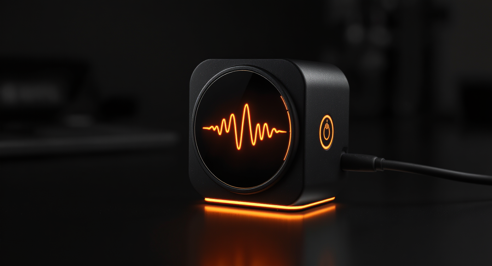
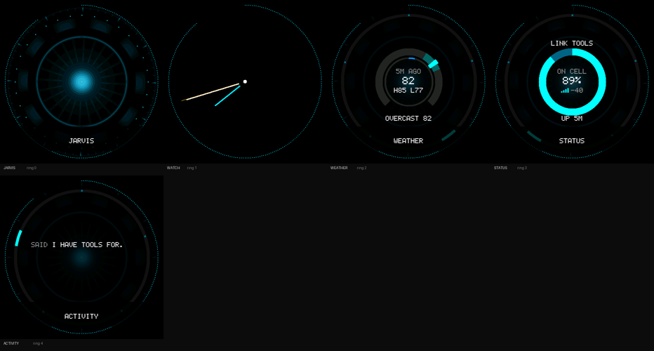
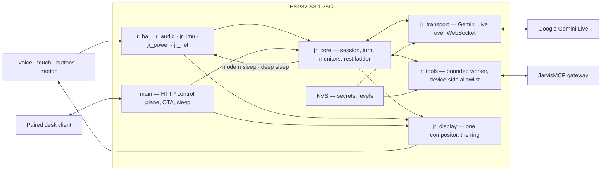

<p align="center">
  
</p>

<p align="center">
  
</p>

<p align="center">
  <strong>A voice-first J.A.R.V.I.S. desk companion on an ESP32-S3.</strong><br>
  Native Gemini Live conversation, a round AMOLED that shows what it knows,
  live tools by voice, physical privacy, motion awareness, and a device that
  sleeps when nobody is using it.
</p>

<p align="center">
  <a href="https://github.com/PascalAI2024/JarvisNano/stargazers"></a>
  <a href="LICENSE"></a>
  
  
  
</p>

---

## What It Is

JarvisNano turns the **Waveshare ESP32-S3-Touch-AMOLED-1.75C** into a small,
always-available desk assistant. The firmware runs directly on the ESP32-S3:
the microphones stream to Gemini Live, the reply plays through the ES8311
speaker path at its native 24 kHz, and one compositor drives the 466×466 round
AMOLED. No phone, no hub, no cloud relay of your audio beyond Gemini itself.

The original Waveshare 1.75 and the Seeed XIAO tracks are kept as hardware
references. The **1.75C is the product and the only supported build target**.

## The Experience

- Say **"Jarvis"** or press **PWR**, then talk. The face listens, thinks, and
  speaks; a reply can be interrupted by talking over it.
- Ask for the world. "What's the news on SpaceX?", "Weather?", "Bitcoin?" —
  one tool call each through the JarvisMCP gateway, spoken back in a sentence.
- Walk **the ring** with a centre swipe: **JARVIS · WATCH · WEATHER · STATUS ·
  ACTIVITY**, and **DESK** appears only while a companion is live. Every
  screen shows a live reading; there is no settings page.
- Tap an open **WEATHER**, **WATCH** or **ACTIVITY** sheet and Jarvis says it
  aloud. Pick the device up after a rest and it glances at the weather.
- **STATUS** is the device at a glance: the cell, the charger, Wi-Fi bars with
  the dBm, the session and tools lamps, the address, the chip temperature, the
  CPU gear and radio mode, and how long it has been up.
- Privacy is physical: hold the glass, turn it face-down, or press the centre
  control. A gold ring says the mic is off, from across the room.
- Left alone on battery it rests, dims, and finally **deep-sleeps**; lift it or
  tap it and it boots back listening.

<p align="center">
  
  <br><em>The ring, photographed from the live panel in one walk (<code>scripts/screens.py</code>), off USB.</em>
</p>

## Hardware Used

| Subsystem | Live hardware | Firmware role |
|---|---|---|
| Compute | ESP32-S3R8, dual core, 240 MHz | Voice owner, compositor, tools, HTTP control plane |
| Display | CO5300 466×466 QSPI AMOLED | Baked reactive faces + one procedural compositor; DISPOFF/SLPIN for sleep |
| Touch | CST9217 | Tap, hold, edge levels, ring and sheet gestures; a wake source in deep sleep |
| Audio | ES7210 + ES8311 | 24 kHz duplex clock, 16 kHz AEC-clean uplink, native 24 kHz playback |
| Motion | QMI8658 | Flip, shake, lift, orientation; its Wake-on-Motion engine wakes the chip |
| Power | AXP2101 | Battery, USB and charge state, PWR key |
| Memory | 8 MB octal PSRAM | Faces, playback ring, queues, worker stacks, snapshots |
| Flash | 32 MB DIO | Two 4 MB OTA slots, emotes, WakeNet model |

The C revision has **no TCA9554, PCF85063 RTC, or microSD slot**. Time is
SNTP-backed. See [`docs/HARDWARE.md`](docs/HARDWARE.md) for the pin-accurate
capability map and [`docs/reference/power-modes.md`](docs/reference/power-modes.md)
for what sleeps and how it wakes.

## One Interaction Grammar

| Input | Action |
|---|---|
| "Jarvis" / PWR short | Wake and listen; never mutes |
| PWR long | Speak the battery state |
| BOOT short | Open/close the control shade |
| BOOT hold 1.5–5 s | Open a visible 60-second pairing window |
| BOOT held during reset | ROM downloader |
| Left-edge vertical | Volume ± 5, from any screen |
| Right-edge vertical | Brightness ± 5, from any screen |
| Centre vertical swipe | The ring: JARVIS ↔ WATCH ↔ WEATHER ↔ STATUS ↔ (DESK while live) ↔ ACTIVITY, wrapping |
| Centre up on a ring screen | Open the screen's sheet; down closes it |
| Tap an open sheet | Jarvis speaks what the screen shows |
| Horizontal swipe | Ten-second WATCH peek |
| Double tap | Home |
| Glass hold | Physical privacy mute/unmute |
| Face-down ~600 ms | Flip privacy; face-up clears only a flip-origin mute |
| Lift after a rest | Weather glance for eight seconds |
| Still ten minutes past DREAM, on battery | Deep sleep; lift or touch to wake |

The shade repeats the legend on glass: `L VOL`, `R LGT`, `PWR LISTEN`,
`BOOT CLOSE`, and the centre MUTE/LISTEN action. There is one gesture path;
no hidden rotary recognizer.

## Architecture


```mermaid
flowchart LR
    Human[Voice · touch · buttons · motion]

    subgraph Device[ESP32-S3 1.75C]
        HAL[jr_hal · jr_audio · jr_imu · jr_power · jr_net]
        Core[jr_core — session, turn, monitors, rest ladder]
        Voice[jr_transport — Gemini Live over WebSocket]
        Tools[jr_tools — bounded worker, device-side allowlist]
        Glass[jr_display — one compositor, the ring]
        HTTP[main — HTTP control plane, OTA, sleep]
        NVS[NVS — secrets, levels]
    end

    Gemini[Google Gemini Live]
    MCP[JarvisMCP gateway]
    Operator[Paired desk client]

    Human --> HAL --> Core
    Core <--> Voice <--> Gemini
    Core <--> Tools <--> MCP
    Core --> Glass --> Human
    HAL --> Glass
    Core -->|modem sleep · deep sleep| HAL
    NVS --> Voice
    NVS --> Tools
    Operator <--> HTTP
    HTTP --> Core
    HTTP --> Glass
```

The image is rooted at `main/main.c` and `components/jr_*`; `main/main.c` is
the HTTP route authority. `firmware/`, `esp-claw/` and the old dashboard are
history, not part of the build. Ownership, data flow, the session watchdogs
and the power ladder are in [`docs/ARCHITECTURE.md`](docs/ARCHITECTURE.md).

## Build and Run

Requirements: Docker, Python 3, Git, and a USB-C data cable for the first flash.

```bash
git clone https://github.com/PascalAI2024/JarvisNano.git
cd JarvisNano

./scripts/build-v5.sh          # pinned to espressif/idf:v5.5.4
./scripts/flash-v5.sh          # 1.75C, DIO, verified, NVS preserved
```

A running device cannot be re-flashed over USB-JTAG (esptool cannot sync while
the firmware owns the port). Update it over Wi-Fi instead:

```bash
export JARVIS_DEVICE_HOST='<device-ip>'
python3 scripts/jarvisctl.py ota build/jarvisrobot_v5.bin   # ~30 s, back in ~5 s
python3 scripts/jarvisctl.py status                         # exits non-zero when deaf or muted
python3 scripts/screens.py --out ring.png                   # photograph the ring
```

`jarvis-desk.py` owns pairing and the desk workflows, `jarvisctl.py` is the
operator's daily tool, and `live-device.py` captures evidence bundles. Details,
gotchas and the verification recipe are in [`docs/BUILD.md`](docs/BUILD.md).

## Live Capabilities

- Direct Gemini Live duplex session with WakeNet "Jarvis", server VAD, and AEC.
- An adaptive jitter buffer behind the speaker: Gemini paces native audio near
  real time with stalls over a second, so playback runs a second behind the
  network and rebuilds its lead after any hole. Counters at
  `/api/device/health`.
- Three session watchdogs: keepalive, no-reply, and unanswered-utterance — a
  session that stops answering is replaced, not waited on.
- Tools by voice: web search and news, weather, Wikipedia, prices, exchange
  rates, time zones, translation, research papers, and the device's own
  levels, behind a read-only allowlist enforced on the device.
- The ring: WEATHER fetched by the device itself and aged honestly; STATUS with
  live connections, battery and die temperature; ACTIVITY with the last three
  things Jarvis did; DESK only while a companion is live.
- A rest ladder that ends in deep sleep on battery, with the IMU's own
  motion engine, the touch line and a timer as the ways back; CPU gears by
  mood and a four-times-faster ladder below 20 %.
- Physical authority: synthetic input cannot clear privacy, approve consent,
  answer asks, or escape a companion's lease.
- Dual-slot OTA with preflight, probation, and rollback; deep sleep refuses to
  run while an image is still on probation.
- Host-tested rendering: 556 checks pin the ring, the sheets and the HUD,
  mutation-checked both ways; the rest ladder and session core have their own
  pure-C harness.

## Evidence, Not Theatre

- A screenshot is the exact submitted RGB565 buffer, **not panel readback**.
- A playback counter proves PCM reached the codec write seam, **not that a
  speaker was audible**.
- Synthetic touch proves routing, **not physical authority**.
- A green host suite closes nothing whose contract is visible, audible or
  physical: [`docs/evidence/`](docs/evidence/README.md) holds the photographs,
  logs and numbers, and [`PLAN.md`](PLAN.md) says plainly what has not been
  proven by a hand yet.

## Security Boundary

Secrets live in device NVS or the host keychain — never in source, logs,
screenshots or arguments. **NVS is unencrypted today:** physical flash access
exposes Wi-Fi, Gemini and JarvisMCP credentials. Use dedicated, revocable keys.

Tools reach JarvisMCP over the legacy `/act` route with a bearer that carries
the gateway's full authority, so the **device** is the policy: it generates
calls only into a read-only allowlist and refuses everything else before any
code exists. The typed `/device/v1/invoke` route with server-side capability
policy is the intended long-term boundary and is not provisioned yet.

`JR_DEV_OPEN_DIAGNOSTICS` opens the control plane to the LAN for development
and **must be 0 before any release**. Signed images, authenticated encrypted
upload, and attended NVS/flash encryption remain public-release gates. See
[`SECURITY.md`](SECURITY.md) and
[`docs/RELEASE_CHECKLIST.md`](docs/RELEASE_CHECKLIST.md).

## Repository Map

| Path | Purpose |
|---|---|
| `main/` | Composition root: voice pump, HTTP control plane, OTA, sleep |
| `components/jr_core` | Pure session, turn, monitor and rest-ladder state (host-tested) |
| `components/jr_transport` | Gemini framing and the WebSocket adapter |
| `components/jr_audio` | ES7210/ES8311 capture, AEC, the playback ring and jitter buffer |
| `components/jr_display` | The compositor, the ring, the HUD (host-tested) |
| `components/jr_tools` | On-device tools and the JarvisMCP bridge with its allowlist |
| `components/jr_imu` · `jr_power` · `jr_net` | Motion, PMIC, Wi-Fi with modem sleep |
| `boards/waveshare/esp32s3_touch_amoled_1_75c` | The board definition |
| `scripts/` | Build, flash, OTA, operator and QA tools |
| `docs/` | Architecture, hardware, protocol, build, design, evidence, references |
| `docs/ARCHIVE/` | Superseded plans, kept as history |

Start with [`DOCUMENTATION_MAP.md`](DOCUMENTATION_MAP.md).

## Current Priorities

The open work in [`PLAN.md`](PLAN.md), wave N10:

1. Prove the lift wake by hand: a device off USB, face-down ten minutes, lifted.
2. Watch the unanswered-utterance watchdog in real use; tune its count if
   ambient chatter trips it.
3. Cache the shell veil so ring screens render at the face's 19 fps.
4. Give the update ring and the companion rim different hues.
5. Close the release gates: diagnostics auth on, signed OTA, encrypted storage,
   exact third-party notices.

## Contributing

Start with [`CONTRIBUTING.md`](CONTRIBUTING.md), build the v5 target, and
attach evidence from the surface you changed. Keep credentials, endpoints,
NVS images, device logs and machine-specific state out of commits;
`./scripts/check-secrets.sh` runs before every commit.

JarvisNano is Apache-2.0. See [`LICENSE`](LICENSE), [`NOTICE`](NOTICE), and
[`THIRD_PARTY_NOTICES.md`](THIRD_PARTY_NOTICES.md).
