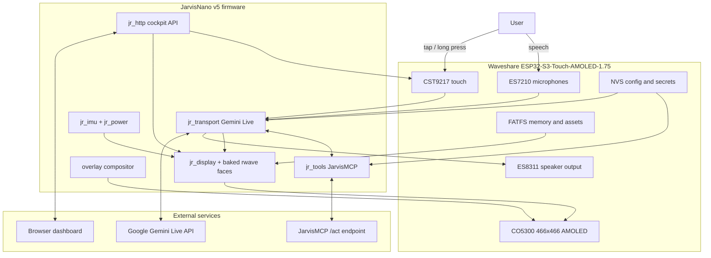

<p align="center">
  
</p>

<p align="center">
  
</p>

<p align="center">
  <em>USB-powered ESP32-S3 desktop assistant with Gemini Live voice, a round AMOLED face, touch controls, and JarvisMCP tools.</em>
</p>

<p align="center">
  <a href="https://github.com/PascalAI2024/JarvisNano/stargazers"></a>
  <a href="LICENSE"></a>
  
  
  
</p>

---

JarvisNano is an open-source ESP32-S3 firmware project for a small, physical
J.A.R.V.I.S.-style assistant. The current release target is the
**Waveshare ESP32-S3-Touch-AMOLED-1.75**: a round 466x466 AMOLED device with
capacitive touch, ES7210 microphones, ES8311 speaker output, 16 MB flash, and
8 MB PSRAM.

The Seeed XIAO ESP32-S3 Sense track remains in-tree for camera and tiny-board
experiments, but Waveshare is the v1 path.

| Board | Status | Best for | Adaptation |
|---|---|---|---|
| **Waveshare ESP32-S3-Touch-AMOLED-1.75** | Primary v1 target | Voice + face + touch cockpit, USB desktop assistant | [`boards/waveshare/esp32s3_touch_amoled_1_75/`](boards/waveshare/esp32s3_touch_amoled_1_75/) |
| **Seeed XIAO ESP32-S3 Sense** | Secondary track | Camera experiments, compact voice/vision work | [`boards/seeed/xiao_esp32s3_sense/`](boards/seeed/xiao_esp32s3_sense/) |

## Waveshare v1 Scope

- Gemini Live voice loop over WebSocket, using on-device NVS config for keys.
- CO5300 round AMOLED display driven through the direct `jarvis_board`
  primitive, with emote and UI ownership mediated by a display arbiter.
- Runtime display diagnostics:
  `/api/display/snapshot.json`, `/api/display/snapshot.ppm`, and
  `/api/ui/snapshot.ppm`.
- CST9217 touch diagnostics at `/api/touch`, with physical tap routing for
  voice interaction.
- ES7210 mic input and ES8311 speaker output on I2S.
- Browser dashboard and HTTP diagnostics for first setup and QA.
- JarvisMCP tool bridge configured only through NVS. No keys in source.

Post-v1 tracks are Android/BLE, battery reporting, camera/XIAO parity, and an
optional BSP/LVGL migration once the direct Waveshare runtime is boringly
stable. Astonishingly, "boring" is the goal.

## Architecture


```mermaid
flowchart TB
    User[User]

    subgraph Board[Waveshare ESP32-S3-Touch-AMOLED-1.75]
        Touch[CST9217 touch]
        Mic[ES7210 microphones]
        Speaker[ES8311 speaker output]
        Display[CO5300 466x466 AMOLED]
        NVS[NVS config and secrets]
        FATFS[FATFS memory and assets]
    end

    subgraph Firmware[JarvisNano v5 firmware]
        Gemini[jr_transport Gemini Live]
        Face[jr_display + baked rwave faces]
        HUD[overlay compositor]
        HTTP[jr_http cockpit API]
        MCP[jr_tools JarvisMCP]
        IMU[jr_imu + jr_power]
    end

    subgraph External[External services]
        GeminiAPI[Google Gemini Live API]
        JarvisMCP[JarvisMCP /act endpoint]
        Browser[Browser dashboard]
    end

    User -->|tap / long press| Touch
    User -->|speech| Mic
    Touch --> Gemini
    Mic --> Gemini
    Gemini <--> GeminiAPI
    Gemini --> Speaker
    Gemini --> Face
    Gemini <--> MCP
    MCP <--> JarvisMCP
    Face --> Display
    HUD --> Display
    IMU --> Face
    NVS --> Gemini
    NVS --> MCP
    FATFS --> Face
    HTTP <--> Browser
    HTTP --> Face
    HTTP --> Touch
```

Display screenshots are firmware software mirrors (`/api/display/snapshot.*`),
not CO5300 panel readback. There is no separate `ui_layer` framebuffer on v5.

For the deeper charts, see [docs/ARCHITECTURE.md](docs/ARCHITECTURE.md).

## Quick Start

You need Docker, Python 3, Git, a USB-C data cable, and the Waveshare
ESP32-S3-Touch-AMOLED-1.75 board.

```bash
git clone git@github.com:PascalAI2024/JarvisNano.git
cd JarvisNano

./scripts/build-v5.sh
./scripts/flash-v5.sh
```

`flash-v5.sh` preserves NVS by default so Wi-Fi, Gemini, and JarvisMCP config
survive normal firmware iteration. Use `ERASE_NVS=1` when a bad saved config
is causing trouble. The older `scripts/bootstrap.sh` path builds the leftover
esp-claw overlay; it is not the v5 image.

After flashing, use USB diagnostics first:

```bash
./scripts/usb-monitor.py --seconds 5 --send status
```

Then configure the device through the dashboard/API. Sensitive values must be
written to NVS, never committed:

- `llm_api_key` or `gemini_api_key` for Gemini Live, depending on the active
  config path in your build.
- `jarvis_mcp_url` and `jarvis_mcp_key` for JarvisMCP tools.
- `pairing_token` for protected writes once token enforcement is enabled.

Detailed build and flash notes live in [docs/BUILD.md](docs/BUILD.md). The
current hardware handoff and diagnostic commands live in
[docs/NEXT_SESSION.md](docs/NEXT_SESSION.md).

## Runtime Diagnostics

Use the live-device harness when the board is on Wi-Fi:

```bash
export JARVIS_DEVICE_HOST=<device-host>
scripts/live-device.py status --host "$JARVIS_DEVICE_HOST"
scripts/live-device.py screen --host "$JARVIS_DEVICE_HOST" --save-sd
scripts/live-device.py gemini-cycle --host "$JARVIS_DEVICE_HOST" --text "Say one short sentence." --report
scripts/live-device.py logs --host "$JARVIS_DEVICE_HOST" --grep touch,rwave,gemini,audio,ws
```

Key HTTP surfaces:

| Endpoint | Purpose |
|---|---|
| `/api/cockpit` | Combined network, voice, tools, display, touch |
| `/api/gemini/live` | Gemini / audio / tool counters |
| `/api/display` | Display health |
| `/api/display/snapshot.json` | Submission-mirror metadata |
| `/api/display/snapshot.ppm` | Software mirror (not panel readback) |
| `/api/touch` | CST9217 counters |
| `/api/audio/taps` | Diagnostic tap metadata |
| `/api/tools/config` | Redacted JarvisMCP status |

See [docs/LIVE_DEVICE_DEBUG.md](docs/LIVE_DEVICE_DEBUG.md) for the acceptance
commands and the known failure signatures.

## Browser Dashboard

[`dashboard/index.html`](dashboard/index.html) is the browser cockpit for local
setup and diagnostics. The dashboard should become Waveshare-first for v1:
face preview, touch status, Gemini state, memory/tool health, masked config,
and mobile/desktop visual QA.

The WebSerial button still serves a **legacy XIAO** blob. Flash Waveshare
with `scripts/flash-v5.sh`.

## Current Status

v5 is the live image (`main/` + `components/jr_*`):

- Boots on the Waveshare 1.75" AMOLED (`docs/evidence/20260718-v5-boot.log`).
- Gemini Live voice, baked reactive face, overlay HUD, choice arcs, watch
  face, flip-to-mute, shake-to-cancel, attract reel.
- API key rides `x-goog-api-key`, not the WebSocket query string.
- Pairing token, wake word, BLE, and camera are not v1 blockers.

Doc index: [DOCUMENTATION_MAP.md](DOCUMENTATION_MAP.md). Release candidate
checklist: [docs/RELEASE_CHECKLIST.md](docs/RELEASE_CHECKLIST.md).

## Roadmap

Phases 0–4 of the glass/voice work shipped in July 2026. Open items are
release-candidate proof on the connected board, pairing-token writes, and
post-v1 WakeNet / BLE / camera. Full checkboxes: [docs/ROADMAP.md](docs/ROADMAP.md).

## Layout

```
JarvisNano/
├── boards/                                   # Waveshare + XIAO board YAMLs
├── main/ + components/jr_*                   # live v5 firmware
├── scripts/build-v5.sh + flash-v5.sh         # Docker IDF 5.5.4
├── firmware/ + esp-claw/                     # leftover overlay (not in v5 image)
├── dashboard/                                # browser cockpit
├── android/                                  # companion, post-v1
├── DOCUMENTATION_MAP.md
├── docs/
│   ├── NEXT_SESSION.md + ROADMAP.md + BUILD.md
│   ├── reference/                            # gotcha knowledge base
│   ├── evidence/                             # hardware proof
│   └── ARCHIVE/                              # superseded plans
├── scripts/                                  # build-v5, flash-v5, live QA
└── hardware/                                 # enclosure concepts
```

v5 is `./scripts/build-v5.sh`. `scripts/bootstrap.sh` still overwrites
`esp-claw/` from `firmware/` — only use that tree if you are touching the
legacy overlay. Do not edit generated copies under `esp-claw/`.

## Security And Public Repo Hygiene

- No API keys, bearer tokens, Wi-Fi credentials, LAN addresses, device MACs, or
  internal URLs belong in this repo.
- Runtime secrets live in NVS and are written through `/api/config`.
- Public reads can stay open on a trusted LAN; writes/control should require
  `X-JarvisNano-Token` for public builds.
- Run `./scripts/check-secrets.sh` before publishing.

## License

[Apache-2.0](LICENSE), matching upstream ESP-Claw.

## Credits

- [Espressif ESP-Claw](https://github.com/espressif/esp-claw) for the agent framework.
- [Espressif esp-gmf / esp_board_manager](https://github.com/espressif/esp-gmf) for board codegen.
- [Waveshare ESP32-S3-Touch-AMOLED-1.75](https://www.waveshare.com/wiki/ESP32-S3-Touch-AMOLED-1.75) for the primary v1 hardware.
- [Seeed Studio XIAO ESP32-S3 Sense](https://wiki.seeedstudio.com/xiao_esp32s3_getting_started/) for the secondary compact board.
