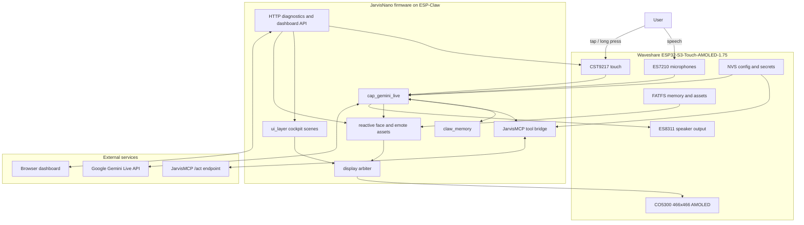
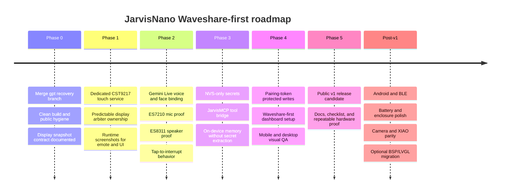

<p align="center">
  
</p>

<p align="center">
  
</p>

<p align="center">
  <em>USB-powered ESP32-S3 desktop assistant with Gemini Live voice, a round AMOLED face, touch controls, and JarvisMCP tools.</em>
</p>

<p align="center">
  <a href="https://github.com/PascalAI2024/JarvisNano/stargazers"></a>
  <a href="LICENSE"></a>
  
  
  
</p>

---

JarvisNano is an open-source ESP32-S3 firmware project for a small, physical
J.A.R.V.I.S.-style assistant. The current release target is the
**Waveshare ESP32-S3-Touch-AMOLED-1.75**: a round 466x466 AMOLED device with
capacitive touch, ES7210 microphones, ES8311 speaker output, 16 MB flash, and
8 MB PSRAM.

The Seeed XIAO ESP32-S3 Sense track remains in-tree for camera and tiny-board
experiments, but Waveshare is the v1 path.

| Board | Status | Best for | Adaptation |
|---|---|---|---|
| **Waveshare ESP32-S3-Touch-AMOLED-1.75** | Primary v1 target | Voice + face + touch cockpit, USB desktop assistant | [`boards/waveshare/esp32s3_touch_amoled_1_75/`](boards/waveshare/esp32s3_touch_amoled_1_75/) |
| **Seeed XIAO ESP32-S3 Sense** | Secondary track | Camera experiments, compact voice/vision work | [`boards/seeed/xiao_esp32s3_sense/`](boards/seeed/xiao_esp32s3_sense/) |

## Waveshare v1 Scope

- Gemini Live voice loop over WebSocket, using on-device NVS config for keys.
- CO5300 round AMOLED display driven through the direct `jarvis_board`
  primitive, with emote and UI ownership mediated by a display arbiter.
- Runtime display diagnostics:
  `/api/display/snapshot.json`, `/api/display/snapshot.ppm`, and
  `/api/ui/snapshot.ppm`.
- CST9217 touch diagnostics at `/api/touch`, with physical tap routing for
  voice interaction.
- ES7210 mic input and ES8311 speaker output on I2S.
- Browser dashboard and HTTP diagnostics for first setup and QA.
- JarvisMCP tool bridge configured only through NVS. No keys in source.

Post-v1 tracks are Android/BLE, battery reporting, camera/XIAO parity, and an
optional BSP/LVGL migration once the direct Waveshare runtime is boringly
stable. Astonishingly, "boring" is the goal.

## Architecture


```mermaid
flowchart TB
    User[User]

    subgraph Board[Waveshare ESP32-S3-Touch-AMOLED-1.75]
        Touch[CST9217 touch]
        Mic[ES7210 microphones]
        Speaker[ES8311 speaker output]
        Display[CO5300 466x466 AMOLED]
        NVS[NVS config and secrets]
        FATFS[FATFS memory and assets]
    end

    subgraph Firmware[JarvisNano firmware on ESP-Claw]
        Gemini[cap_gemini_live]
        Face[reactive face and emote assets]
        UI[ui_layer cockpit scenes]
        Arbiter[display arbiter]
        HTTP[HTTP diagnostics and dashboard API]
        MCP[JarvisMCP tool bridge]
        Memory[claw_memory]
    end

    subgraph External[External services]
        GeminiAPI[Google Gemini Live API]
        JarvisMCP[JarvisMCP /act endpoint]
        Browser[Browser dashboard]
    end

    User -->|tap / long press| Touch
    User -->|speech| Mic
    Touch --> Gemini
    Mic --> Gemini
    Gemini <--> GeminiAPI
    Gemini --> Speaker
    Gemini --> Face
    Gemini <--> MCP
    MCP <--> JarvisMCP
    Gemini <--> Memory
    Face --> Arbiter
    UI --> Arbiter
    Arbiter --> Display
    NVS --> Gemini
    NVS --> MCP
    FATFS --> Face
    HTTP <--> Browser
    HTTP --> Face
    HTTP --> UI
    HTTP --> Touch
```

Display screenshots are firmware software mirrors, not CO5300 panel readback.
If the old reactor face owns the panel, the snapshot should show that reactor
face. If a UI scene owns the panel, use `/api/ui/snapshot.ppm`. That distinction
matters; it caused real confusion on hardware.

For the deeper charts, see [docs/ARCHITECTURE.md](docs/ARCHITECTURE.md).

## Quick Start

You need Docker, Python 3, Git, a USB-C data cable, and the Waveshare
ESP32-S3-Touch-AMOLED-1.75 board.

```bash
git clone git@github.com:PascalAI2024/JarvisNano.git
cd JarvisNano

BOARD_VENDOR=waveshare \
BOARD_NAME=esp32s3_touch_amoled_1_75 \
./scripts/bootstrap.sh build

./scripts/flash.sh
```

`flash.sh` preserves NVS and FATFS storage by default so Wi-Fi, Gemini, and
JarvisMCP config survive normal firmware iteration. Use `STORAGE=1` only for a
fresh install, partition-layout change, or deliberate wipe. Use `ERASE_NVS=1`
when a bad saved config is causing trouble.

After flashing, use USB diagnostics first:

```bash
./scripts/usb-monitor.py --seconds 5 --send status
```

Then configure the device through the dashboard/API. Sensitive values must be
written to NVS, never committed:

- `llm_api_key` or `gemini_api_key` for Gemini Live, depending on the active
  config path in your build.
- `jarvis_mcp_url` and `jarvis_mcp_key` for JarvisMCP tools.
- `pairing_token` for protected writes once token enforcement is enabled.

Detailed build and flash notes live in [docs/BUILD.md](docs/BUILD.md). The
current hardware handoff and diagnostic commands live in
[docs/NEXT_SESSION.md](docs/NEXT_SESSION.md).

## Runtime Diagnostics

Use the live-device harness when the board is on Wi-Fi:

```bash
export JARVIS_DEVICE_HOST=<device-host>
scripts/live-device.py status --host "$JARVIS_DEVICE_HOST"
scripts/live-device.py screen --host "$JARVIS_DEVICE_HOST" --save-sd
scripts/live-device.py gemini-cycle --host "$JARVIS_DEVICE_HOST" --text "Say one short sentence." --report
scripts/live-device.py logs --host "$JARVIS_DEVICE_HOST" --grep touch,rwave,gemini,audio,ws
```

Key HTTP surfaces:

| Endpoint | Purpose |
|---|---|
| `/api/status` | Boot/runtime health |
| `/api/gemini/live` | Gemini Live state and control |
| `/api/display/face` | Known face states: `idle`, `listen`, `think`, `speak`, `error`, `sleep` |
| `/api/display/snapshot.json` | Display owner and mirror metadata |
| `/api/display/snapshot.ppm` | Active display-owner software mirror |
| `/api/ui/snapshot.ppm` | UI-layer framebuffer capture |
| `/api/touch` | CST9217 touch health and last event |
| `/api/audio/level` | Mic level sampler, paused while Gemini owns the mic |
| `/api/tools/status` | Gemini/JarvisMCP configured state without exposing secrets |

See [docs/LIVE_DEVICE_DEBUG.md](docs/LIVE_DEVICE_DEBUG.md) for the acceptance
commands and the known failure signatures.

## Browser Dashboard

[`dashboard/index.html`](dashboard/index.html) is the browser cockpit for local
setup and diagnostics. The dashboard should become Waveshare-first for v1:
face preview, touch status, Gemini state, memory/tool health, masked config,
and mobile/desktop visual QA.

The WebSerial browser flasher in the existing dashboard is still the XIAO-era
path unless a Waveshare firmware bundle is explicitly published. Developers
should use the local build + `scripts/flash.sh` flow for Waveshare.

## Current Status

Waveshare runtime recovery is merged:

- Direct CO5300 display primitive restored.
- Boot is stable on preserve-mode flash in the current hardware lane.
- Display software snapshots work for emote and UI owners.
- Touch diagnostics route is live.
- JarvisMCP config fields and masked tool status are present.
- Gemini text/voice diagnostics exist, but physical voice quality and speaker
  proof remain active QA items before v1 release.

The public release is not a finished consumer product yet. The release candidate
requires two clean passes of the checklist in
[docs/RELEASE_CHECKLIST.md](docs/RELEASE_CHECKLIST.md): clean build, preserve
flash, wiped-storage flash, boot watch, display/touch/voice/JarvisMCP tests,
dashboard setup, and secret scan.

## Roadmap


```mermaid
timeline
    title JarvisNano Waveshare-first roadmap
    Phase 0 : Merge gpt recovery branch
            : Clean build and public hygiene
            : Display snapshot contract documented
    Phase 1 : Dedicated CST9217 touch service
            : Predictable display arbiter ownership
            : Runtime screenshots for emote and UI
    Phase 2 : Gemini Live voice and face binding
            : ES7210 mic proof
            : ES8311 speaker proof
            : Tap-to-interrupt behavior
    Phase 3 : NVS-only secrets
            : JarvisMCP tool bridge
            : On-device memory without secret extraction
    Phase 4 : Pairing-token protected writes
            : Waveshare-first dashboard setup
            : Mobile and desktop visual QA
    Phase 5 : Public v1 release candidate
            : Docs, checklist, and repeatable hardware proof
    Post-v1 : Android and BLE
            : Battery and enclosure polish
            : Camera and XIAO parity
            : Optional BSP/LVGL migration
```

Full detail is in [docs/ROADMAP.md](docs/ROADMAP.md).

## Layout

```
JarvisNano/
├── boards/
│   ├── waveshare/esp32s3_touch_amoled_1_75/  # primary v1 board
│   └── seeed/xiao_esp32s3_sense/             # secondary camera/tiny-board track
├── firmware/
│   ├── components/                           # canonical firmware components
│   ├── emote/                                # reactive face runtime
│   ├── http_server/                          # diagnostic and control APIs
│   ├── main/                                 # touch/demo integration
│   ├── router_rules/                         # ESP-Claw event routing
│   └── ui_layer/                             # cockpit/UI framebuffer layer
├── docs/
│   ├── reference/                            # subsystem knowledge base
│   ├── ARCHITECTURE.md
│   ├── BUILD.md
│   ├── LIVE_DEVICE_DEBUG.md
│   ├── NEXT_SESSION.md
│   ├── RELEASE_CHECKLIST.md
│   └── ROADMAP.md
├── dashboard/                                # browser cockpit and flasher
├── scripts/                                  # bootstrap, flash, smoke, live QA
└── hardware/                                 # enclosure concepts
```

Important: `scripts/bootstrap.sh` copies canonical sources into the ignored
`esp-claw/` checkout on every build. Edit `firmware/`, `boards/`, and
bootstrap patch functions, not generated copies under `esp-claw/`.

## Security And Public Repo Hygiene

- No API keys, bearer tokens, Wi-Fi credentials, LAN addresses, device MACs, or
  internal URLs belong in this repo.
- Runtime secrets live in NVS and are written through `/api/config`.
- Public reads can stay open on a trusted LAN; writes/control should require
  `X-JarvisNano-Token` for public builds.
- Run `./scripts/check-secrets.sh` before publishing.

## License

[Apache-2.0](LICENSE), matching upstream ESP-Claw.

## Credits

- [Espressif ESP-Claw](https://github.com/espressif/esp-claw) for the agent framework.
- [Espressif esp-gmf / esp_board_manager](https://github.com/espressif/esp-gmf) for board codegen.
- [Waveshare ESP32-S3-Touch-AMOLED-1.75](https://www.waveshare.com/wiki/ESP32-S3-Touch-AMOLED-1.75) for the primary v1 hardware.
- [Seeed Studio XIAO ESP32-S3 Sense](https://wiki.seeedstudio.com/xiao_esp32s3_getting_started/) for the secondary compact board.
