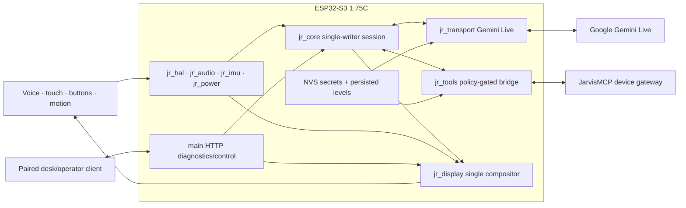

<p align="center">
  
</p>

<p align="center">
  
</p>

<p align="center">
  <strong>A voice-first J.A.R.V.I.S. desk companion on an ESP32-S3.</strong><br>
  Native Gemini Live conversation, a reactive round AMOLED face, physical privacy,
  touch and button controls, motion awareness, local diagnostics, and policy-gated tools.
</p>

<p align="center">
  <a href="https://github.com/PascalAI2024/JarvisNano/stargazers"></a>
  <a href="LICENSE"></a>
  
  
  
</p>

---

## What It Is

JarvisNano turns the **Waveshare ESP32-S3-Touch-AMOLED-1.75C** into a small,
always-available desktop assistant. The live firmware runs directly on the
ESP32-S3: the microphone streams to Gemini Live, returned PCM plays through the
ES8311 speaker path, and one compositor drives the 466×466 round AMOLED.
A phone is not required for the primary voice loop.

This repository also retains the original Waveshare 1.75 hardware definition
and Seeed XIAO experiments as reference tracks, not release builds. The
**1.75C is the product and only supported build target**.

## The Experience

- Say **“Jarvis”** or press **PWR** to establish attention.
- Speak naturally; the face moves through Listening, Thinking, and Speaking.
- Interrupt or stop a reply without turning a normal tap into a privacy trap.
- Hold the glass, use centre MUTE/LISTEN, or turn the puck face-down for physical privacy.
- Glance at an explicit ten-second Watch without replacing the voice-first home.
- Move through Desk, Tools, and Settings as temporary side spaces.
- Adjust volume and brightness from any screen using the physical edges.
- Inspect the real device through a paired diagnostics and operator surface.

## Hardware Used

| Subsystem | Live hardware | Firmware role |
|---|---|---|
| Compute | ESP32-S3R8, dual core, 240 MHz | Voice owner, UI, tools, diagnostics |
| Display | CO5300 466×466 QSPI AMOLED | Baked reactive faces + one procedural compositor |
| Touch | CST9217 | Tap, hold, global edge levels, page/detail gestures |
| Audio | ES7210 + ES8311 | 24 kHz duplex bus, 16 kHz AEC-clean uplink, speaker output |
| Motion | QMI8658 | Flip, shake, lift, orientation |
| Power | AXP2101 | Battery, USB/charge state, physical PWR key |
| Memory | 8 MB octal PSRAM | Face assets, snapshots, logs, queues, worker stacks |
| Flash | 32 MB DIO | Dual 4 MB OTA slots, emotes, WakeNet model, storage |

The C revision has **no TCA9554, PCF85063 RTC, or microSD slot**. Time is
SNTP-backed. See [`docs/HARDWARE.md`](docs/HARDWARE.md) for the pin-accurate
capability and safety matrix.

## One Interaction Grammar

| Input | Action |
|---|---|
| PWR short | Wake/re-arm voice; never mutes |
| PWR long | Battery and charging status |
| BOOT short, after boot | Open/close controls |
| BOOT hold 1.5–5 s, after boot | Open a visible 60-second pairing claim window |
| BOOT held during reset | Enter the ROM downloader |
| Left-edge vertical | Volume +/− 5 from any screen |
| Right-edge vertical | Brightness +/− 5 from any screen |
| Horizontal swipe | Jarvis ↔ Desk ↔ Tools ↔ Settings |
| Top-edge down | Open controls |
| Centre up | Open detail, or close controls |
| Double tap | Return to Jarvis Home |
| Glass hold | Physical privacy mute/unmute |
| Face-down for ~600 ms | Enter flip privacy; sustained face-up clears only a flip-origin mute |

The controls surface repeats the same map on glass: `L VOL`, `R LIGHT`,
`PWR LISTEN`, `BOOT CLOSE`, and the centre MUTE/LISTEN action. There is no
second hidden rotary recognizer.

## Architecture


```mermaid
flowchart LR
    Human[Voice · touch · buttons · motion]

    subgraph Device[ESP32-S3 1.75C]
        HAL[jr_hal · jr_audio · jr_imu · jr_power]
        Core[jr_core single-writer session]
        Voice[jr_transport Gemini Live]
        Tools[jr_tools policy-gated bridge]
        Glass[jr_display single compositor]
        HTTP[main HTTP diagnostics/control]
        NVS[NVS secrets + persisted levels]
    end

    Gemini[Google Gemini Live]
    MCP[JarvisMCP device gateway]
    Operator[Paired desk/operator client]

    Human --> HAL --> Core
    Core <--> Voice <--> Gemini
    Core <--> Tools <--> MCP
    Core --> Glass --> Human
    HAL --> Glass
    NVS --> Voice
    NVS --> Tools
    Operator <--> HTTP
    HTTP --> Core
    HTTP --> Glass
```

The release composition is rooted at `main/main.c` and `components/jr_*`.
`main/main.c` is the live HTTP route authority. `firmware/`, `esp-claw/`, and
the older dashboard are retained history or compatibility work; they do not
define the v5 image.

For ownership and data-flow detail, see
[`docs/ARCHITECTURE.md`](docs/ARCHITECTURE.md).

## Build and Run

Requirements: Docker, Python 3, Git, and a USB-C data cable for initial flashing.

```bash
git clone https://github.com/PascalAI2024/JarvisNano.git
cd JarvisNano

./scripts/build-v5.sh
./scripts/flash-v5.sh
```

The build is pinned to `espressif/idf:v5.5.4`. The flash script targets the
1.75C by default, requires DIO, verifies written data, and preserves NVS unless
`ERASE_NVS=1` is explicitly supplied.

Once the device is on Wi-Fi:

```bash
export JARVIS_DEVICE_HOST='<device-ip>'
# First host only: hold BOOT for 1.5–5 s until PAIRING OPEN appears.
python3 scripts/jarvis-desk.py --host "$JARVIS_DEVICE_HOST" pair
python3 scripts/jarvisctl.py status
python3 scripts/jarvisctl.py gestures 40
python3 scripts/jarvisctl.py screen
python3 scripts/jarvis-desk.py --host "$JARVIS_DEVICE_HOST" doctor
```

`jarvis-desk.py` owns first pairing and Desk/operator workflows;
`jarvisctl.py` provides concise paired operator commands; `live-device.py`
captures deeper evidence bundles. All three use the same host-bound Keychain
token and keep it out of argv/output.

Detailed setup, OTA, and verification instructions live in
[`docs/BUILD.md`](docs/BUILD.md).

## Live Capabilities

- Native Gemini Live duplex session with WakeNet “Jarvis,” server VAD, and AEC.
- Bounded PSRAM-backed uplink buffering and reconnect state machine.
- Five baked reactive faces plus a procedural battery, privacy, caption, choice,
  Watch, controls, and operator compositor.
- Physical input provenance: synthetic QA cannot clear privacy, approve consent,
  answer asks, or escape operator mode.
- Dual-slot OTA with power/network/memory preflight, probation, and rollback.
- Paired persistent volume/brightness and local Gemini level tools.
- JarvisMCP fixed tools plus a typed, fail-closed device gateway. Dynamic catalog
  response projection remains an active hardening item in `PLAN.md`.
- 128 KB device log ring, audio taps, task watermarks, frame diagnostics,
  software display mirror, and paired doctor workflow.

## Evidence, Not Theatre

JarvisNano distinguishes software evidence from physical proof:

- A screenshot is the exact submitted RGB565 buffer, **not panel readback**.
- A playback tap proves PCM reached the codec write seam, **not that a speaker
  was audible**.
- Synthetic touch proves routing, **not physical authority**.
- Hold/flip-origin privacy can be cleared only by its allowed physical action.

The live release has been exercised on the physical 1.75C for voice, touch,
Watch, controls, privacy, charge state, Wi-Fi OTA, rollback probation, memory
headroom, and paired diagnostics. Remaining soak and release gates are explicit
in [`PLAN.md`](PLAN.md), not hidden behind “done” language.

## Security Boundary

Secrets belong in device NVS or the host keychain—never source, logs,
screenshots, or command arguments. **Current NVS is unencrypted:** physical
flash access or a shared dump exposes Wi-Fi, Gemini, and JarvisMCP credentials.
Use dedicated revocable keys.

The preferred typed `/device/v1/invoke` path uses server-side capability policy.
Legacy `/act` lacks equivalent device scope and is not a release boundary.
Trusted-LAN OTA works, but signed application verification, authenticated
encrypted upload, and attended NVS/flash encryption remain public-release gates.
Secure Boot/eFuse work is separately attended and never part of ordinary OTA.
See [`SECURITY.md`](SECURITY.md) and
[`docs/RELEASE_CHECKLIST.md`](docs/RELEASE_CHECKLIST.md).

## Repository Map

| Path | Purpose |
|---|---|
| `main/` | Composition root, live HTTP/control plane |
| `components/jr_core` | Pure session, turn, monitor, and mood state |
| `components/jr_transport` | Gemini framing and WebSocket adapter |
| `components/jr_audio` | ES7210/ES8311 capture, playback, AEC, diagnostics |
| `components/jr_display` | Round display engine and compositor |
| `components/jr_hal` | CST9217 input and board HAL |
| `components/jr_tools` | On-device tools and JarvisMCP bridge |
| `boards/waveshare/esp32s3_touch_amoled_1_75c` | Primary board definition |
| `scripts/` | Reproducible build, flash, operator, and QA tools |
| `docs/` | Canonical product, architecture, protocol, build, and evidence docs |
| `docs/ARCHIVE/` | Superseded plans and historical implementation records |

Start with [`DOCUMENTATION_MAP.md`](DOCUMENTATION_MAP.md). Historical documents
are useful evidence, but never outrank the canonical live set.

## Current Priorities

The active wave in [`PLAN.md`](PLAN.md) is intentionally boring and important:

1. Prove uninterrupted long-session voice and playback pacing.
2. Finish byte-budgeted JarvisMCP catalog projection.
3. Split the composition root along existing ownership boundaries.
4. Make documentation, tests, and release gates one-command reproducible.
5. Close signed OTA, encrypted transport/storage, and third-party notice gates.

## Contributing

Start with [`CONTRIBUTING.md`](CONTRIBUTING.md), build the live v5 target, and
attach evidence from the changed surface. Keep credentials, local endpoints,
NVS images, device logs, and machine-specific state out of commits.

JarvisNano source is Apache-2.0. See [`LICENSE`](LICENSE), [`NOTICE`](NOTICE),
and [`THIRD_PARTY_NOTICES.md`](THIRD_PARTY_NOTICES.md); binary releases require
the generated exact dependency notice bundle.
