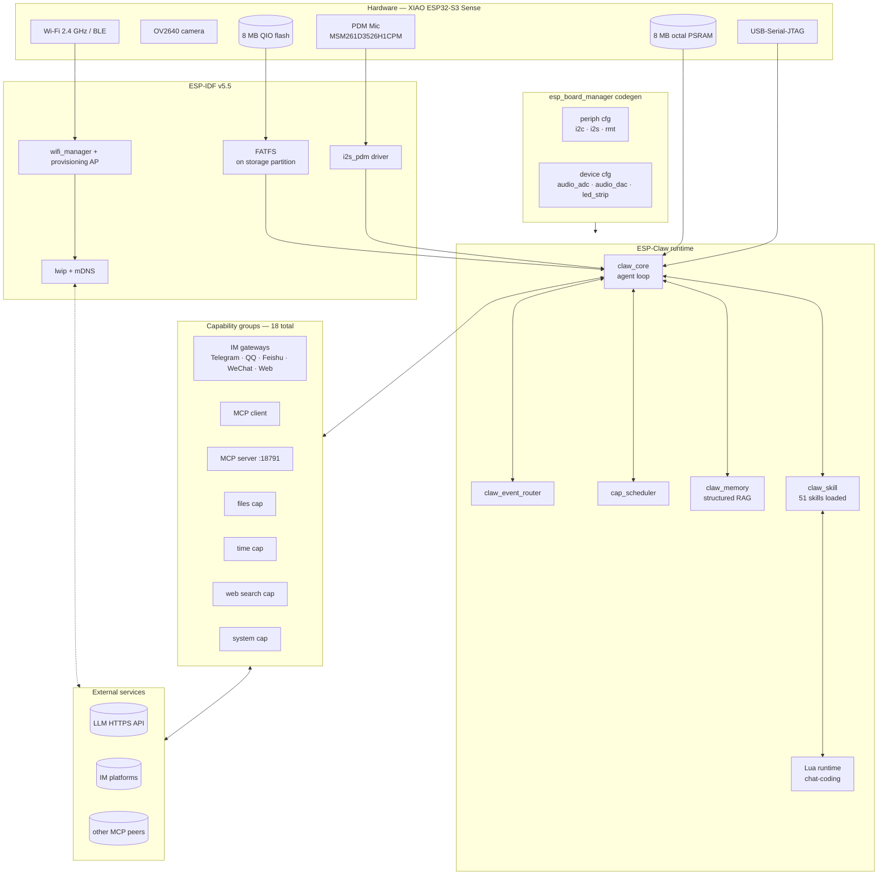
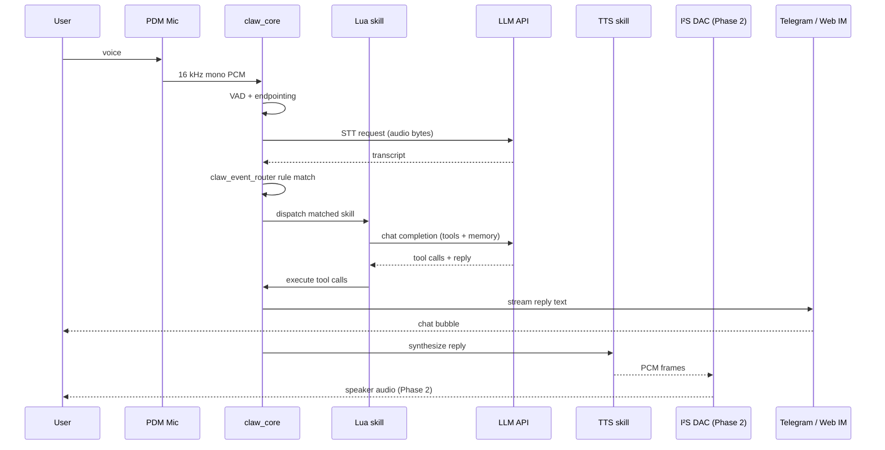
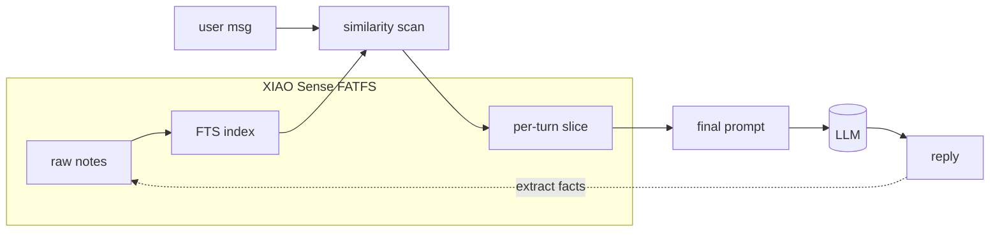
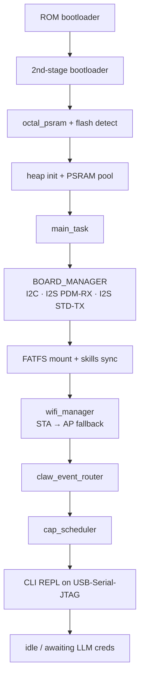

# Architecture

How the firmware is organized once it boots, and how a single user
utterance flows through it.

## Subsystem map



## Single-utterance lifecycle

What happens when you speak to the robot:



## Why structured memory matters

ESP-Claw's `claw_memory` keeps facts on-device (FATFS). The system prompt
is small; relevant memories are retrieved per-turn. Privacy stays local;
only the prompt + relevant slice ever hits the LLM.



## Boot order



## File layout (firmware side)

The `application/edge_agent/` ESP-IDF project is laid out as follows
(after `bootstrap.sh` runs):

```
edge_agent/
├── main/                        # app entry, Wi-Fi mgr, CLI
├── components/                  # capability impls (im, mcp, scheduler, memory…)
├── boards/                      # the YAML+C board adaptations
│   ├── espressif/               # upstream-provided
│   ├── m5stack/                 # upstream-provided
│   └── seeed/xiao_esp32s3_sense/  ← ours
├── managed_components/          # idf-component-manager pulls
│   └── espressif__esp_board_manager/  ← codegen patched here
└── partitions_8MB.csv           # 8 MB layout used on the XIAO
```
