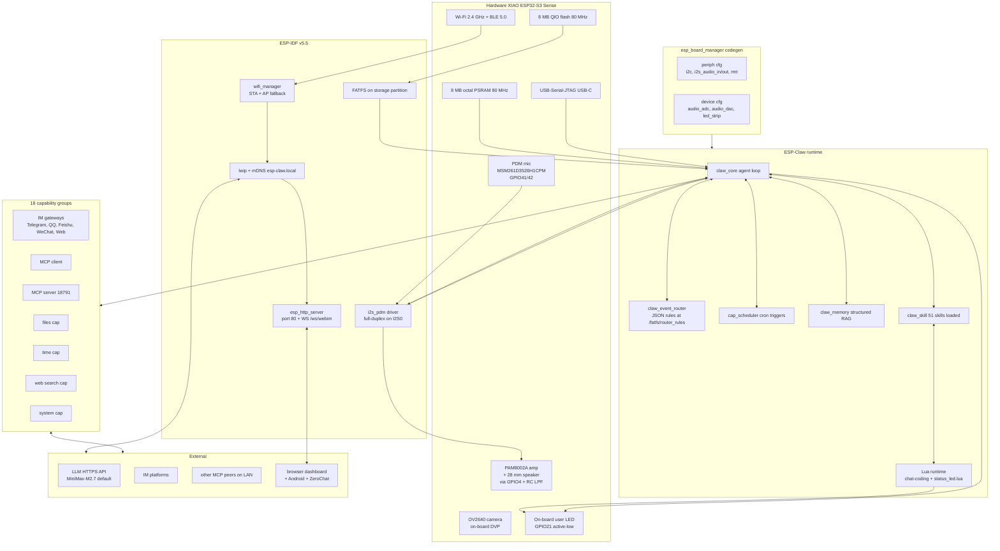
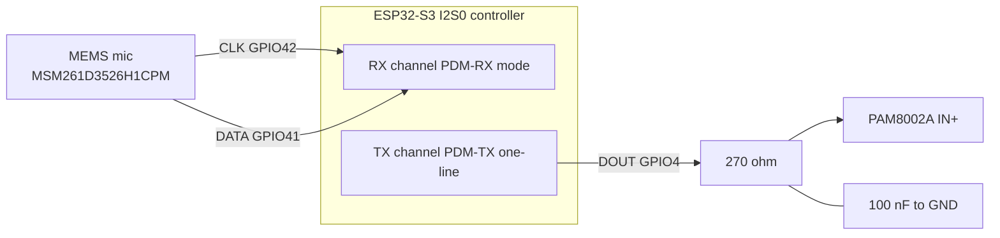
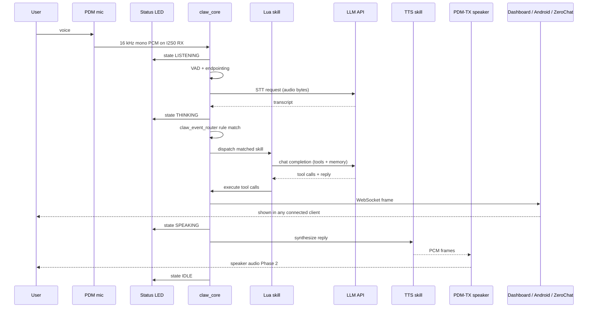
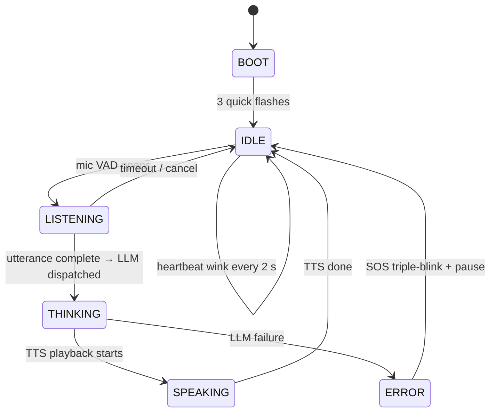
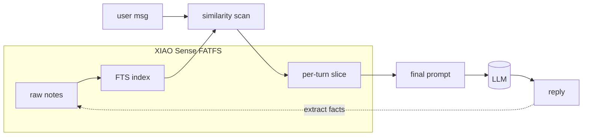
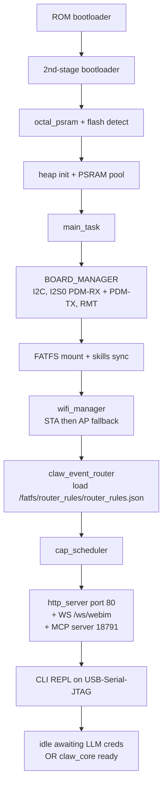

# Architecture

How the firmware is organized once it boots, and how a single user
utterance flows through it.

## Subsystem map



## I2S0 full-duplex layout

ESP32-S3 only supports PDM on **I2S0**, so we run mic + speaker as two
separate channels on the same controller:



Verified by the boot log:

```
PERIPH_I2S: I2S[0] PDM-RX, clk: 42, din: 41
PERIPH_I2S: I2S[0] PDM-TX, clk: -1, dout: 4
PERIPH_I2S: I2S[0] initialize success: 0x3c1fcd90
PERIPH_I2S: I2S[0] initialize success: 0x3c1fcbbc
```

## Single-utterance lifecycle

What happens when you speak to the robot:



## Status LED state machine

The on-board GPIO21 user LED (active-LOW) is driven by an async Lua job
that runs forever once started. State controlled by the agent loop;
fallback patterns work even with no device events.



## Why structured memory matters

ESP-Claw's `claw_memory` keeps facts on-device (FATFS). The system prompt
is small; relevant memories are retrieved per-turn. Privacy stays local;
only the prompt + relevant slice ever hits the LLM.



## Boot order



## File layout (firmware side)

The `application/edge_agent/` ESP-IDF project is laid out as follows
(after `bootstrap.sh` runs):

```
edge_agent/
├── main/                              # app entry, Wi-Fi mgr, CLI
├── components/                        # capability impls (im, mcp, scheduler, memory…)
├── boards/                            # the YAML+C board adaptations
│   ├── espressif/                     #   upstream-provided
│   ├── m5stack/                       #   upstream-provided
│   └── seeed/xiao_esp32s3_sense/      #   ← OURS
├── managed_components/                # idf-component-manager pulls
│   └── espressif__esp_board_manager/  #   ← codegen patched here
├── fatfs_image/                       # FATFS contents baked into flash
│   ├── scripts/builtin/status_led.lua #   ← OURS
│   ├── router_rules/router_rules.json #   includes our boot_status_led rule
│   └── skills/                        #   capability docs for the LLM
└── partitions_8MB.csv                 # 8 MB layout used on the XIAO
```

## Public protocol surface

Everything a client (browser dashboard, Android app, ZeroChat, third-party)
talks to is documented in [`docs/PROTOCOL.md`](PROTOCOL.md). Versioned via
the `X-JarvisNano-Protocol: 1` header.

| Surface | Where | Used by |
| --- | --- | --- |
| HTTP REST | port 80 | dashboard · Android · ZeroChat |
| WebSocket `/ws/webim` | port 80 | dashboard · Android · ZeroChat |
| MCP JSON-RPC | port 18791 `/mcp_server` | other MCP peers |
| BLE GATT (Phase 2) | UUIDs in PROTOCOL.md | Android · ZeroChat |
| On-device LLM hand-off (Phase 3) | BLE audio + control | Android (Gemma 4 E4B local) |
