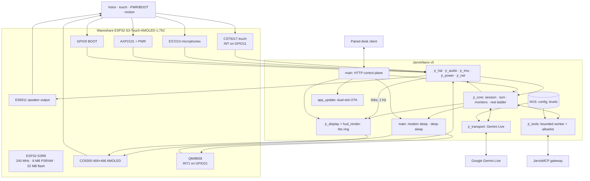
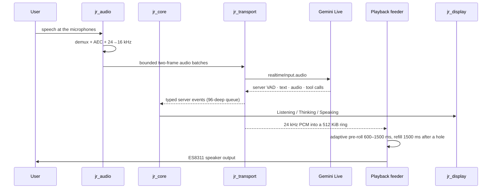
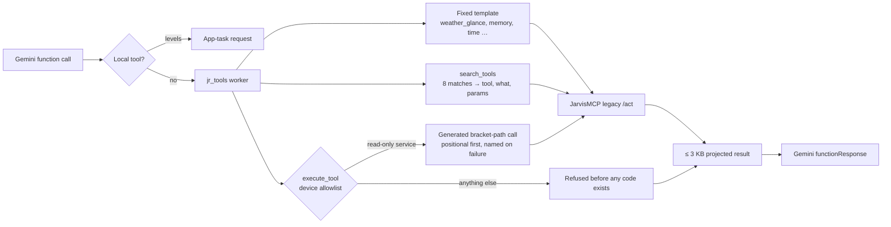
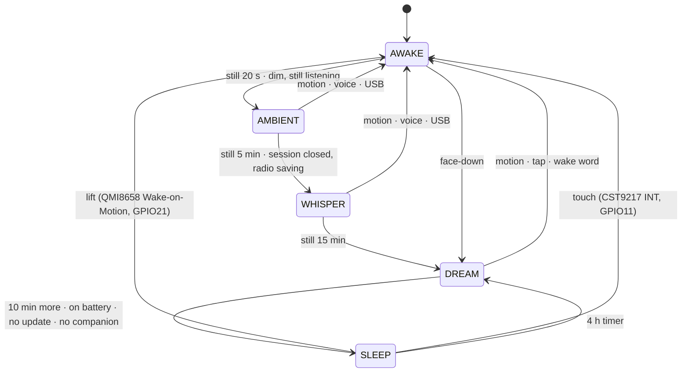
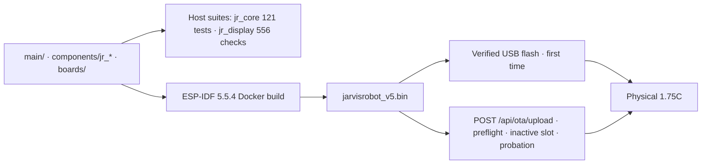

# Architecture

> **Live target:** plain ESP-IDF 5.5.4 on the Waveshare
> ESP32-S3-Touch-AMOLED-1.75C. Last reconciled: **2026-09-01**.

The image is rooted in `main/`, `components/jr_*`, and the selected board
definition. `firmware/`, `esp-claw/`, and the older dashboard are not part of
the image produced by `scripts/build-v5.sh`.

## System overview

```mermaid
flowchart TB
    Human[Voice · touch · PWR/BOOT · motion]

    subgraph Board[Waveshare ESP32-S3-Touch-AMOLED-1.75C]
        S3[ESP32-S3R8<br/>240 MHz · 8 MB PSRAM · 32 MB flash]
        Mic[ES7210 microphones]
        DAC[ES8311 speaker output]
        Screen[CO5300 466×466 AMOLED]
        Touch[CST9217 touch<br/>INT on GPIO11]
        IMU[QMI8658<br/>INT1 on GPIO21]
        PMIC[AXP2101 + PWR]
        Boot[GPIO0 BOOT]
    end

    subgraph Runtime[JarvisNano v5]
        HAL[jr_hal · jr_audio · jr_imu · jr_power · jr_net]
        Core[jr_core: session · turn · monitors · rest ladder]
        Voice[jr_transport: Gemini Live]
        Tools[jr_tools: bounded worker + allowlist]
        Display[jr_display + hud_render: the ring]
        HTTP[main: HTTP control plane]
        OTA[app_update: dual-slot OTA]
        Sleep[main: modem sleep · deep sleep]
        NVS[(NVS: config, levels)]
    end

    Gemini[Google Gemini Live]
    MCP[JarvisMCP gateway]
    Desk[Paired desk client]

    Human --> Touch --> HAL
    Human --> Mic --> HAL
    Human --> PMIC --> HAL
    Human --> Boot --> HAL
    IMU --> HAL
    HAL --> Core
    Core <--> Voice <--> Gemini
    Core <--> Tools <--> MCP
    Core --> Display --> Screen --> Human
    Core --> HAL --> DAC --> Human
    Core --> Sleep --> IMU
    Sleep --> Screen
    HAL -->|links, 1 Hz| Display
    NVS --> Voice
    NVS --> Tools
    Desk <--> HTTP
    HTTP --> Core
    HTTP --> Display
    HTTP --> OTA
    HTTP --> Sleep
```

## Ownership and tasks

The runtime is single-owner at every load-bearing boundary.

| Owner | Responsibility |
|---|---|
| `jr_voice` | `jr_orch_step`, Gemini events and commands, physical input policy, the rest ladder, privacy, levels, the sleep decision |
| `websocket_task` | TLS/WebSocket transport events only |
| `jr_pb_feed` | Drain the bounded playback ring into `esp_codec_dev_write`, behind the jitter buffer |
| `gfx_render` | Render one frame in 12-row strips and submit synchronous DMA; the only task that may issue a panel command (brightness, DISPOFF, SLPIN) |
| `jr_present` | Load and cache face assets, apply the latest requested face |
| `jr_tools` | Execute one bounded local or JarvisMCP job, publish one bounded result |
| `httpd` | Parse and authenticate requests, post bounded commands; never owns realtime state |
| `jr_imu` / `jr_power` | Publish non-blocking sensor snapshots; the IMU sampler stops before deep sleep hands the part its wake engine |

The composition root owns concrete wiring. Pure `jr_core` code calls no
ESP-IDF, touch, audio, display, HTTP or network API, and is tested on the host
(`host/`, 121 tests) alongside the display's own harness
(`components/jr_display/tests`, 556 checks).

## Voice path

The 1.75C shares one 24 kHz I²S clock between ES7210 capture and ES8311
playback. Capture is read as four TDM lanes, demultiplexed, and downsampled
24→16 kHz for AEC, VAD and Gemini input. Gemini output stays native 24 kHz.

```mermaid
sequenceDiagram
    participant U as User
    participant A as jr_audio
    participant C as jr_core
    participant T as jr_transport
    participant G as Gemini Live
    participant P as Playback feeder
    participant D as jr_display

    U->>A: speech at the microphones
    A->>A: demux + AEC + 24→16 kHz
    A->>T: bounded two-frame audio batches
    T->>G: realtimeInput.audio
    G-->>T: server VAD · text · audio · tool calls
    T-->>C: typed server events (96-deep queue)
    C->>D: Listening / Thinking / Speaking
    T-->>P: 24 kHz PCM into a 512 KiB ring
    P->>P: adaptive pre-roll 600–1500 ms, refill 1500 ms after a hole
    P->>U: ES8311 speaker output
```

Gemini's server VAD owns turn boundaries and interruption. The local VAD is
observability and pacing, and one more thing: the clock behind the
unanswered-utterance watchdog below.

**Why the speaker runs a second behind the network.** Measured from the
transcript timing, Gemini paces native audio near real time and stalls
0.8–2.2 s mid-sentence. Draining as fast as it arrives produced holes; the
feeder waits for a lead before a reply's first word (600 ms, stepping up 300 ms
after any reply with a hole and down 200 ms after three clean ones, between 600
and 1500) and rebuilds a 1500 ms lead after any underrun, capped so a reply
boundary never waits more than 2.5 s. Counters: `/api/device/health` → `playback`, `rx`.

### Session liveness

Three watchdogs, each answering a different silence:

| Watchdog | Detects | Acts |
|---|---|---|
| Keepalive (`jr_core` monitors) | no server frame for the keepalive window | `StaleDeadline` → reconnect with the resume handle |
| No-reply (`jr_core` monitors) | Thinking older than 20 s | `NoReplyTimeout` → the turn is abandoned |
| Unanswered utterance (`main.c`, `UTT_*`) | an utterance ≥ 800 ms ends with the device still Listening and no server frame arrives within 7 s; two in a row | injects `StaleDeadline`, caption `RECONNECTING` |

The third exists because a server that goes quiet while the socket stays up
looks, to the first two, exactly like a healthy idle session. Seen on the
glass: three whole questions in forty seconds, no reply, no error, then
answers again.

## Physical input policy

Touch reports tap, long press and four-way swipes with origin and end
coordinates and synthetic provenance. One production gesture path:

| Input | Action |
|---|---|
| "Jarvis" / PWR short | Listen; never mutes |
| PWR long | Speak the battery |
| BOOT short | Control shade open/close |
| BOOT hold 1.5–5 s | Visible 60-second pairing window |
| BOOT held during reset | ROM downloader |
| Left-edge vertical | Volume |
| Right-edge vertical | Brightness |
| Centre vertical swipe | The ring: JARVIS ↔ WATCH ↔ WEATHER ↔ STATUS ↔ (DESK while live) ↔ ACTIVITY, wrapping |
| Centre up / down | Open / close the current screen's sheet |
| Tap on an open sheet | Jarvis speaks the screen (a text turn; the mic is untouched) |
| Horizontal swipe | Ten-second WATCH peek |
| Double tap | Home |
| Glass hold | Physical privacy |
| Face-down / face-up | Enter flip privacy / clear only a flip-origin mute |
| Lift after a rest | Weather glance for eight seconds |

Edge intent is accepted only after the swipe classifier selects UP/DOWN, so
horizontal navigation stays untouched. Synthetic input may walk the ring and
open sheets but cannot clear privacy, approve consent, answer asks, or escape
a companion's lease.

## Display path

One display engine. Baked `rwave_*.eaf` assets provide the reactor face;
`hud_render` and `jr_display` add the battery rim, the gold privacy ring,
captions, choice arcs, the WATCH face, the shade, and the ring's screens in
the measured negative space of a 466 px circle: a focal ring at r76–96, a
sheet band inside r168, an orbit rail at r185–194, the shell clipped at r214,
and the rim tenants beyond.

Each ring screen is a focal object plus a sheet composed once per frame from
packed words other tasks publish lock-free: the power word from `jr_power`,
the weather from the device's own fetch, the activity feed from turn ends,
and the links word (`jr_display_links_set`, 1 Hz from `publish_shell_state`)
that carries Wi-Fi state and RSSI, the session socket, the tools bridge, the
companion, the radio's power mode and the die temperature. STATUS reads the
same words `/api/cockpit` serves, so the glass and the API cannot disagree.

Measured on the panel with the mic idle: JARVIS 19 fps, the ring screens
12–14. The shell veil is recomputed every strip; caching it is the next win.

Snapshot routes are software mirrors of the submitted RGB565, not panel
readback:

| Route | Meaning |
|---|---|
| `/api/display` | Presenter health and counters |
| `/api/display/snapshot.json` | Mirror metadata and freshness |
| `/api/display/snapshot.ppm` | The exact submitted frame |

## Tool path

Gemini sees eight declared tools: the fixed device tools, the local level
tools, `search_tools` and `execute_tool`. Everything except the levels runs on
the `jr_tools` worker.

```mermaid
flowchart LR
    Call[Gemini function call] --> Local{Local tool?}
    Local -->|levels| App[App-task request]
    Local -->|no| Worker[jr_tools worker]
    Worker --> Fixed[Fixed template<br/>weather_glance, memory, time …]
    Worker --> Search[search_tools<br/>8 matches → tool, what, params]
    Worker --> Exec{execute_tool<br/>device allowlist}
    Exec -->|read-only service| Gen[Generated bracket-path call<br/>positional first, named on failure]
    Exec -->|anything else| Refuse[Refused before any code exists]
    Fixed --> Act[JarvisMCP legacy /act]
    Search --> Act
    Gen --> Act
    Act --> Result[≤ 3 KB projected result]
    Refuse --> Result
    Result --> Reply[Gemini functionResponse]
```

The legacy `/act` bearer carries the gateway's full authority, so the device
is the policy: `execute_tool` generates calls only into a read-only allowlist
(`components/jr_tools/src/jr_tools_templates.c`) and results are projected to
fit the 3,072-byte Gemini slot. The typed `/device/v1/invoke` route with
server-side capability policy is the intended long-term boundary and is not
provisioned. Jobs the device owns (the weather glance) are tagged
`JR_TOOLS_SESSION_ANY` so no session close can orphan them.

## Power ladder

The rest ladder in `jr_core` names the state; `main.c` drives the hardware
under it: the CPU gear (240 MHz while anything is happening, 160 at rest on
the cell, max pinned to min so nothing scales under a peripheral), Wi-Fi
modem sleep, and deep sleep at the bottom. Below 20 % on the cell the
ladder runs four times faster. Light sleep cannot engage while the
microphones capture, which is always. Measurements and the gear rationale:
[`reference/power-modes.md`](reference/power-modes.md).

```mermaid
stateDiagram-v2
    [*] --> AWAKE
    AWAKE --> AMBIENT: still 20 s · dim, still listening
    AMBIENT --> WHISPER: still 5 min · session closed, radio saving
    WHISPER --> DREAM: still 15 min
    AWAKE --> DREAM: face-down
    DREAM --> SLEEP: 10 min more · on battery · no update · no companion
    SLEEP --> AWAKE: lift (QMI8658 Wake-on-Motion, GPIO21)
    SLEEP --> AWAKE: touch (CST9217 INT, GPIO11)
    SLEEP --> DREAM: 4 h timer
    AMBIENT --> AWAKE: motion · voice · USB
    WHISPER --> AWAKE: motion · voice · USB
    DREAM --> AWAKE: motion · tap · wake word
```

Each wake line is armed only if it is quiet at that moment, so a wrong
polarity costs a wake source and never a boot loop; the timer is always
armed. RTC memory carries whether the mic was live, so a lifted device comes
back `LISTENING`. Deep sleep refuses to run while the image is on OTA
probation, because it is a reboot through the bootloader and would roll the
image back. Recipe, measurements and gotchas:
[`reference/power-modes.md`](reference/power-modes.md).

## HTTP and authority

`main/main.c` is the route authority. Content-bearing reads and mutating
routes require the proof named for that surface — pairing token, control
header, or both — in [`PROTOCOL.md`](PROTOCOL.md). With
`JR_DEV_OPEN_DIAGNOSTICS` set the control header alone suffices on the LAN;
that flag must be 0 before release.

Physical authority is stronger than remote control:

- Remote input is tagged synthetic.
- Remote resume never clears physical hold or flip privacy.
- Privacy gates the microphone frames themselves, not just the re-arm: while
  paused, every frame is zeroed before the VAD and the uplink, whatever the
  session is doing. A text turn from the desk works with the mic shut.
- Consent accepts only physical post-prompt taps.
- A companion's lease has a physical double-tap escape.
- OTA cannot override deliberate privacy state.

## Memory discipline

Internal contiguous RAM, not total PSRAM, is the binding resource for TLS,
DMA and task creation: the Gemini handshake fails once the largest internal
block drops under about 8 KB. Queue payloads, logs, snapshots, the playback
ring and worker stacks live in PSRAM; display DMA buffers stay internal.
`sdkconfig` is generated, so memory tuning lives in `sdkconfig.defaults`.

Runtime gates refuse optional work when the largest internal block is below
8 KB, PSRAM is below 2 MB, the display is unstable, or OTA preflight fails.
No failure path may retry unbounded, queue unbounded work, or reboot because
a diagnostic counter moved.

## OTA and release boundary

Two 4 MB application slots. OTA writes only the inactive slot, then boots
under a probation window that requires voice, network, tools, HTTP, wake and
display progress before the image is marked valid; the update ring is violet
on every screen until then. A running device is updated over Wi-Fi
(`POST /api/ota/upload`) because esptool cannot sync over USB-JTAG while the
firmware owns the port.

Trusted-LAN OTA is operational. Public release still requires signed images,
authenticated encrypted upload, attended at-rest credential protection, and
an exact third-party notice bundle. Secure Boot, anti-rollback, flash
encryption and eFuses are separately attended hardware operations.

## Build boundary

```mermaid
flowchart LR
    Source[main/ · components/jr_* · boards/]
    Host[Host suites: jr_core 121 tests · jr_display 556 checks]
    Docker[ESP-IDF 5.5.4 Docker build]
    Image[jarvisrobot_v5.bin]
    USB[Verified USB flash · first time]
    OTA[POST /api/ota/upload · preflight · inactive slot · probation]
    Device[Physical 1.75C]

    Source --> Host
    Source --> Docker --> Image
    Image --> USB --> Device
    Image --> OTA --> Device
```

Use [`BUILD.md`](BUILD.md), [`RELEASE_CHECKLIST.md`](RELEASE_CHECKLIST.md),
and [`../PLAN.md`](../PLAN.md) for commands, gates and open work.
