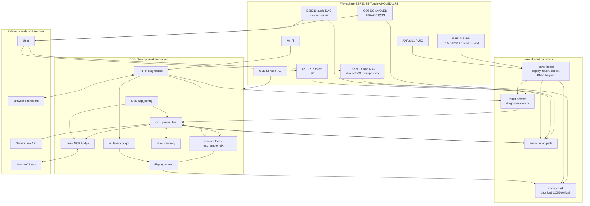
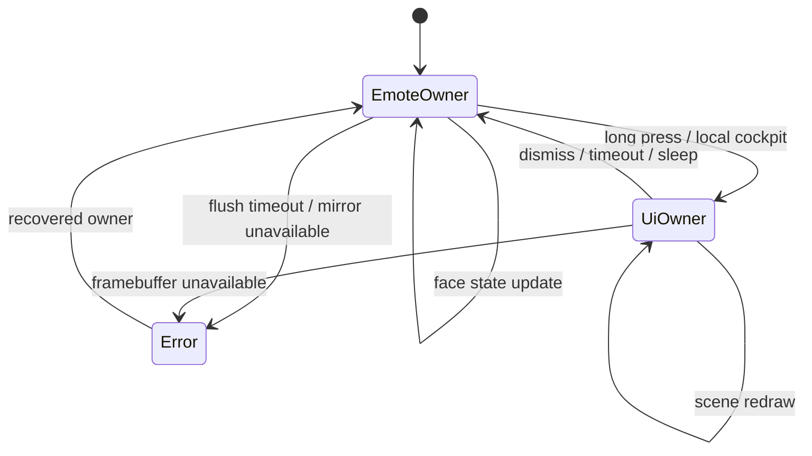
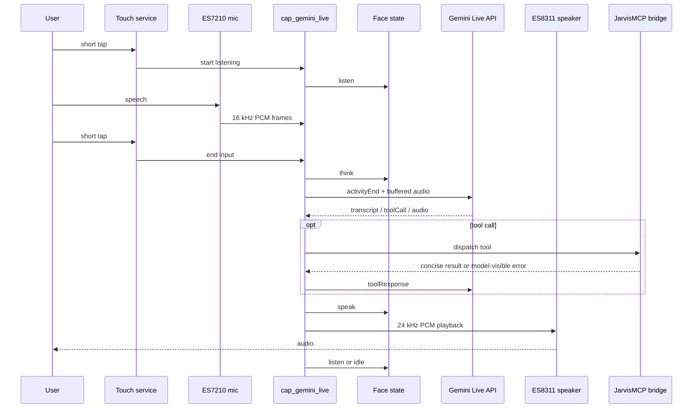
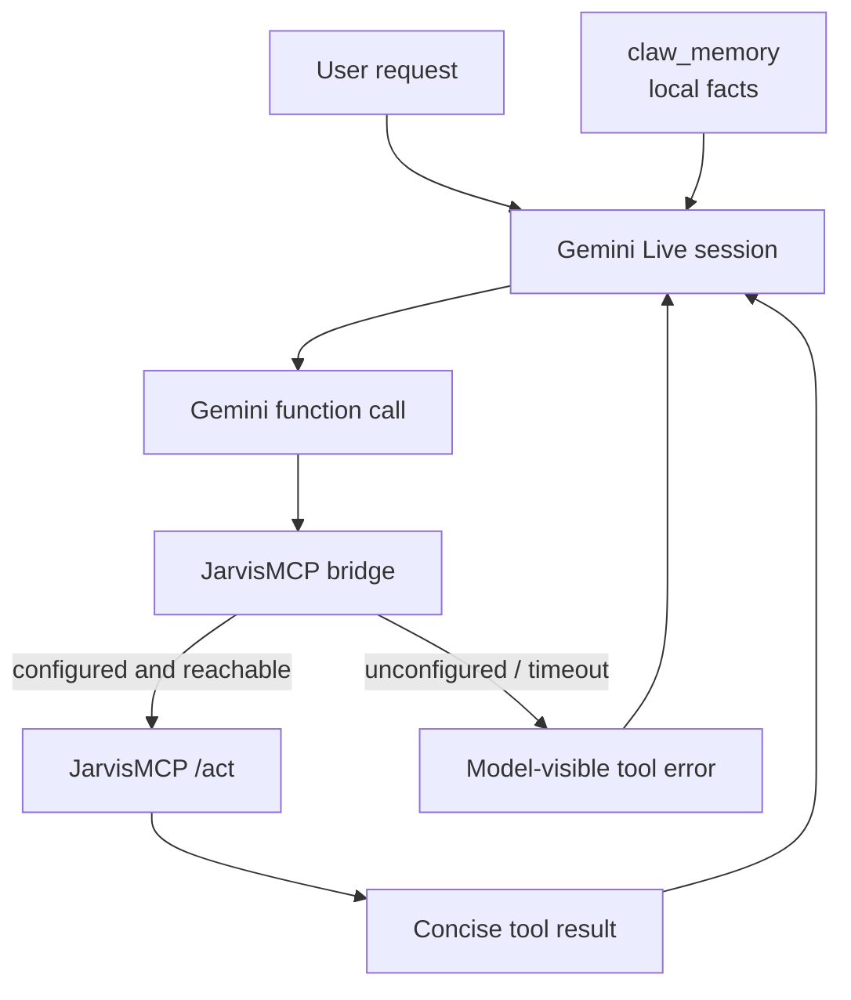
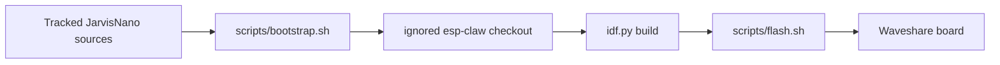

# Architecture

JarvisNano is now organized around the Waveshare ESP32-S3-Touch-AMOLED-1.75
desktop assistant path. The older XIAO/camera track remains supported, but it
does not define the v1 release architecture.

## Release Architecture

```mermaid
flowchart TB
    subgraph HW[Waveshare ESP32-S3-Touch-AMOLED-1.75]
        S3[ESP32-S3R8<br/>16 MB flash / 8 MB PSRAM]
        AMOLED[CO5300 AMOLED<br/>466x466 QSPI]
        TOUCH[CST9217 touch<br/>I2C]
        ADC[ES7210 audio ADC<br/>dual MEMS microphones]
        DAC[ES8311 audio DAC<br/>speaker output]
        PMIC[AXP2101 PMIC]
        USB[USB-Serial-JTAG]
        WIFI[Wi-Fi]
    end

    subgraph BSP[Jarvis board primitives]
        Board[jarvis_board<br/>display, touch, codec, PMIC helpers]
        DisplayHAL[display HAL<br/>chunked CO5300 flush]
        TouchSvc[touch service<br/>diagnostic events]
        AudioSvc[audio codec path]
    end

    subgraph Runtime[ESP-Claw application runtime]
        Gemini[cap_gemini_live]
        Face[reactive face / esp_emote_gfx]
        UILayer[ui_layer cockpit]
        Arbiter[display arbiter]
        HTTP[HTTP diagnostics]
        Config[NVS app_config]
        Memory[claw_memory]
        Tools[JarvisMCP bridge]
    end

    subgraph External[External clients and services]
        GeminiAPI[Gemini Live API]
        MCP[JarvisMCP /act]
        Browser[Browser dashboard]
        Human[User]
    end

    S3 --> Board
    AMOLED --> DisplayHAL
    TOUCH --> TouchSvc
    ADC --> AudioSvc
    DAC --> AudioSvc
    PMIC --> Board
    USB --> Runtime
    WIFI --> HTTP
    Board --> DisplayHAL
    Board --> TouchSvc
    Board --> AudioSvc
    TouchSvc --> Gemini
    AudioSvc --> Gemini
    Gemini <--> GeminiAPI
    Gemini --> AudioSvc
    Gemini --> Face
    Gemini <--> Memory
    Gemini <--> Tools
    Tools <--> MCP
    Config --> Gemini
    Config --> Tools
    Face --> Arbiter
    UILayer --> Arbiter
    Arbiter --> DisplayHAL
    HTTP <--> Browser
    HTTP --> Face
    HTTP --> UILayer
    HTTP --> TouchSvc
    Human --> TOUCH
    Human --> ADC
    DAC --> Human
    AMOLED --> Human
```

## Display Ownership

The round display has two runtime producers:

- `esp_emote_gfx` / reactive face for idle, listening, thinking, speaking,
  error, and sleep states.
- `ui_layer` for cockpit/menu scenes and diagnostics.

They must not both push frames blindly. The display arbiter owns that handoff.

```mermaid
stateDiagram-v2
    [*] --> EmoteOwner
    EmoteOwner --> UiOwner: long press / local cockpit
    UiOwner --> EmoteOwner: dismiss / timeout / sleep
    EmoteOwner --> EmoteOwner: face state update
    UiOwner --> UiOwner: scene redraw
    EmoteOwner --> Error: flush timeout / mirror unavailable
    UiOwner --> Error: framebuffer unavailable
    Error --> EmoteOwner: recovered owner
```

Snapshot routes report software mirrors, not physical panel readback:

| Route | Source | Use |
|---|---|---|
| `/api/display/snapshot.json` | owner/mirror metadata | Fast health check |
| `/api/display/snapshot.ppm` | active display owner, usually emote mirror | Face/runtime screenshot |
| `/api/ui/snapshot.ppm` | `ui_layer` visible framebuffer | Cockpit/menu screenshot |

`panel_readback:false` is intentional. If the panel and snapshot disagree, the
bug is in owner transfer, stale mirror freshness, or a physical flush path. Do
not treat the software mirror as panel truth.

## Voice Turn

Gemini Live is the primary interaction loop for Waveshare v1. Manual touch
start/end is the first stable path; hands-free VAD follows after that path is
boring.

```mermaid
sequenceDiagram
    participant U as User
    participant T as Touch service
    participant A as ES7210 mic
    participant GL as cap_gemini_live
    participant F as Face state
    participant G as Gemini Live API
    participant S as ES8311 speaker
    participant M as JarvisMCP bridge

    U->>T: short tap
    T->>GL: start listening
    GL->>F: listen
    U->>A: speech
    A->>GL: 16 kHz PCM frames
    U->>T: short tap
    T->>GL: end input
    GL->>F: think
    GL->>G: activityEnd + buffered audio
    G-->>GL: transcript / toolCall / audio
    opt tool call
        GL->>M: dispatch tool
        M-->>GL: concise result or model-visible error
        GL->>G: toolResponse
    end
    GL->>F: speak
    GL->>S: 24 kHz PCM playback
    S-->>U: audio
    GL->>F: listen or idle
```

Known face states are intentionally small:

| Public value | Meaning |
|---|---|
| `idle` | Ready, not currently listening |
| `listen` | Capturing user input |
| `think` | Waiting for Gemini or a tool result |
| `speak` | Playing model audio |
| `error` | Recoverable fault |
| `sleep` | Dismissed or inactive |

## Config And Secrets

Runtime secrets are NVS values. They are not source files, sample configs, or
generated firmware defaults.

```mermaid
flowchart LR
    Browser[Dashboard or setup script]
    Token[X-JarvisNano-Token]
    ConfigAPI[/api/config]
    NVS[(NVS app namespace)]
    GeminiKey[Gemini key<br/>masked on readback]
    MCPURL[JarvisMCP URL<br/>masked/read protected]
    MCPKey[JarvisMCP key<br/>masked on readback]
    Pairing[Pairing token<br/>never displayed raw]
    Tools[/api/tools/status]

    Browser --> Token
    Token --> ConfigAPI
    Browser --> ConfigAPI
    ConfigAPI --> NVS
    NVS --> GeminiKey
    NVS --> MCPURL
    NVS --> MCPKey
    NVS --> Pairing
    NVS --> Tools
    Tools --> Browser
```

For public builds, reads can remain open on a trusted LAN. Writes and control
routes need pairing-token protection. Protected routes include config writes,
restart/control, Gemini control, touch injection, JarvisMCP config, and
destructive file actions.

## Memory And Tools

`claw_memory` remains on-device for local assistant memory. It must not extract
or store secrets. JarvisMCP is the v1 tool execution path:

```mermaid
flowchart TB
    User[User request]
    Gemini[Gemini Live session]
    Memory[claw_memory<br/>local facts]
    ToolCall[Gemini function call]
    Bridge[JarvisMCP bridge]
    MCP[JarvisMCP /act]
    Result[Concise tool result]
    Failure[Model-visible tool error]

    User --> Gemini
    Memory --> Gemini
    Gemini --> ToolCall
    ToolCall --> Bridge
    Bridge -->|configured and reachable| MCP
    MCP --> Result
    Bridge -->|unconfigured / timeout| Failure
    Result --> Gemini
    Failure --> Gemini
```

Unconfigured or unreachable JarvisMCP must not crash or wedge the live session.
It returns a short failure result to the model.

## Build Boundary

Canonical sources live in this repo under `firmware/`, `boards/`, and
`scripts/bootstrap.sh`. The ignored `esp-claw/` checkout is generated on every
bootstrap/build.

```mermaid
flowchart LR
    Canonical[Tracked JarvisNano sources]
    Bootstrap[scripts/bootstrap.sh]
    EspClaw[ignored esp-claw checkout]
    Build[idf.py build]
    Flash[scripts/flash.sh]
    Device[Waveshare board]

    Canonical --> Bootstrap
    Bootstrap --> EspClaw
    EspClaw --> Build
    Build --> Flash
    Flash --> Device
```

Edits made only under `esp-claw/` are disposable. If a generated file must be
changed, add an idempotent patch function to `scripts/bootstrap.sh` or patch the
canonical source that gets copied into the generated tree.

## Post-v1 Tracks

- BSP/LVGL migration only after direct CO5300 display, touch, voice, and
  diagnostics stay green.
- Android/BLE after firmware service stability.
- Battery/enclosure polish after USB desktop v1 ships.
- Camera/XIAO parity after Waveshare voice/display release candidate.
