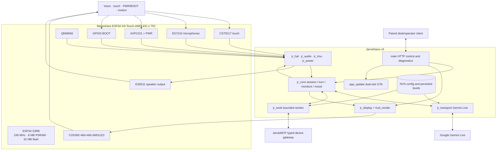
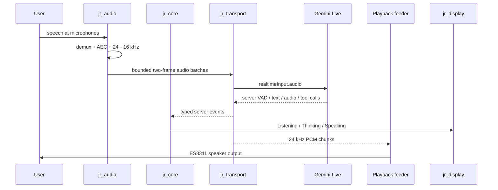
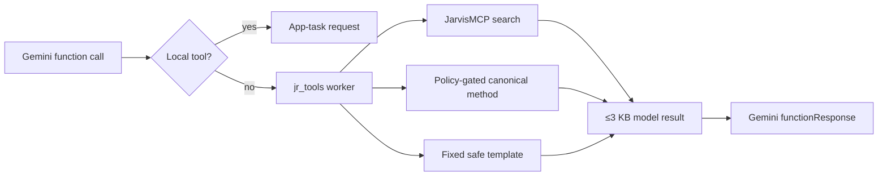
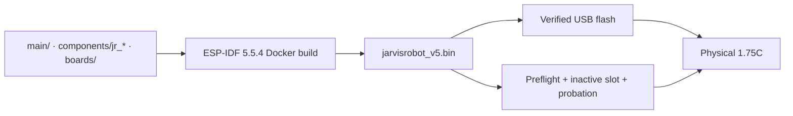

# Architecture

> **Live target:** plain ESP-IDF v5 on the Waveshare
> ESP32-S3-Touch-AMOLED-1.75C. Last reconciled: **2026-08-28**.

The release composition is rooted in `main/`, `components/jr_*`, and the selected
board definition. `firmware/`, `esp-claw/`, and the older dashboard are not
part of the image produced by `scripts/build-v5.sh`.

## System overview

```mermaid
flowchart TB
    Human[Voice · touch · PWR/BOOT · motion]

    subgraph Board[Waveshare ESP32-S3-Touch-AMOLED-1.75C]
        S3[ESP32-S3R8<br/>240 MHz · 8 MB PSRAM · 32 MB flash]
        Mic[ES7210 microphones]
        DAC[ES8311 speaker output]
        Screen[CO5300 466×466 AMOLED]
        Touch[CST9217 touch]
        IMU[QMI8658]
        PMIC[AXP2101 + PWR]
        Boot[GPIO0 BOOT]
    end

    subgraph Runtime[JarvisNano v5]
        HAL[jr_hal · jr_audio · jr_imu · jr_power]
        Core[jr_core session / turn / monitors / mood]
        Voice[jr_transport Gemini Live]
        Tools[jr_tools bounded worker]
        Display[jr_display + hud_render]
        HTTP[main HTTP control and diagnostics]
        OTA[app_update dual-slot OTA]
        NVS[(NVS config and persisted levels)]
    end

    Gemini[Google Gemini Live]
    MCP[JarvisMCP typed device gateway]
    Desk[Paired desk/operator client]

    Human --> Touch --> HAL
    Human --> Mic --> HAL
    Human --> PMIC --> HAL
    Human --> Boot --> HAL
    IMU --> HAL
    HAL --> Core
    Core <--> Voice <--> Gemini
    Core <--> Tools <--> MCP
    Core --> Display --> Screen --> Human
    Core --> HAL --> DAC --> Human
    NVS --> Voice
    NVS --> Tools
    Desk <--> HTTP
    HTTP --> Core
    HTTP --> Display
    HTTP --> OTA
```

## Ownership and tasks

The runtime is intentionally single-owner at every load-bearing boundary.

| Owner | Responsibility |
|---|---|
| `jr_voice` | `jr_orch_step`, Gemini events/commands, physical input policy, mood, privacy, level requests |
| `websocket_task` | TLS/WebSocket transport events only |
| `jr_pb_feed` | Drain bounded playback ring into `esp_codec_dev_write` |
| `gfx_render` | Decode/render one display frame and submit synchronous DMA strips |
| `jr_present` | Load/cache face assets and apply the latest requested face/bucket |
| `jr_tools` | Execute one bounded local/JarvisMCP job and publish a bounded result |
| `httpd` | Parse/authenticate requests and post bounded commands; never own realtime state |
| `jr_imu` / `jr_power` | Publish non-blocking sensor snapshots |

The composition root owns concrete wiring. Pure `jr_core` code does not call
ESP-IDF, touch, audio, display, HTTP, or network APIs.

## Voice path

The 1.75C shares one 24 kHz I²S clock between ES7210 capture and ES8311 playback.
Capture is read as four TDM lanes, demultiplexed, and downsampled 24→16 kHz for
AEC/VAD/Gemini input. Gemini output remains native 24 kHz PCM.

```mermaid
sequenceDiagram
    participant U as User
    participant A as jr_audio
    participant C as jr_core
    participant T as jr_transport
    participant G as Gemini Live
    participant P as Playback feeder
    participant D as jr_display

    U->>A: speech at microphones
    A->>A: demux + AEC + 24→16 kHz
    A->>T: bounded two-frame audio batches
    T->>G: realtimeInput.audio
    G-->>T: server VAD / text / audio / tool calls
    T-->>C: typed server events
    C->>D: Listening / Thinking / Speaking
    T-->>P: 24 kHz PCM chunks
    P->>U: ES8311 speaker output
```

Gemini server VAD owns native turn boundaries and interruption semantics. Local
RMS/VAD remains observability and pacing input; local barge is disabled unless a
measured fallback is deliberately enabled. Uplink backpressure is buffered in a
bounded PSRAM queue; a transient full TCP window is not treated as a socket
death.

## Physical input policy

Touch reports tap, long press, and four-way swipe events with original/end
coordinates and synthetic provenance. There is one production gesture path:

| Input | Action |
|---|---|
| PWR short | Listen/wake only |
| PWR long | Battery/charging status |
| BOOT short after boot | Controls open/close |
| BOOT hold 1.5–5 s after boot | Visible 60-second pairing claim window |
| BOOT held during reset | ROM downloader |
| Left-edge vertical | Volume |
| Right-edge vertical | Brightness |
| Horizontal swipe | Move temporary side spaces |
| Top-edge down | Controls |
| Centre up | Detail or controls close |
| Double tap | Jarvis Home |
| Glass hold | Physical privacy |
| Sustained face-down / face-up | Enter flip privacy / clear only a flip-origin mute |

Top-edge down outranks edge-level handling. Vertical edge intent is accepted only
after the swipe classifier selects UP/DOWN, so horizontal navigation remains
unchanged. Synthetic input may test benign routing but cannot clear privacy,
approve consent, answer asks, or escape operator ownership.

## Display path

There is one display engine. Baked `rwave_*.eaf` assets provide the reactor face;
`hud_render` and `jr_display` add battery, privacy, captions, choices, Watch,
controls, side spaces, and operator state in measured negative space.

The render task uses 12-row internal-DMA strips. The listening tell is a sparse
precomputed halo rather than a full procedural annulus; settled Jarvis and Watch
hold roughly 15–16 FPS on the live panel. Controls are more expensive and remain
an explicit optimization item in `PLAN.md`.

Snapshot routes are software mirrors of submitted RGB565—not panel readback:

| Route | Meaning |
|---|---|
| `/api/display` | Presenter health/counters |
| `/api/display/snapshot.json` | Mirror metadata and freshness |
| `/api/display/snapshot.ppm` | Exact submitted software frame |

## Tool path

Gemini sees a fixed, bounded tool catalog plus `search_tools` and
`execute_tool`. Local level tools are handled in firmware. Other work runs on the
`jr_tools` worker and uses a dedicated JarvisMCP device route.

```mermaid
flowchart LR
    Call[Gemini function call] --> Local{Local tool?}
    Local -->|yes| App[App-task request]
    Local -->|no| Worker[jr_tools worker]
    Worker --> Fixed[Fixed safe template]
    Worker --> Search[JarvisMCP search]
    Worker --> Execute[Policy-gated canonical method]
    Search --> Result[≤3 KB model result]
    Execute --> Result
    Fixed --> Result
    Result --> Reply[Gemini functionResponse]
```

The server denies unknown, destructive, executable, credential, site-scoped,
and unclassified capabilities. Device response projection must also fit the
3,072-byte Gemini result slot; cursor-aware byte budgeting remains active work.

## HTTP and authority

`main/main.c` is the live route authority. The root page and coarse hardware
counters are available on a trusted development LAN. Content-bearing reads and
mutating routes require the proof named for that surface—pairing token, control
header, or both—in [`PROTOCOL.md`](PROTOCOL.md).

Physical authority is stronger than remote control:

- Remote input is tagged synthetic.
- Remote resume never clears physical hold/flip privacy.
- Consent accepts only physical post-prompt taps.
- Operator mode has a physical double-tap escape.
- OTA cannot override deliberate privacy state.

See [`PROTOCOL.md`](PROTOCOL.md) for the route/auth matrix.

## Memory discipline

Internal contiguous RAM—not total PSRAM—is the binding resource for TLS/AES,
DMA, and task creation. Large queue payloads, logs, snapshots, audio taps, and
worker stacks live in PSRAM. Display DMA buffers remain internal.

Runtime gates refuse optional work when:

- largest internal block is below 8 KB;
- PSRAM is below 2 MB;
- display is unstable;
- OTA power/network/slot preflight fails.

No failure path may allocate unbounded retries, queue unbounded work, or reboot
merely because a diagnostic counter increased.

## OTA and release boundary

The 32 MB partition table has two 4 MB application slots. OTA writes only the
inactive slot, then boots under a probation window that requires voice, network,
tools, HTTP, wake, and display progress before marking the image valid.

Trusted-LAN OTA is operational. Public release still requires signed images,
authenticated encrypted upload, attended at-rest credential protection, and an
exact third-party notice bundle. Secure Boot, anti-rollback, flash encryption,
and eFuses remain separately attended hardware operations.

## Build boundary

```mermaid
flowchart LR
    Source[main/ · components/jr_* · boards/]
    Docker[ESP-IDF 5.5.4 Docker build]
    Image[jarvisrobot_v5.bin]
    USB[Verified USB flash]
    OTA[Preflight + inactive slot + probation]
    Device[Physical 1.75C]

    Source --> Docker --> Image
    Image --> USB --> Device
    Image --> OTA --> Device
```

Use [`BUILD.md`](BUILD.md), [`RELEASE_CHECKLIST.md`](RELEASE_CHECKLIST.md), and
[`../PLAN.md`](../PLAN.md) for commands, gates, and incomplete work.
