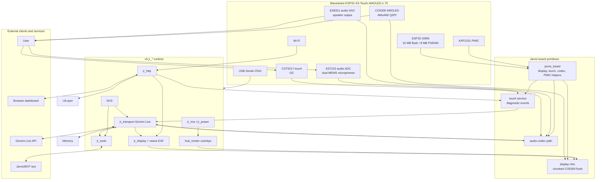
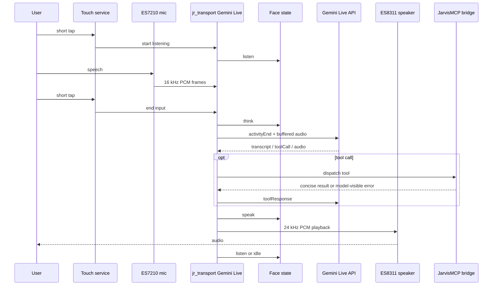
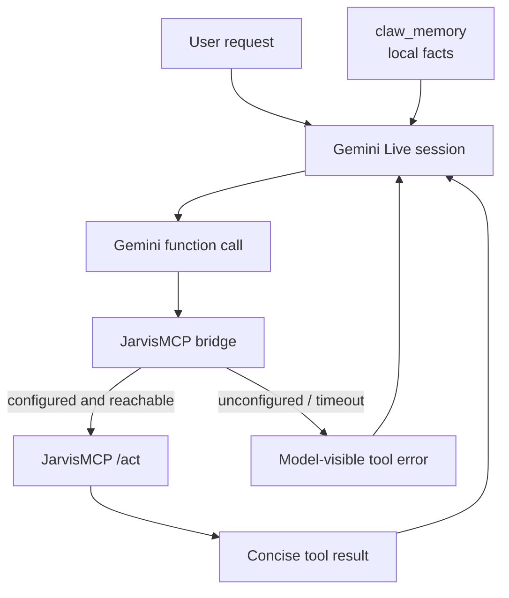
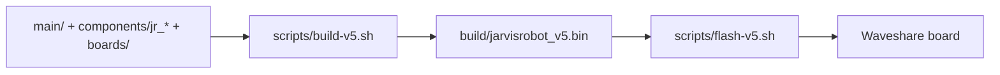

# Architecture

> **Live stack (2026-08-14):** v5 is a plain ESP-IDF app at `main/` +
> `components/jr_*`. Root `CMakeLists.txt` does **not** compile `firmware/` or
> `esp-claw/`. The diagram below still names the roles (voice, face, HTTP,
> tools). Implementation names on v5 are `jr_audio`, `jr_display`,
> `jr_transport` / Gemini Live, `jr_http`, `jr_imu`, `jr_power`. See
> [`BUILD.md`](BUILD.md) and [`JARVISNANO_OS_PLAN.md`](JARVISNANO_OS_PLAN.md).

JarvisNano is organized around the Waveshare ESP32-S3-Touch-AMOLED-1.75
desktop assistant path. The older XIAO/camera track remains in-tree, but it
does not define the v1 release architecture.

## Release Architecture

```mermaid
flowchart TB
    subgraph HW[Waveshare ESP32-S3-Touch-AMOLED-1.75]
        S3[ESP32-S3R8<br/>16 MB flash / 8 MB PSRAM]
        AMOLED[CO5300 AMOLED<br/>466x466 QSPI]
        TOUCH[CST9217 touch<br/>I2C]
        ADC[ES7210 audio ADC<br/>dual MEMS microphones]
        DAC[ES8311 audio DAC<br/>speaker output]
        PMIC[AXP2101 PMIC]
        USB[USB-Serial-JTAG]
        WIFI[Wi-Fi]
    end

    subgraph BSP[Jarvis board primitives]
        Board[jarvis_board<br/>display, touch, codec, PMIC helpers]
        DisplayHAL[display HAL<br/>chunked CO5300 flush]
        TouchSvc[touch service<br/>diagnostic events]
        AudioSvc[audio codec path]
    end

    subgraph Runtime[v5 jr_* runtime]
        Gemini[jr_transport Gemini Live]
        Face[jr_display + rwave EAF]
        HUD[hud_render overlays]
        HTTP[jr_http]
        Config[NVS]
        Tools[jr_tools]
        IMU[jr_imu / jr_power]
    end

    subgraph External[External clients and services]
        GeminiAPI[Gemini Live API]
        MCP[JarvisMCP /act]
        Browser[Browser dashboard]
        Human[User]
    end

    S3 --> Board
    AMOLED --> DisplayHAL
    TOUCH --> TouchSvc
    ADC --> AudioSvc
    DAC --> AudioSvc
    PMIC --> Board
    USB --> Runtime
    WIFI --> HTTP
    Board --> DisplayHAL
    Board --> TouchSvc
    Board --> AudioSvc
    TouchSvc --> Gemini
    AudioSvc --> Gemini
    Gemini <--> GeminiAPI
    Gemini --> AudioSvc
    Gemini --> Face
    Gemini <--> Memory
    Gemini <--> Tools
    Tools <--> MCP
    Config --> Gemini
    Config --> Tools
    Face --> DisplayHAL
    HUD --> DisplayHAL
    IMU --> HUD
    HTTP <--> Browser
    HTTP --> Face
    HTTP --> UILayer
    HTTP --> TouchSvc
    Human --> TOUCH
    Human --> ADC
    DAC --> Human
    AMOLED --> Human
```

## Display Ownership

v5 has one compositor. Baked `rwave_*.eaf` faces are the reactor art.
`hud_render` draws only in the measured negative space (thinking comet,
battery rim, choice arcs, captions). There is no `ui_layer` and no display
arbiter. D1 in `JARVISNANO_OS_PLAN.md` killed the LVGL split.

Snapshot routes report software mirrors, not physical panel readback:

| Route | Source | Use |
|---|---|---|
| `/api/display` | display health | Fast check |
| `/api/display/snapshot.json` | submission-mirror metadata | Freshness / size |
| `/api/display/snapshot.ppm` | software mirror | Face + overlay screenshot |

`panel_readback:false` is intentional. If the panel and snapshot disagree, the
bug is in the compositor or the flush path, not a second owner. There is no
`/api/ui/snapshot.ppm` on v5.

## Voice Turn

Gemini Live is the primary loop. v5 is always-ready listen (`VOICE_ALWAYS_READY`),
not tap-to-talk first. Playback is locked to the 16 kHz capture clock.

```mermaid
sequenceDiagram
    participant U as User
    participant T as Touch service
    participant A as ES7210 mic
    participant GL as jr_transport Gemini Live
    participant F as Face state
    participant G as Gemini Live API
    participant S as ES8311 speaker
    participant M as JarvisMCP bridge

    U->>T: short tap
    T->>GL: start listening
    GL->>F: listen
    U->>A: speech
    A->>GL: 16 kHz PCM frames
    U->>T: short tap
    T->>GL: end input
    GL->>F: think
    GL->>G: activityEnd + buffered audio
    G-->>GL: transcript / toolCall / audio
    opt tool call
        GL->>M: dispatch tool
        M-->>GL: concise result or model-visible error
        GL->>G: toolResponse
    end
    GL->>F: speak
    GL->>S: 24 kHz PCM playback
    S-->>U: audio
    GL->>F: listen or idle
```

Known face states are intentionally small:

| Public value | Meaning |
|---|---|
| `idle` | Ready, not currently listening |
| `listen` | Capturing user input |
| `think` | Waiting for Gemini or a tool result |
| `speak` | Playing model audio |
| `error` | Recoverable fault |
| `sleep` | Dismissed or inactive |

## Config And Secrets

Runtime secrets are NVS values. They are not source files, sample configs, or
generated firmware defaults.

```mermaid
flowchart LR
    Browser[Dashboard or setup script]
    Token[X-JarvisNano-Token]
    ConfigAPI[/api/config]
    NVS[(NVS app namespace)]
    GeminiKey[Gemini key<br/>masked on readback]
    MCPURL[JarvisMCP URL<br/>masked/read protected]
    MCPKey[JarvisMCP key<br/>masked on readback]
    Pairing[Pairing token<br/>never displayed raw]
    Tools[/api/tools/status]

    Browser --> Token
    Token --> ConfigAPI
    Browser --> ConfigAPI
    ConfigAPI --> NVS
    NVS --> GeminiKey
    NVS --> MCPURL
    NVS --> MCPKey
    NVS --> Pairing
    NVS --> Tools
    Tools --> Browser
```

For public builds, reads can remain open on a trusted LAN. Writes and control
routes need pairing-token protection. Protected routes include config writes,
restart/control, Gemini control, touch injection, JarvisMCP config, and
destructive file actions.

## Memory And Tools

`claw_memory` remains on-device for local assistant memory. It must not extract
or store secrets. JarvisMCP is the v1 tool execution path:

```mermaid
flowchart TB
    User[User request]
    Gemini[Gemini Live session]
    Memory[claw_memory<br/>local facts]
    ToolCall[Gemini function call]
    Bridge[JarvisMCP bridge]
    MCP[JarvisMCP /act]
    Result[Concise tool result]
    Failure[Model-visible tool error]

    User --> Gemini
    Memory --> Gemini
    Gemini --> ToolCall
    ToolCall --> Bridge
    Bridge -->|configured and reachable| MCP
    MCP --> Result
    Bridge -->|unconfigured / timeout| Failure
    Result --> Gemini
    Failure --> Gemini
```

Unconfigured or unreachable JarvisMCP must not crash or wedge the live session.
It returns a short failure result to the model.

## Build Boundary

Canonical v5 sources are `main/`, `components/jr_*`, and `boards/`.
`scripts/build-v5.sh` runs pinned ESP-IDF 5.5.4 in Docker and produces
`build/jarvisrobot_v5.bin`. `firmware/` + `scripts/bootstrap.sh` + ignored
`esp-claw/` is the leftover overlay and is not this image.

```mermaid
flowchart LR
    Canonical[main/ + components/jr_* + boards/]
    Build[scripts/build-v5.sh]
    Image[build/jarvisrobot_v5.bin]
    Flash[scripts/flash-v5.sh]
    Device[Waveshare board]

    Canonical --> Build
    Build --> Image
    Image --> Flash
    Flash --> Device
```

## Post-v1 Tracks

- BSP/LVGL migration only after direct CO5300 display, touch, voice, and
  diagnostics stay green.
- Android/BLE after firmware service stability.
- Battery/enclosure polish after USB desktop v1 ships.
- Camera/XIAO parity after Waveshare voice/display release candidate.
