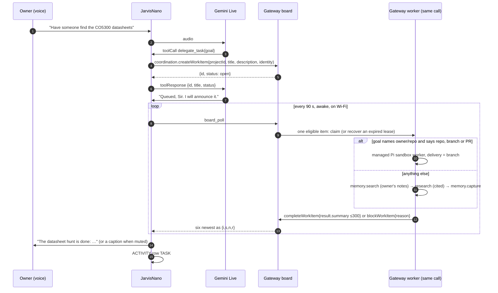

# JARVIS Brain Architecture — personal on-device self + company-brain access

> Status: May 2026 design sketch, reconciled with live v5 on 2026-08-27.
> Current truth is `jr_tools` + [`PROTOCOL.md`](PROTOCOL.md). The 1.75C has no
> SD card or Lua runtime in the v5 composition.

## Core principle: thin durable body, evolving brain

The ESP32-S3 cannot run a capable model on-chip (local "AI" tops out at
wake-words / tiny classifiers). So intelligence is split, and **everything that
evolves lives off the constrained device**:

| Layer | Where | Live role | Evolves by |
|-------|-------|-----------|-----------|
| **Senses + body** | device | mic, speaker, AMOLED, touch, motion, power state | dual-slot OTA |
| **Personal state** | NVS today | bounded settings and secrets; no narrative memory yet | paired writes |
| **Reasoning** | Gemini Live | speech, reasoning, and fixed tool declarations | server/model update |
| **Company brain** | JarvisMCP device gateway | bounded on-demand shared knowledge/tools | server-side capability |

## Personal memory on the 1.75C

The C revision has no microSD. The 32 MB partition table contains an unused
FAT partition, but v5 does not mount it and therefore does not claim durable
personal narrative memory. Identity/context injection and approved write-back
remain product work. The storage decision must include wear limits, corruption
recovery, data bounds, and a pairing/consent contract before code lands.

The original 1.75’s `/sdcard` and the legacy esp-claw Lua skill engine are
compatibility-track facilities, not live 1.75C capabilities.

## Company brain (reached, not stored)

The live device reaches a bounded JarvisMCP device gateway
(`/device/v1/invoke`, with legacy `/act` compatibility). It queries shared
knowledge on demand rather than carrying the company vault on-device.

## Evolution layers (easiest → hardest)

1. **Server-side tools** — the current device advertises a fixed bounded
   catalogue. A dynamic signed/allowlisted manifest remains future work.
2. **Durable personal memory** — assign the internal FAT partition a bounded
   product role, then inject approved context at session start.
3. **OTA self-update** — live: 32 MB layout, `ota_0`/`ota_1`, streaming upload,
   boot selection, and a post-init validity checkpoint. Bootloader rollback
   becomes effective after the rollback-enabled bootloader is installed.
4. **Self-heal loop** — future: diagnose from counters/log receipts, apply a
   bounded config repair, or schedule a signed OTA.

## Hands elsewhere: the delegation loop (2026-09-02)

The device never runs the work, and since the evening of 2026-09-02 no
other host does either. A spoken job becomes one work item on the durable
coordination board; the device's own 90-second poll is the scheduler's
heartbeat, and the gateway does the work inside that same call; the device
announces the result. Two rules carry the design: the tool returns in one
round trip (the 30 s sandbox and the unanswered-utterance watchdog both
forbid waiting), and the result comes back by the device's own poll, so
nothing ever needs a route into the device.

- **Device:** `delegate_task(goal)` and `delegated_tasks()` are projected
  templates in `components/jr_tools`; `board_poll` is the device-owned job
  (`main/device_tools.c`, `JR_TOOLS_SESSION_ANY`) whose program claims and
  settles one item per poll (a research item measured 21 s against the
  gateway's 30 s cap), then lists the six most recently touched items and
  announces a completed or blocked one once, a 16-entry ring of ids deduping
  across polls. The first poll after boot only seeds the ring. The project
  id is `project_id` in `POST /api/tools/config` (default `jarvisnano-desk`),
  spliced into the templates as a literal.
- **Two kinds of hands.** A goal that names `owner/repo` and says repo,
  branch or PR goes to the gateway's managed Pi sandbox worker, which owns
  the model and GitHub credentials and delivers a branch; the repository
  must be on the gateway's allowlist or the item is blocked with that
  reason. Everything else is answered by the gateway's cited research agent,
  with the top three hits from the owner's own notes prepended as context,
  the full answer filed into the company brain under `jarvisnano-desk`, and
  the first 300 characters spoken.
- **Failure is a blocked item, never silence.** Any error blocks the item
  with the reason; a lease that expires mid-run (the gateway killed the call)
  is recovered on a later poll with evidence, per the board's own policy.
- **`tools/board-worker/worker.py`** remains as a reference for a worker on a
  machine with a coding agent, for jobs the gateway cannot do. It is not
  required for any of the above.
- **Persona:** one rule, in `compose_system_instruction`: answer now what
  one tool call answers; delegate what needs a browser, a repository, a
  document, or several steps; never delegate what can be answered now.

### Open-source device, private gateway

JarvisNano is public; the gateway it talks to is not. The line between them
is a contract, and the repository depends only on the contract:

- **Transport:** one HTTPS endpoint that accepts a JavaScript program and
  returns its JSON result, authenticated by a bearer. Both live in the
  device's NVS (`POST /api/tools/config`), never in the repository.
- **Services the device names**, all by method name only:
  `websearch`, `weather`, `wiki`, `time`, `crypto`, `stocks`, `research`,
  `memory.search` / `memory.capture`, `coordination.{createWorkItem,
  listWorkItems, claimWorkItem, recoverWorkItem, reportProgress,
  completeWorkItem, blockWorkItem}`, and optionally
  `sandboxes.workerSubmit`. The device's allowlist and deny prefixes are its
  own policy (`components/jr_tools/src/jr_tools_templates.c`).
- **What another gateway must provide** to run this firmware unchanged: the
  execute endpoint, a `jarvis` object with those methods and the result
  shapes the templates read (`answer`, `sources[]`, `id`, `status`,
  `leaseState`, `resultSummary`), and a 30-second call budget or better.
  Everything else in JarvisMCP (its catalog, hosts, credentials, sandbox
  fleet) is implementation, and none of it appears here.

## Open questions for the user
- Autonomy: does he write to his own memory freely, or propose for approval?
- One device vs. a fleet sharing one company brain.
- Security: signing for OTA images + auth boundary for the tool manifest.

## What exists now

Live v5 has direct Gemini voice, ten bounded tools (two of them the board),
Brain/Desk surfaces, a 128 KB PSRAM log ring, dual-slot OTA, NVS configuration,
and the unused internal FAT partition. Missing pieces are durable personal
memory, dynamic tool manifests, signed OTA policy, and a server-side self-heal
coordinator.
