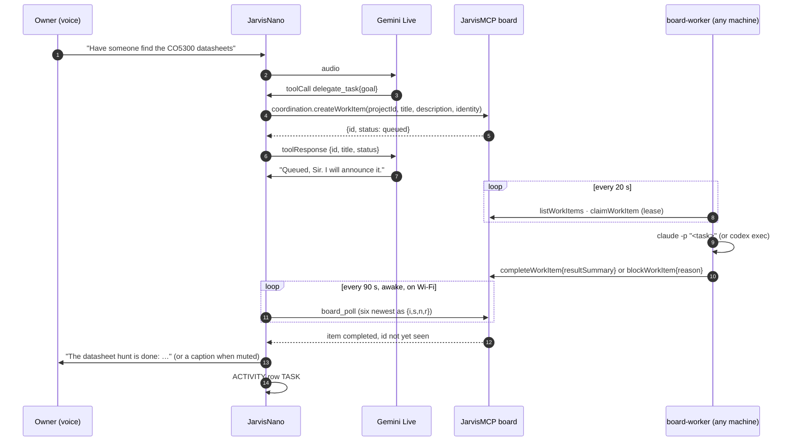

# JARVIS Brain Architecture — personal on-device self + company-brain access

> Status: May 2026 design sketch, reconciled with live v5 on 2026-08-27.
> Current truth is `jr_tools` + [`PROTOCOL.md`](PROTOCOL.md). The 1.75C has no
> SD card or Lua runtime in the v5 composition.

## Core principle: thin durable body, evolving brain

The ESP32-S3 cannot run a capable model on-chip (local "AI" tops out at
wake-words / tiny classifiers). So intelligence is split, and **everything that
evolves lives off the constrained device**:

| Layer | Where | Live role | Evolves by |
|-------|-------|-----------|-----------|
| **Senses + body** | device | mic, speaker, AMOLED, touch, motion, power state | dual-slot OTA |
| **Personal state** | NVS today | bounded settings and secrets; no narrative memory yet | paired writes |
| **Reasoning** | Gemini Live | speech, reasoning, and fixed tool declarations | server/model update |
| **Company brain** | JarvisMCP device gateway | bounded on-demand shared knowledge/tools | server-side capability |

## Personal memory on the 1.75C

The C revision has no microSD. The 32 MB partition table contains an unused
FAT partition, but v5 does not mount it and therefore does not claim durable
personal narrative memory. Identity/context injection and approved write-back
remain product work. The storage decision must include wear limits, corruption
recovery, data bounds, and a pairing/consent contract before code lands.

The original 1.75’s `/sdcard` and the legacy esp-claw Lua skill engine are
compatibility-track facilities, not live 1.75C capabilities.

## Company brain (reached, not stored)

The live device reaches a bounded JarvisMCP device gateway
(`/device/v1/invoke`, with legacy `/act` compatibility). It queries shared
knowledge on demand rather than carrying the company vault on-device.

## Evolution layers (easiest → hardest)

1. **Server-side tools** — the current device advertises a fixed bounded
   catalogue. A dynamic signed/allowlisted manifest remains future work.
2. **Durable personal memory** — assign the internal FAT partition a bounded
   product role, then inject approved context at session start.
3. **OTA self-update** — live: 32 MB layout, `ota_0`/`ota_1`, streaming upload,
   boot selection, and a post-init validity checkpoint. Bootloader rollback
   becomes effective after the rollback-enabled bootloader is installed.
4. **Self-heal loop** — future: diagnose from counters/log receipts, apply a
   bounded config repair, or schedule a signed OTA.

## Hands elsewhere: the delegation loop (2026-09-02)

The device never runs the work. A spoken job becomes one work item on the
durable coordination board; a worker on any machine with a coding agent
claims it; the device announces the result. Two rules carry the design:
the tool returns in one round trip (the 30 s sandbox and the unanswered-
utterance watchdog both forbid waiting), and the result comes back by the
device's own poll, so no worker ever needs a route into the device.

- **Device:** `delegate_task(goal)` and `delegated_tasks()` are projected
  templates in `components/jr_tools`; `board_poll` is the device-owned job
  (`main/device_tools.c`, `JR_TOOLS_SESSION_ANY`) that lists the six most
  recently touched items and announces a completed or blocked one once, a
  16-entry ring of ids deduping across polls. The first poll after boot only
  seeds the ring. The project id is `project_id` in `POST /api/tools/config`
  (default `jarvisnano-desk`), spliced into the templates as a literal.
- **Worker:** `tools/board-worker/worker.py`, standard library, three
  environment variables, one lease at a time. It is the contract's other
  end, not a fleet.
- **Persona:** one rule, in `compose_system_instruction`: answer now what
  one tool call answers; delegate what needs a browser, a repository, a
  document, or several steps; never delegate what can be answered now.

## Open questions for the user
- Autonomy: does he write to his own memory freely, or propose for approval?
- One device vs. a fleet sharing one company brain.
- Security: signing for OTA images + auth boundary for the tool manifest.

## What exists now

Live v5 has direct Gemini voice, ten bounded tools (two of them the board),
Brain/Desk surfaces, a 128 KB PSRAM log ring, dual-slot OTA, NVS configuration,
and the unused internal FAT partition. Missing pieces are durable personal
memory, dynamic tool manifests, signed OTA policy, and a server-side self-heal
coordinator.
