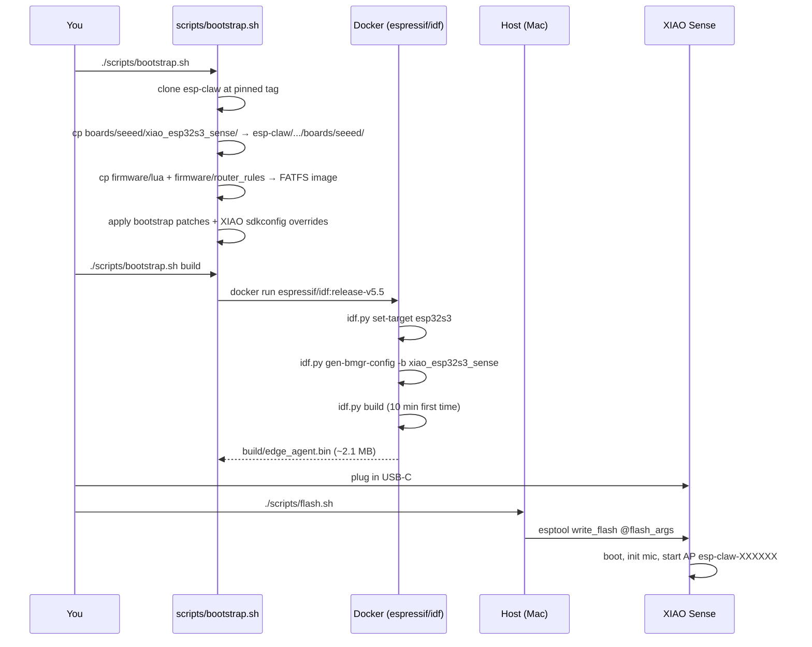

# Build & Flash

There are **two install paths**:

| Path | What you need | Best for |
| --- | --- | --- |
| **A. Browser flasher (no CLI)** | Chrome / Edge + a USB-C cable | End users. Click → install. No esptool, no Docker. |
| **B. Local build + flash** | Docker, Python 3, Git | Developers iterating on firmware. |

## Path A — Browser flasher

1. Open [`dashboard/index.html`](../dashboard/index.html) — either from this repo's `python3 -m http.server` or from any deploy target.
2. Click the **Flash** tab.
3. Plug in the XIAO Sense holding the **BOOT** button. Click **Install**. Pick the `/dev/cu.usbmodem*` (macOS / Linux) or `COM*` (Windows) port.
4. Wait ~30 s. The merged 7.6 MB firmware bundle (`dashboard/firmware/jarvis-xiao-esp32s3-sense.bin`) is written via WebSerial.
5. The device reboots, broadcasts `esp-claw-XXXXXX`. Visit [`dashboard/onboard.html`](../dashboard/onboard.html) and walk through the 5-step wizard.

Browser support note: Web Serial only works on Chromium browsers (Chrome, Edge, Brave, Arc, Opera). **Safari and Firefox don't support Web Serial** — use one of the Chromium browsers if the Install button is greyed out.

---

## Path B — Local build + flash

The full pipeline runs in Docker, so you only need:
- macOS / Linux / Windows + WSL
- Docker Desktop
- Python 3 + `pip` (for `esptool` on the host — flashing happens outside Docker because Docker Desktop on macOS doesn't pass USB through)
- Git

Android companion builds are separate from the firmware flow. See
[`android/README.md`](../android/README.md) for JDK, Gradle, and Android SDK
requirements.

The XIAO doesn't need to be plugged in for the build, only for the flash step.



## Step-by-step

### 1. Clone

```bash
git clone git@github.com:PascalAI2024/JarvisNano.git
cd JarvisNano
```

### 2. Bootstrap

```bash
./scripts/bootstrap.sh
```

This:
1. Clones `espressif/esp-claw` into `esp-claw/` (gitignored) at the pinned `ESP_CLAW_REF` in `scripts/bootstrap.sh`.
2. Copies `boards/seeed/xiao_esp32s3_sense/` into the upstream tree.
3. Copies `firmware/lua/*.lua` and `firmware/router_rules/router_rules.json` into the upstream FATFS image so prototype scripts and router rules are baked into flash.
4. Applies `patches/0001-fix-pdm-rx-hp-filter-cap.patch` to
   `managed_components/espressif__esp_board_manager/peripherals/periph_i2s/periph_i2s.py`.
5. Applies the local Phase-2 HTTP/camera/Wi-Fi patches used by the dashboard and onboarding flow.
6. Patches a native GPIO21 status LED task into `edge_agent/main.c` so the physical board shows boot/alive state after core services are online, without starting a long-running Lua job.
7. During `build`, forces the 8 MB flash profile and disables the App Claw interactive serial REPL for the XIAO build. USB serial logs stay enabled; only the heap-heavy command shell is skipped.
8. Fails clearly if the pinned upstream tree drifts in a way that prevents required managed components or patches from applying.

### 3. Build inside Docker

```bash
./scripts/bootstrap.sh build
```

First build pulls the `espressif/idf:release-v5.5` image (~13 GB) and
takes 8–15 minutes. Subsequent builds reuse `application/edge_agent/build/`
and finish in 30–60 seconds for incremental edits.

If you want a clean rebuild:
```bash
rm -rf esp-claw/application/edge_agent/build esp-claw/application/edge_agent/components/gen_bmgr_codes
./scripts/bootstrap.sh build
```

### 4. Flash from host

```bash
ls /dev/cu.usbmodem*    # confirm enumeration
./scripts/flash.sh
```

If nothing shows up, hold the **BOOT** button while plugging in to force download mode.

The script wraps `esptool.py write_flash` with the addresses esp-claw's
build emits. By default it flashes bootloader, partition table, OTA data, and
the app while preserving the FATFS `storage` partition so Wi-Fi and LLM
configuration survive firmware iteration. Pass `STORAGE=1 ./scripts/flash.sh`
for first install, partition-layout changes, or a deliberate provisioning wipe.

After a build, run the post-build smoke check:

```bash
./scripts/smoke-build.sh
```

It records the pinned esp-claw commit, app/storage image sizes, and expected
firmware/FATFS strings in `.build_logs/smoke-build.txt`.

For manual flashing during firmware iteration:

```bash
cd esp-claw/application/edge_agent/build
python3 -m esptool --chip esp32s3 -p /dev/cu.usbmodem1101 -b 460800 \
  --before default_reset --after hard_reset write_flash @flash_args
```

### 5. Talk to it

After flashing, the XIAO reboots and broadcasts an open Wi-Fi AP named
`esp-claw-XXXXXX` (the `XXXXXX` is the last 3 bytes of the MAC). Join it
from your phone or laptop, browse to **http://192.168.4.1/** (or open
[`dashboard/onboard.html`](../dashboard/onboard.html) — the 5-step wizard), and
configure:

- Your home Wi-Fi SSID + password
- An LLM provider (OpenAI / Anthropic / **MiniMax-M2.7** / Qwen / Ollama / custom endpoint) + API key + model
- Optionally a Telegram bot token, or just use the built-in **Web IM**

The device reboots onto your LAN. Find it again at
**http://esp-claw.local/** (mDNS) — the [Cockpit dashboard](../dashboard/index.html)
takes over from there.

Developer note: current firmware keeps the provisioning AP active only while
joining Wi-Fi. Once STA receives an IP it switches to STA-only mode to avoid
AP+STA single-radio reachability problems on some routers. Serial should show
`STA connected; provisioning AP stopped for LAN reachability`, and
`/api/status` should report `ap_active:false`.

## Monitoring serial output

`esp-idf-monitor` is feature-rich but laggy on macOS over USB-Serial-JTAG.
Faster alternatives:

```bash
# screen — built-in, snappy. Ctrl-A K to exit.
screen /dev/cu.usbmodem* 115200

# picocom — also snappy, easier exit (Ctrl-A Ctrl-X)
brew install picocom
picocom -b 115200 /dev/cu.usbmodem*

# minicom — familiar UX
brew install minicom
minicom -D /dev/cu.usbmodem* -b 115200
```

For decoded panic backtraces / GDB stub interception, `esp-idf-monitor`
is still worth keeping for emergencies:
```bash
pip install --user esp-idf-monitor
python -m esp_idf_monitor -p /dev/cu.usbmodem*
```

## HTTP reachability matrix

When the board boots but the dashboard cannot reach it, test the cheapest
endpoint first across AP, STA IP, and mDNS:

```bash
./scripts/http-matrix.sh
```

By default it probes `192.168.4.1`, `192.168.50.80`, and `esp-claw.local`.
The matrix covers the cheap health/status path plus the endpoints used by
onboarding, settings, chat, telemetry, and camera diagnostics:

- `/api/health`
- `/api/status`
- `/api/config`
- `/api/webim/status`
- `/api/battery`
- `/api/audio/level`
- `/api/wifi/scan`
- `/api/camera/snapshot`
- `OPTIONS /api/status`
- WebSocket upgrade for `/ws/webim`

Override the host list when the board has a different STA IP:

```bash
./scripts/http-matrix.sh 192.168.1.42 esp-claw.local
```

If the first few endpoints pass but later probes time out, check for open
dashboard/browser tabs holding many connections to port 80. The firmware enables
HTTP LRU socket purge, shorter socket timeouts, and `Connection: close` on JSON
responses, but stale browser tabs can still make a small MCU look worse than it
is during matrix runs.

## Troubleshooting

| Symptom                                          | Fix                                                                                  |
| ------------------------------------------------ | ------------------------------------------------------------------------------------ |
| `idf.py: command not found` from your host shell | You're trying to run IDF outside Docker. Use `./scripts/bootstrap.sh build`.         |
| Build dies on `i2s_pdm_rx_slot_config_t … hp_en` | Codegen patch wasn't applied. Re-run `./scripts/bootstrap.sh`.                       |
| Flash fails: `serial.serialutil.SerialException` | Hold **BOOT** while plugging in, then release after the second beep / port appears.  |
| Boot loop / brownout                             | USB cable is power-only or the host port can't supply 500 mA. Try a different cable. |
| Boot log reaches `Starting console REPL`, then `Out of memory!` | Rebuild with current `scripts/bootstrap.sh`; it disables the App Claw interactive CLI for the XIAO while preserving USB logs. |
| AP never appears                                 | Wait 30 s — Wi-Fi calibration runs on first boot and adds latency.                   |
| `esp-claw.local` doesn't resolve                 | Some routers block mDNS. Use the IP address printed on serial instead.               |
