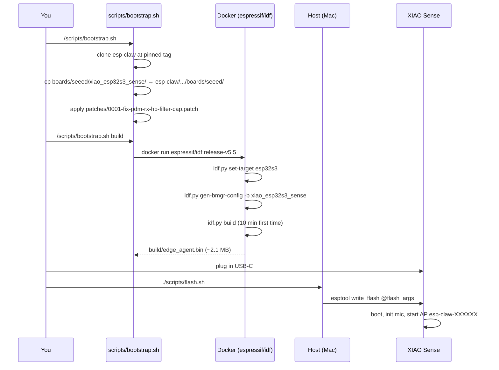

# Build & Flash

The full pipeline runs in Docker, so you only need:
- macOS / Linux / Windows + WSL
- Docker Desktop
- Python 3 + `pip` (for `esptool` on the host — flashing happens outside Docker because Docker Desktop on macOS doesn't pass USB through)
- Git

The XIAO doesn't need to be plugged in for the build, only for the flash step.



## Step-by-step

### 1. Clone

```bash
git clone git@github.com:PascalAI2024/JarvisNano.git
cd JarvisNano
```

### 2. Bootstrap

```bash
./scripts/bootstrap.sh
```

This:
1. Clones `espressif/esp-claw` into `esp-claw/` (gitignored).
2. Copies `boards/seeed/xiao_esp32s3_sense/` into the upstream tree.
3. Applies `patches/0001-fix-pdm-rx-hp-filter-cap.patch` to
   `managed_components/espressif__esp_board_manager/peripherals/periph_i2s/periph_i2s.py`.

### 3. Build inside Docker

```bash
./scripts/bootstrap.sh build
```

First build pulls the `espressif/idf:release-v5.5` image (~13 GB) and
takes 8–15 minutes. Subsequent builds reuse `application/edge_agent/build/`
and finish in 30–60 seconds for incremental edits.

If you want a clean rebuild:
```bash
rm -rf esp-claw/application/edge_agent/build esp-claw/application/edge_agent/components/gen_bmgr_codes
./scripts/bootstrap.sh build
```

### 4. Flash from host

```bash
ls /dev/cu.usbmodem*    # confirm enumeration
./scripts/flash.sh
```

If nothing shows up, hold the **BOOT** button while plugging in to force download mode.

The script wraps `esptool.py write_flash` with the addresses esp-claw's
build emits — bootloader, partition table, OTA data, the app, and the
FATFS `storage` blob (which holds Lua skills + memory).

### 5. Talk to it

After flashing, the XIAO reboots and broadcasts an open Wi-Fi AP named
`esp-claw-XXXXXX` (the `XXXXXX` is the last 3 bytes of the MAC). Join it
from your phone or laptop, browse to **http://192.168.4.1/**, and
configure:

- Your home Wi-Fi SSID + password
- An LLM provider (OpenAI / Anthropic / Qwen / DeepSeek / custom endpoint) + API key + model
- Optionally a Telegram bot token, or just use the built-in **Web IM**

The device reboots onto your LAN. Find it again at
**http://esp-claw.local/** (mDNS) and start chatting.

## Monitoring serial output

`esp-idf-monitor` is feature-rich but laggy on macOS over USB-Serial-JTAG.
Faster alternatives:

```bash
# screen — built-in, snappy. Ctrl-A K to exit.
screen /dev/cu.usbmodem* 115200

# picocom — also snappy, easier exit (Ctrl-A Ctrl-X)
brew install picocom
picocom -b 115200 /dev/cu.usbmodem*

# minicom — familiar UX
brew install minicom
minicom -D /dev/cu.usbmodem* -b 115200
```

For decoded panic backtraces / GDB stub interception, `esp-idf-monitor`
is still worth keeping for emergencies:
```bash
pip install --user esp-idf-monitor
python -m esp_idf_monitor -p /dev/cu.usbmodem*
```

## Troubleshooting

| Symptom                                          | Fix                                                                                  |
| ------------------------------------------------ | ------------------------------------------------------------------------------------ |
| `idf.py: command not found` from your host shell | You're trying to run IDF outside Docker. Use `./scripts/bootstrap.sh build`.         |
| Build dies on `i2s_pdm_rx_slot_config_t … hp_en` | Codegen patch wasn't applied. Re-run `./scripts/bootstrap.sh`.                       |
| Flash fails: `serial.serialutil.SerialException` | Hold **BOOT** while plugging in, then release after the second beep / port appears.  |
| Boot loop / brownout                             | USB cable is power-only or the host port can't supply 500 mA. Try a different cable. |
| AP never appears                                 | Wait 30 s — Wi-Fi calibration runs on first boot and adds latency.                   |
| `esp-claw.local` doesn't resolve                 | Some routers block mDNS. Use the IP address printed on serial instead.               |
