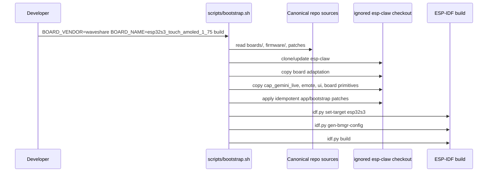

# Build And Flash

The primary v1 target is the **Waveshare ESP32-S3-Touch-AMOLED-1.75**. The
Seeed XIAO path remains available, but do not use the old XIAO defaults when
debugging the round AMOLED device.

## Install Paths

| Path | Target | Best for |
|---|---|---|
| Local build + `scripts/flash.sh` | Waveshare primary | Firmware development and release validation |
| Browser flasher | XIAO-era bundle unless updated | End-user no-CLI installs after a matching firmware bundle is published |

## Requirements

- Docker Desktop or a Linux Docker host.
- Python 3 on the host for flashing and diagnostics.
- Git.
- USB-C data cable.
- Waveshare ESP32-S3-Touch-AMOLED-1.75 board.

Flashing runs on the host because Docker Desktop on macOS does not pass the
native ESP32-S3 USB-Serial-JTAG device through cleanly.

## Build Waveshare Firmware

```bash
git clone git@github.com:PascalAI2024/JarvisNano.git
cd JarvisNano

BOARD_VENDOR=waveshare \
BOARD_NAME=esp32s3_touch_amoled_1_75 \
./scripts/bootstrap.sh build
```

The first build pulls the ESP-IDF Docker image and can take several minutes.
Incremental builds are much faster.

`bootstrap.sh` performs the important source sync:


```mermaid
sequenceDiagram
    participant U as Developer
    participant B as scripts/bootstrap.sh
    participant C as Canonical repo sources
    participant E as ignored esp-claw checkout
    participant I as ESP-IDF build

    U->>B: BOARD_VENDOR=waveshare BOARD_NAME=esp32s3_touch_amoled_1_75 build
    B->>C: read boards/, firmware/, patches
    B->>E: clone/update esp-claw
    B->>E: copy board adaptation
    B->>E: copy cap_gemini_live, emote, ui, board primitives
    B->>E: apply idempotent app/bootstrap patches
    B->>I: idf.py set-target esp32s3
    B->>I: idf.py gen-bmgr-config
    B->>I: idf.py build
```

Important: edit canonical files in this repo, not generated copies under
`esp-claw/`. Bootstrap overwrites selected generated files on every build.

## Flash Waveshare Firmware

```bash
./scripts/flash.sh
```

`flash.sh` reads the generated `flasher_args.json`, including the board flash
settings and partition offsets. It preserves storage by default so Wi-Fi,
Gemini, JarvisMCP, and pairing-token config survive normal iteration.

Use these modes deliberately:

```bash
# First install, partition change, or deliberate provisioning wipe.
STORAGE=1 ./scripts/flash.sh

# Bad saved config recovery.
ERASE_NVS=1 ./scripts/flash.sh

# Full blank-device release test.
ERASE_NVS=1 STORAGE=1 ./scripts/flash.sh
```

The Waveshare CO5300/QSPI display path requires DIO flash mode. Use the repo
scripts rather than a copied manual `esptool` command unless you are diagnosing
the flasher itself.

## USB Diagnostics First

The Waveshare board uses native ESP32-S3 USB-Serial-JTAG. Host reset-line
behavior can leave it in ROM download mode after a hard reset, where flashing
works but the app does not boot. The repo scripts avoid the common reset trap.

Use the monitor that does not toggle modem-control lines:

```bash
./scripts/usb-monitor.py --seconds 5 --send status
```

If you need to specify a port:

```bash
PORT=/dev/cu.usbmodem* ./scripts/flash.sh
./scripts/usb-monitor.py --port /dev/cu.usbmodem*
```

Expected good status includes boot stages through Wi-Fi/HTTP/app startup and a
stable uptime counter. If the serial log shows ROM download mode, unplug/replug
or flash again with the repo script.

## Configure Runtime Secrets

Do not put keys or local URLs in source. Configure them on the device through
NVS-backed `/api/config`.

Fields used by Waveshare v1:

| Field | Purpose |
|---|---|
| `llm_api_key` / `gemini_api_key` | Gemini Live key, depending on the active config path |
| `jarvis_mcp_url` | JarvisMCP `/act` endpoint |
| `jarvis_mcp_key` | JarvisMCP bearer token |
| `pairing_token` | Token for protected write/control routes |

Config readback must mask sensitive values. `/api/tools/status` reports whether
Gemini and JarvisMCP are configured without exposing the actual values.

## Live Device Checks

After the device is on Wi-Fi:

```bash
export JARVIS_DEVICE_HOST=<device-host>
scripts/live-device.py status --host "$JARVIS_DEVICE_HOST"
scripts/live-device.py report --host "$JARVIS_DEVICE_HOST"
scripts/live-device.py screen --host "$JARVIS_DEVICE_HOST" --save-sd
scripts/live-device.py gemini-cycle --host "$JARVIS_DEVICE_HOST" --text "Say one short sentence." --report
```

The display snapshot routes are software mirrors:

- `/api/display/snapshot.json` gives owner and mirror metadata.
- `/api/display/snapshot.ppm` captures the active display owner, normally emote.
- `/api/ui/snapshot.ppm` captures the UI framebuffer.

Use [LIVE_DEVICE_DEBUG.md](LIVE_DEVICE_DEBUG.md) for the full acceptance matrix.

## Smoke Check

After a build:

```bash
./scripts/smoke-build.sh
```

Before pushing:

```bash
git diff --check
./scripts/check-secrets.sh
```

## Browser Flasher Status

The dashboard WebSerial flasher is useful, but the current public browser bundle
must be treated as board-specific. Do not assume it programs Waveshare unless
`dashboard/firmware/manifest.json` and the published binary were intentionally
updated from a Waveshare build.

For Waveshare development and release candidates, use local build + host flash.

## HTTP Reachability Matrix

When the board boots but the dashboard cannot reach it:

```bash
./scripts/http-matrix.sh "$JARVIS_DEVICE_HOST" esp-claw.local
```

The matrix covers health/status, config, web IM, battery/audio/touch/display
diagnostics, and browser preflight behavior. If early endpoints pass but later
ones hang, check for stale browser tabs holding many MCU HTTP sockets.

## Troubleshooting

| Symptom | Fix |
|---|---|
| `idf.py: command not found` from host shell | Use `./scripts/bootstrap.sh build`; IDF runs in Docker. |
| Display stuck on white dot or old face | Check `/api/display/snapshot.json` owner and freshness, then capture both display and UI snapshots. |
| Snapshot differs from what your eyes see | Snapshot is a software mirror, not panel readback; investigate display owner transfer and flush path. |
| App does not boot after successful flash | Check for ROM download mode; use repo flash/monitor scripts and avoid reset-line toggles. |
| Bad config causes boot loop | Reflash with `ERASE_NVS=1` to wipe saved config. |
| Voice path conflicts with audio level sampler | Stop the sampler; Gemini owns the mic during active sessions. |
