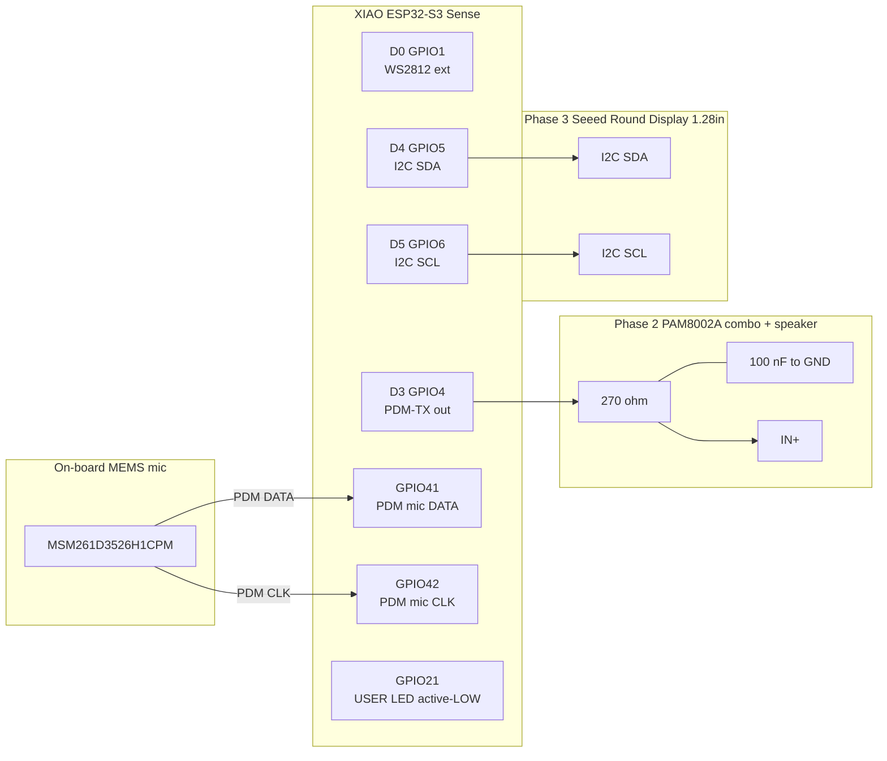
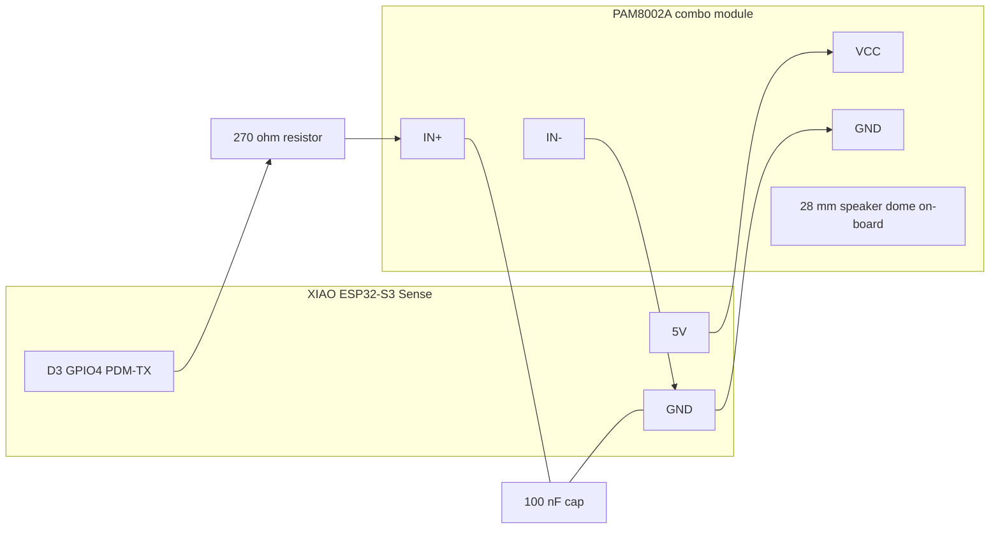
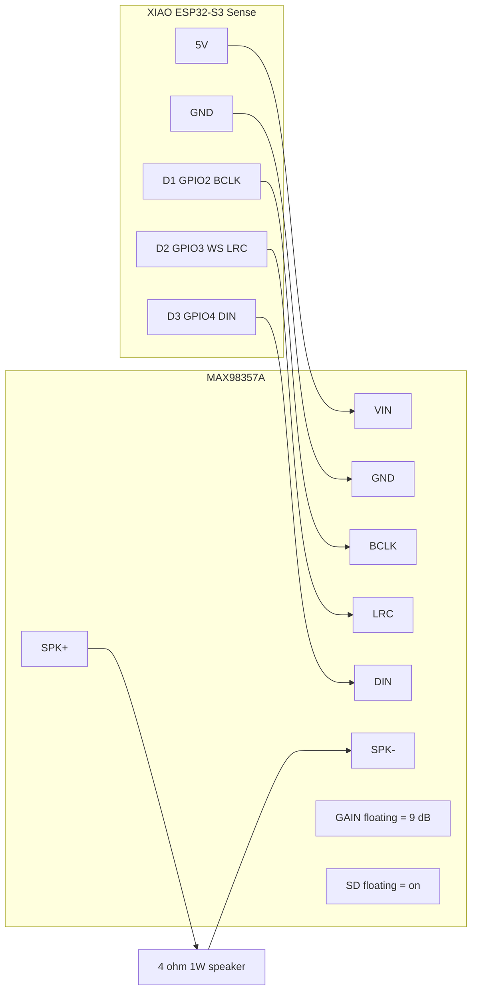

# Hardware

Pin map, schematic, BOM, and wiring diagrams for each phase.

## XIAO ESP32-S3 Sense at a glance

| Spec       | Value                                |
| ---------- | ------------------------------------ |
| MCU        | ESP32-S3R8 (dual-core 240 MHz)       |
| Flash      | 8 MB QIO @ 80 MHz                    |
| PSRAM      | 8 MB octal @ 80 MHz                  |
| Wi-Fi      | 2.4 GHz, BLE 5.0                     |
| USB        | Native USB-C (USB-Serial-JTAG)       |
| Mic        | MSM261D3526H1CPM PDM (on-board)      |
| Camera     | OV2640 2 MP (on-board, ribbon)       |
| Footprint  | 21 × 17.5 mm                         |
| Power      | 5 V via USB-C, 3.3 V LDO regulated   |

## Pin assignments (Phase 1 firmware)

| Header | GPIO | Direction | Phase | Use |
| --- | --- | --- | --- | --- |
| D0 | 1  | output | 1 | RMT WS2812 placeholder (optional) |
| D1 | 2  | reserved | — | free (was I²S BCLK in MAX98357 alt; unused under PAM8002A) |
| D2 | 3  | reserved | — | free (was I²S WS in MAX98357 alt; unused under PAM8002A) |
| **D3** | **4**  | output | **2** | **PDM-TX → 270 Ω + 100 nF → PAM8002A IN+** |
| D4 | 5  | I²C | 1/3 | I²C SDA (touchscreen + sensors) |
| D5 | 6  | I²C | 1/3 | I²C SCL |
| D6 | 43 | UART | — | UART TX (free if not used) |
| D7 | 44 | UART | — | UART RX (free if not used) |
| D8 | 7  | output | 3 | free — Phase 3 LCD CS candidate |
| D9 | 8  | output | 3 | free — Phase 3 LCD RST candidate |
| D10 | 9 | output | 3 | free — Phase 3 LCD DC candidate |
| (on-board) | **21** | output | 1 | **User LED — active LOW** (driven by `status_led.lua`) |
| (on-board) | **41** | input | 1 | **PDM mic DATA** (full-duplex on I²S0 RX) |
| (on-board) | **42** | output | 1 | **PDM mic CLK** |

## Wiring — Phase 1 (bare board)

Nothing to wire. Plug USB-C into your Mac, hit `./scripts/flash.sh`,
done. The on-board PDM mic and Wi-Fi are already on the chip.

## Wiring — Phase 2 (add the PAM8002A speaker module)

The chosen Phase-2 amp is the **PAM8002A combo board** — analog mono 3 W amp with a built-in 28 mm 4 Ω speaker (the ubiquitous ~$3 AliExpress module).

The XIAO ESP32-S3 has no DAC, so the firmware drives **I²S PDM-TX on a single GPIO** (D3 / GPIO4) and an external **RC low-pass filter** reconstructs the analog signal that the PAM8002A expects on its IN+ pin.

**Notes:**
- **Why this works:** PDM-TX out of GPIO4 is a high-frequency 1-bit pulse density signal (~1 MHz). The 270 Ω + 100 nF low-pass (cutoff ≈ 6 kHz, gentle 1st-order roll-off) smooths it back into a usable line-level analog signal. Higher-fidelity setups stack a second RC stage; for a 28 mm speaker on a desk, single-stage is plenty.
- **Power the amp from `5V`** (the USB-C rail), not `3V3`. The 3.3 V regulator can't deliver 1 W audio peaks.
- **Common ground is critical** — tie `AGND` to the XIAO `GND`.
- **No I²S BCLK or WS lines** are used — that path is only needed for digital amps like the MAX98357A. PDM-TX is single-pin.
- The board manager YAML at [`boards/seeed/xiao_esp32s3_sense/board_peripherals.yaml`](../boards/seeed/xiao_esp32s3_sense/board_peripherals.yaml) already declares `format: pdm-out` on `i2s_audio_out`, so once you wire the RC filter the firmware drives audio out on first boot.

### Alternative: MAX98357A I²S amp

If you already have a MAX98357A on hand, swap the YAML back to `format: std-out` with the original BCLK / WS / DOUT pin trio (D1 / D2 / D3) and skip the RC filter. The enclosure cavity fits both modules.

**Notes:**
- Power the amp from `5V` (the USB-C rail), not `3V3`. The 3.3 V regulator on the XIAO can't deliver 1 W audio peaks.
- Common ground is critical — tie `AGND` to the XIAO `GND`.
- `SD` (shutdown) and `GAIN` can stay floating for default behavior. Pull `SD` low to mute.
- After wiring, flip the `audio_dac` block in [`board_devices.yaml`](../boards/seeed/xiao_esp32s3_sense/board_devices.yaml) from `chip: none` to `chip: dummy` and rebuild.

## Wiring — Phase 3 (touchscreen)

A 2.8" or 3.2" SPI ILI9341 + XPT2046 resistive touch is the cheapest
path. The shared SPI bus on the XIAO has only one set of free SPI pins,
so the LCD and touch share MOSI/MISO/SCK with separate CS lines.

Pin sketch (subject to change once we crib LVGL bringup from the M5 CoreS3 board config):

| LCD pin   | XIAO pin  | Notes                          |
| --------- | --------- | ------------------------------ |
| VCC       | 3V3       |                                |
| GND       | GND       |                                |
| CS        | D8/GPIO7  | LCD chip-select                |
| RST       | D9/GPIO8  | reset                          |
| DC        | D10/GPIO9 | data/command                   |
| MOSI      | D6/GPIO43 | SPI MOSI (also UART TX)        |
| SCK       | D7/GPIO44 | SPI SCK (also UART RX)         |
| MISO      | not used  | LCD is write-only              |
| LED       | 3V3       | backlight always on for now    |
| T_CS      | TBD       | XPT2046 touch CS               |
| T_IRQ     | TBD       | optional touch IRQ             |

This phase will need a new `spi_display` peripheral entry in
`board_peripherals.yaml` and a `display_lcd` device entry — see the
`boards/m5stack/m5stack_cores3/` config for the LVGL pattern.

## BOM

| Phase | Item                         | Where           | Approx cost |
| ----- | ---------------------------- | --------------- | ----------- |
| 1     | Seeed XIAO ESP32-S3 Sense    | Seeed / Mouser  | $14         |
| 1     | USB-C cable (data + power)   | anywhere        | $5          |
| 2     | **PAM8002A combo amp + 28 mm speaker module** | AliExpress | $3 |
| 2     | 270 Ω resistor + 100 nF cap (RC LPF) | bin / Mouser | $0.10 |
| 2     | 503450 LiPo (850 mAh) — solders to BAT+ | AliExpress | $4 |
| 2     | (alternative) MAX98357A I²S amp + 4 Ω speaker | Adafruit / AliEx | $5+$2 |
| 3     | Seeed Round Display for XIAO (1.28" GC9A01 + XPT2046) | Seeed | $14 |
| 3     | 3D-printed Monolith enclosure | hardware/enclosure/ | filament |

Total Phase 1: **~$19**. Phase 2 (PAM8002A path): **+$7**. Phase 3 (touchscreen + enclosure): **+$14**.

## Power budget

Order-of-magnitude figures, USB-C 5 V input:

| State                     | Current  | Notes                                |
| ------------------------- | -------- | ------------------------------------ |
| Wi-Fi idle                | ~80 mA   | both cores idling, mic off           |
| Listening (PDM RX)        | ~110 mA  | mic + DMA active                     |
| Status LED on full        | +6 mA    | brief during boot flash + LISTENING  |
| Wi-Fi TX burst            | ~250 mA  | spike during chat upload             |
| PAM8002A @ 1 W (Phase 2)  | +180 mA  | analog amp, RC-filtered PDM input    |
| MAX98357A alt @ 1 W       | +200 mA  | digital I²S amp                      |
| Touchscreen backlight     | +60 mA   | 1.28" round AMOLED (Phase 3)         |
| LiPo charger (Phase 2)    | +200 mA  | only when charging via USB           |

A standard 5 V / 1 A USB charger covers all phases comfortably. With the
850 mAh LiPo and Wi-Fi + chat workload, expect **~5–7 h of run time**
unplugged before the LED starts SOS-ing low battery.
