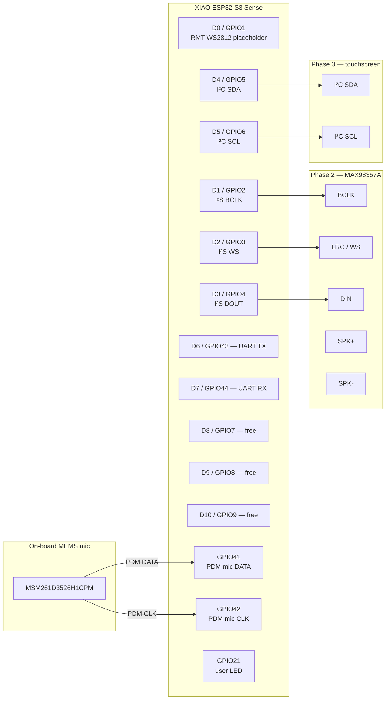
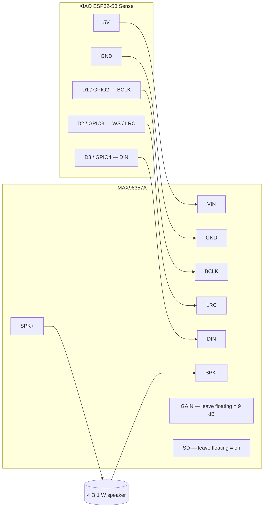

# Hardware

Pin map, schematic, BOM, and wiring diagrams for each phase.

## XIAO ESP32-S3 Sense at a glance

| Spec       | Value                                |
| ---------- | ------------------------------------ |
| MCU        | ESP32-S3R8 (dual-core 240 MHz)       |
| Flash      | 8 MB QIO @ 80 MHz                    |
| PSRAM      | 8 MB octal @ 80 MHz                  |
| Wi-Fi      | 2.4 GHz, BLE 5.0                     |
| USB        | Native USB-C (USB-Serial-JTAG)       |
| Mic        | MSM261D3526H1CPM PDM (on-board)      |
| Camera     | OV2640 2 MP (on-board, ribbon)       |
| Footprint  | 21 × 17.5 mm                         |
| Power      | 5 V via USB-C, 3.3 V LDO regulated   |

## Pin assignments (Phase 1 firmware)

## Wiring — Phase 1 (bare board)

Nothing to wire. Plug USB-C into your Mac, hit `./scripts/flash.sh`,
done. The on-board PDM mic and Wi-Fi are already on the chip.

## Wiring — Phase 2 (add a speaker)

Adafruit / generic **MAX98357A I²S 3 W amp** + 4 Ω 1–2 W speaker.

**Notes:**
- Power the amp from `5V` (the USB-C rail), not `3V3`. The 3.3 V regulator on the XIAO can't deliver 1 W audio peaks.
- Common ground is critical — tie `AGND` to the XIAO `GND`.
- `SD` (shutdown) and `GAIN` can stay floating for default behavior. Pull `SD` low to mute.
- After wiring, flip the `audio_dac` block in [`board_devices.yaml`](../boards/seeed/xiao_esp32s3_sense/board_devices.yaml) from `chip: none` to `chip: dummy` and rebuild.

## Wiring — Phase 3 (touchscreen)

A 2.8" or 3.2" SPI ILI9341 + XPT2046 resistive touch is the cheapest
path. The shared SPI bus on the XIAO has only one set of free SPI pins,
so the LCD and touch share MOSI/MISO/SCK with separate CS lines.

Pin sketch (subject to change once we crib LVGL bringup from the M5 CoreS3 board config):

| LCD pin   | XIAO pin  | Notes                          |
| --------- | --------- | ------------------------------ |
| VCC       | 3V3       |                                |
| GND       | GND       |                                |
| CS        | D8/GPIO7  | LCD chip-select                |
| RST       | D9/GPIO8  | reset                          |
| DC        | D10/GPIO9 | data/command                   |
| MOSI      | D6/GPIO43 | SPI MOSI (also UART TX)        |
| SCK       | D7/GPIO44 | SPI SCK (also UART RX)         |
| MISO      | not used  | LCD is write-only              |
| LED       | 3V3       | backlight always on for now    |
| T_CS      | TBD       | XPT2046 touch CS               |
| T_IRQ     | TBD       | optional touch IRQ             |

This phase will need a new `spi_display` peripheral entry in
`board_peripherals.yaml` and a `display_lcd` device entry — see the
`boards/m5stack/m5stack_cores3/` config for the LVGL pattern.

## BOM

| Phase | Item                         | Where           | Approx cost |
| ----- | ---------------------------- | --------------- | ----------- |
| 1     | Seeed XIAO ESP32-S3 Sense    | Seeed / Mouser  | $14         |
| 1     | USB-C cable (data + power)   | anywhere        | $5          |
| 2     | MAX98357A I²S amp            | Adafruit / AliEx | $5          |
| 2     | 4 Ω 1 W speaker (~28 mm)     | AliExpress      | $2          |
| 2     | Hookup wire / breadboard     | bin             | -           |
| 3     | 2.8" SPI ILI9341 + XPT2046   | AliExpress      | $8          |
| 3     | (optional) 3D-printed shell  | print           | filament    |

Total Phase 1: **~$19**. Total Phase 2: **+$7**. Total Phase 3: **+$8**.

## Power budget

Order-of-magnitude figures, USB-C 5 V input:

| State                     | Current  | Notes                          |
| ------------------------- | -------- | ------------------------------ |
| Wi-Fi idle                | ~80 mA   | both cores idling, mic off     |
| Listening (PDM RX)        | ~110 mA  | mic + DMA active               |
| Wi-Fi TX burst            | ~250 mA  | spike during chat upload       |
| Speaker @ 1 W (Phase 2)   | +200 mA  | through MAX98357A              |
| Touchscreen backlight     | +60 mA   | typical 2.8" panel             |

A standard 5 V / 1 A USB charger covers all phases comfortably.
