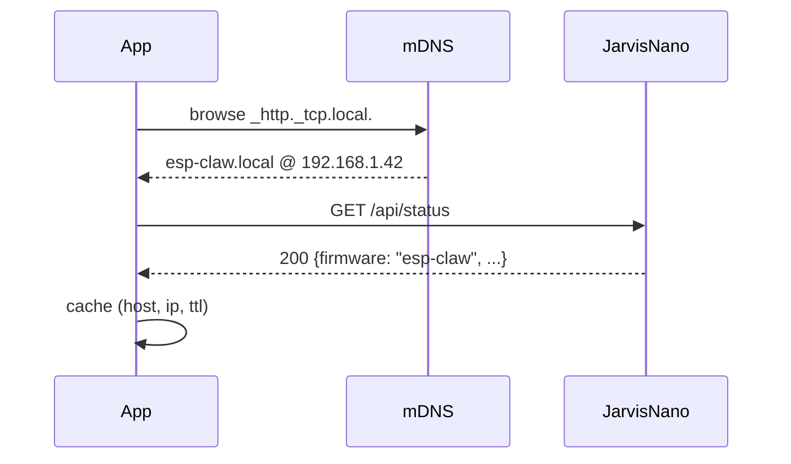
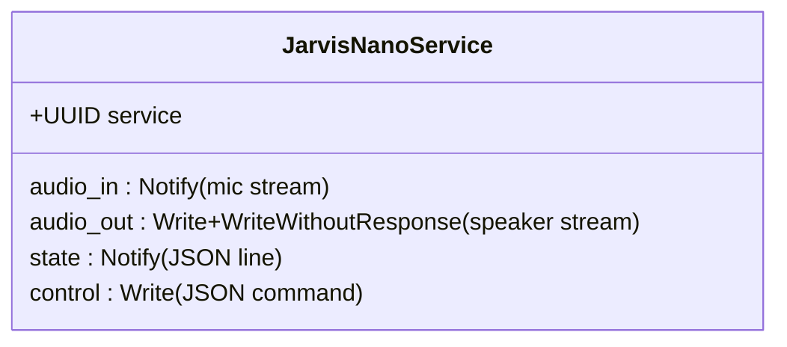
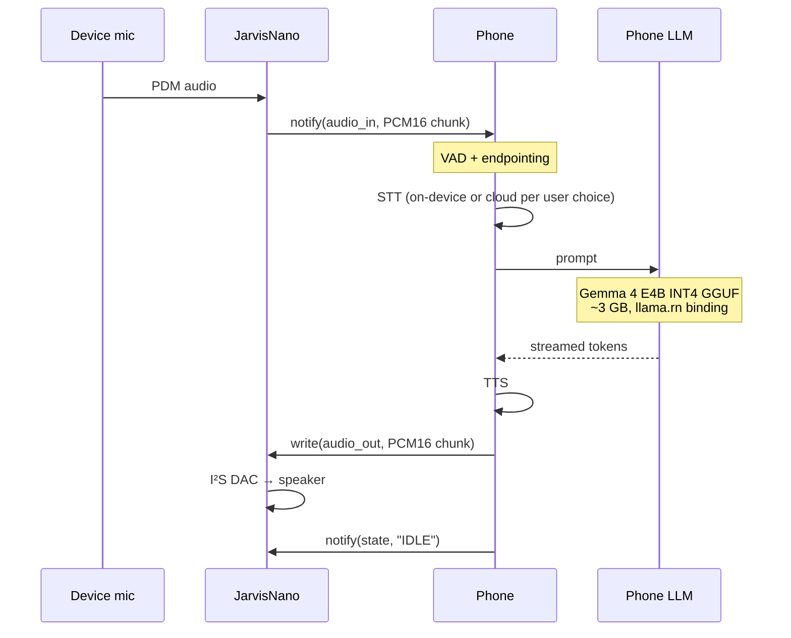
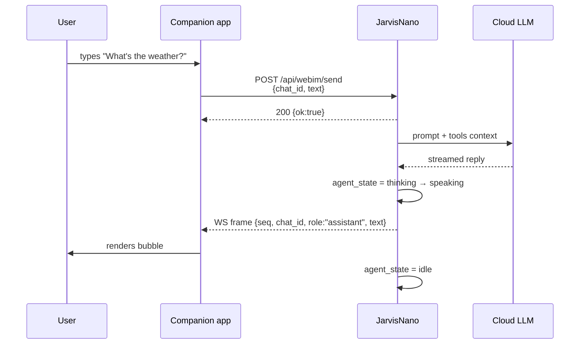

# JarvisNano Protocol

> **Status:** Draft v1 — Phase 1 (HTTP + WebSocket + MCP) is shipped firmware. Phase 2 is partially shipped: PDM-TX audio output, `/api/audio/level`, `/api/battery` not-wired stub, `/api/wifi/scan`, API preflight patch, dashboard readiness, physical GPIO21 alive heartbeat, and the canonical BLE UUIDs are in place; the BLE GATT service, ADC-backed battery readings, camera capture, TTS, and wake-word path are still planned. Phase 3 (on-device LLM) remains forward-looking.

This document is the stable contract that any client — the open-source Kotlin/Compose companion in [`/android`](../android), web dashboards, React Native apps, desktop tools, or third-party tooling — integrates against. It describes how to discover a JarvisNano device, talk to it, listen to it, and (as later phases land) hand it off to a phone for on-device inference.

The firmware running this protocol is [ESP-Claw](https://github.com/espressif/esp-claw) on a Seeed XIAO ESP32-S3 Sense. See [`docs/ARCHITECTURE.md`](ARCHITECTURE.md) for the on-device runtime story.

## Table of contents

1. [Versioning](#1-versioning)
2. [Discovery](#2-discovery)
3. [HTTP REST](#3-http-rest)
4. [WebSocket](#4-websocket)
5. [MCP](#5-mcp)
6. [BLE GATT (Phase 2)](#6-ble-gatt-phase-2)
7. [On-device LLM (Phase 3)](#7-on-device-llm-phase-3)
8. [Security & auth](#8-security--auth)
9. [Lifecycle of one user utterance](#9-lifecycle-of-one-user-utterance)

---

## 1. Versioning

Every HTTP request from a conformant client SHOULD send:

```
X-JarvisNano-Protocol: 1
```

The firmware ignores the header today, but future breaking changes will gate behavior on it. Servers that observe a higher version than they implement MUST respond with their highest supported version in `X-JarvisNano-Protocol-Server`.

Semantic version of this document: **1.0.0-draft**.

---

## 2. Discovery

JarvisNano advertises itself on the local network via mDNS / DNS-SD.

| Field             | Value                       |
| ----------------- | --------------------------- |
| Service type      | `_http._tcp.local.`         |
| Hostname          | `esp-claw.local`            |
| Default HTTP port | `80`                        |
| MCP port          | `18791`                     |
| TXT record `txt`  | `path=/api/status`          |
| TXT record `proto`| `1`                         |

A client SHOULD:

1. Browse `_http._tcp.local.` and prefer instances whose TXT record contains `proto=1`.
2. Resolve the IPv4/IPv6 address.
3. Probe `GET /api/status` with a 2-second timeout. A `200 OK` JSON body with `firmware: "esp-claw"` confirms a JarvisNano.
4. Cache the resolved address but always re-resolve on `ECONNREFUSED` — DHCP leases roll.

If mDNS is unavailable (locked-down Wi-Fi, iOS local-network permission denied), the client MUST allow a manual override: a free-form `host[:port]` entry that resolves via the OS resolver.



---

## 3. HTTP REST

All endpoints are served on port `80`. The base URL is `http://esp-claw.local`.

### 3.1 CORS

Current bootstrap builds apply [`patches/0004-http-phase2-preflight-battery.patch`](../patches/0004-http-phase2-preflight-battery.patch), which adds `OPTIONS /api/*` and returns CORS preflight headers.

Older firmware without that patch needs this workaround: for any non-`GET`, send `Content-Type: text/plain;charset=UTF-8` with a JSON-encoded string body. This is a "simple request" under the CORS spec and skips preflight entirely. The firmware ignores the `Content-Type` and parses the raw body as JSON regardless.

```http
POST /api/webim/send HTTP/1.1
Host: esp-claw.local
Content-Type: text/plain;charset=UTF-8

{"chat_id":"web-1","text":"hello"}
```

Native (non-browser) clients MAY use `application/json`. Browser clients SHOULD keep using the simple-request form until older firmware without the preflight patch is no longer supported. Current JSON responses should include `Access-Control-Allow-Origin: *`; if a new endpoint is added, verify both the `OPTIONS` response and the final response.

### 3.2 Endpoint matrix

| Method | Path                  | Body              | Returns                    | Notes                                  |
| ------ | --------------------- | ----------------- | -------------------------- | -------------------------------------- |
| OPTIONS| `/api/*`              | —                 | 204                        | CORS preflight for API clients.        |
| GET    | `/api/status`         | —                 | `StatusBody`               | Cheap; safe to poll every 5s.          |
| GET    | `/api/config`         | —                 | `ConfigBody`               | LLM provider, Wi-Fi SSID, agent name.  |
| POST   | `/api/config`         | `Partial<Config>` | `{ok: true}`               | Triggers a save; reboot for some keys. |
| GET    | `/api/capabilities`   | —                 | `CapabilityListBody`       | Static tool/capability registry.       |
| GET    | `/api/lua-modules`    | —                 | `LuaModuleListBody`        | Dynamic Lua skill index.               |
| GET    | `/api/files?path=`    | —                 | `FileListBody`             | FATFS browser. `path` is `/`-rooted.   |
| GET    | `/api/webim/status`   | —                 | `{ok: bool, bound: bool}`  | `bound=false` ⇒ WS will reject sends.  |
| POST   | `/api/webim/send`     | `WebImSendBody`   | `{ok: true}`               | See §3.4.                              |
| GET    | `/api/audio/level`    | —                 | `AudioLevelBody`           | Phase 2 mic level telemetry.           |
| GET    | `/api/battery`        | —                 | `BatteryBody`              | Stubbed as not wired until ADC lands.  |
| GET    | `/api/camera/snapshot`| —                 | JPEG bytes                 | Gated/blocked until camera driver lands. |
| GET    | `/api/wifi/scan`      | —                 | `WifiScanBody`             | Shipped by bootstrap patch; used by onboarding wizard. |
| POST   | `/api/restart`        | `{}`              | `{ok: true}` then closes   | Soft reset.                            |

### 3.3 Schemas

```ts
interface StatusBody {
  wifi_connected: boolean;
  ip?: string;
  ap_ssid?: string;
  ap_active?: boolean;
  wifi_mode?: string;
  storage_base_path?: string;
}

interface ConfigBody {
  agent_name: string;
  llm_backend_type: string;
  llm_profile: string;
  llm_model: string;
  llm_base_url?: string;
  llm_auth_type?: "bearer" | "api_key" | "none" | string;
  llm_timeout_ms?: number;
  llm_max_tokens?: number;
  wifi_ssid: string;          // never returns the password
  [key: string]: unknown;
}

interface CapabilityListBody {
  items: { group_id: string; display_name: string; default_llm_visible?: boolean }[];
}

interface LuaModuleListBody {
  items: { module_id: string; display_name: string }[];
}

interface AudioLevelBody {
  rms_db: number;
  peak_db: number;
  ts: number;
}

interface BatteryBody {
  wired: boolean;
  mV: number;
  pct: number;
  state: "not_wired" | "discharging" | "charging" | "full" | string;
  source?: "stub" | "adc" | string;
}

interface WifiScanBody {
  aps: { ssid: string; rssi: number; channel?: number; auth?: string }[];
}

interface WebImSendBody {
  chat_id: string;            // any client-stable identifier; the firmware
                              // uses it to scope WS broadcasts.
  text?: string;              // empty ⇒ files-only message
  files?: string[];           // FATFS paths under /inbox/webim/<...>
}
```

### 3.4 Example: send a chat

```bash
curl -X POST http://esp-claw.local/api/webim/send \
  -H 'Content-Type: text/plain;charset=UTF-8' \
  -H 'X-JarvisNano-Protocol: 1' \
  -d '{"chat_id":"phone-1","text":"What time is it?"}'
```

```json
{ "ok": true }
```

The reply arrives asynchronously over the `/ws/webim` WebSocket (§4).

### 3.5 Status codes

| Code  | Meaning                                                    |
| ----- | ---------------------------------------------------------- |
| `200` | OK.                                                        |
| `400` | Malformed JSON or missing required field (e.g. `chat_id`). |
| `404` | Unknown endpoint.                                          |
| `500` | IM gateway not bound, OOM, FATFS write failure.            |

---

## 4. WebSocket

```
ws://esp-claw.local/ws/webim
```

The device broadcasts every assistant-emitted message to every connected client. There is no per-client subscription — clients filter on `chat_id` themselves.

### 4.1 Frame format

Server-pushed text frames carry a single JSON object:

```ts
interface WebImFrame {
  seq: number;        // monotonically increasing per device boot
  chat_id: string;    // matches the chat_id the client posted to /api/webim/send
  role: "assistant";  // currently the only role broadcast
  text: string;
  ts_ms: number;      // device uptime in ms
  links?: { url: string; label: string }[];
}
```

Example:

```json
{ "seq": 17, "chat_id": "phone-1", "role": "assistant",
  "text": "It's 2:14 PM.", "ts_ms": 184223 }
```

### 4.2 Ping / pong

The firmware honors RFC 6455 ping/pong. A 30-second client-side ping is recommended; the firmware sends pongs unsolicited if it sees a control frame. If no traffic flows for 60 s the firmware does NOT close the socket — the client should treat the socket as live until TCP RST.

### 4.3 Reconnect

Clients SHOULD reconnect with capped exponential backoff (1, 2, 4, 8, max 30 s). On reconnect, replay any in-flight messages older than the highest `seq` they observed if needed; the firmware does not buffer.

---

## 5. MCP

JarvisNano runs an MCP (Model Context Protocol) server exposed at:

```
http://esp-claw.local:18791/mcp_server
```

JSON-RPC 2.0 over HTTP POST. Three tools are exposed in Phase 1:

| Method                | Args                                | Returns                          |
| --------------------- | ----------------------------------- | -------------------------------- |
| `device.describe`     | `{}`                                | Same as `GET /api/status`.       |
| `router.emit_event`   | `{topic: string, payload: object}`  | `{ok: bool}`                     |
| `device.report_state` | `{state: string, detail?: object}`  | `{ok: bool}`                     |

`router.emit_event` is the cross-device hook: a phone, another ESP32, or a desktop agent can post structured events that the on-device Lua skills subscribe to.

```bash
curl -X POST http://esp-claw.local:18791/mcp_server \
  -H 'Content-Type: application/json' \
  -d '{"jsonrpc":"2.0","id":1,"method":"device.describe","params":{}}'
```

---

## 6. BLE GATT (Phase 2)

Phase 2 adds BLE so the device can be paired with a phone for **Privacy Mode** — audio never crosses Wi-Fi, the phone runs the LLM, and the device is just I/O.

### 6.1 UUID derivation

All UUIDs are derived from a single 128-bit namespace using **UUIDv5** (SHA-1, RFC 4122 §4.3). This makes the UUIDs reproducible by any client and the values below are **canonical**.

```
namespace = 6e617676-2d6a-7276-732d-6e616e6f0000   ; "navv-jrvs-nano"

service     = uuidv5(namespace, "jarvisnano.service")     = 1ec185cd-4bc7-5797-a8b1-0f5b66c59757
audio_in    = uuidv5(namespace, "jarvisnano.audio_in")    = ca04b99f-5e74-5a35-8f4f-d1313f19b29b
audio_out   = uuidv5(namespace, "jarvisnano.audio_out")   = 872228b7-ccd8-55dd-b12b-5d0352903617
state       = uuidv5(namespace, "jarvisnano.state")       = dab5c3d4-915d-5f25-acc9-9d511df742bf
control     = uuidv5(namespace, "jarvisnano.control")     = 2e14c0f2-4b07-5802-a8f9-369752d7cf2a
```

Reproducibility check (Python):

```python
import uuid
ns = uuid.UUID("6e617676-2d6a-7276-732d-6e616e6f0000")
assert str(uuid.uuid5(ns, "jarvisnano.service")) == "1ec185cd-4bc7-5797-a8b1-0f5b66c59757"
```

These UUIDs are the contract. The Phase-2 GATT service is not shipped yet; when implemented, firmware will advertise the `service` UUID and expose the four characteristics under it.

### 6.2 Service shape



### 6.3 Characteristics

| Char        | Properties              | Payload                                                            |
| ----------- | ----------------------- | ------------------------------------------------------------------ |
| `audio_in`  | `notify`                | PCM16, mono, 16 kHz, little-endian. Up to 240 samples per packet (480 B), one packet per 15 ms. The phone subscribes; the device pushes mic frames live. |
| `audio_out` | `write` + `write_no_rsp`| PCM16, mono, 16 kHz, little-endian. The phone writes synthesized speech (TTS output or a pre-recorded clip) for the device to play through the I²S amp. |
| `state`     | `notify`                | UTF-8 JSON line: `{"state": "IDLE\|LISTENING\|THINKING\|SPEAKING\|ERROR", "ts_ms": 12345, "detail": "...?"}` — one line per state change. |
| `control`   | `write`                 | UTF-8 JSON command. See §6.4.                                      |

MTU: clients SHOULD request 247 (BLE 4.2 LE Data Length Extension). The firmware implementation should negotiate down on older centrals.

### 6.4 Control commands

```json
{ "cmd": "set_volume", "v": 0.7 }
{ "cmd": "wake" }
{ "cmd": "sleep" }
{ "cmd": "set_voice", "id": "nova" }
{ "cmd": "begin_session", "session_id": "uuid", "mode": "cloud" | "privacy" }
{ "cmd": "end_session", "session_id": "uuid" }
```

Unknown commands are silently dropped (logged on the device).

### 6.5 Pairing

Just-Works pairing for Phase 2 — encrypted but unauthenticated. Phase 3 introduces passkey display via the Round Display.

---

## 7. On-device LLM (Phase 3)

When a paired phone has Privacy Mode enabled, the device hands inference off to the phone:



Reference model: **Gemma 4 E4B INT4 GGUF** (`google/gemma-4-e4b-it-q4_0.gguf`, ~3.0 GB). The phone-side runtime is `llama.cpp` via the React Native binding `llama.rn`. Models are downloaded on first activation and stored in app-private storage; there is no model push from device to phone.

The protocol does not specify the LLM — any GGUF model the phone can load is acceptable. Gemma 4 E4B is the reference because it fits in 4 GB phones and is multilingual.

---

## 8. Security & auth

**Phase 1 has no authentication.** The device trusts every client on its local network.

This is a known limitation. Phase 3 introduces:

- A device-issued bearer token displayed once on the Round Display during pairing.
- `Authorization: Bearer <token>` required on all `/api/*` writes and on `/ws/webim`.
- BLE-only commands gated behind successful Just-Works pairing.

Until then, deploy JarvisNano on a trusted Wi-Fi only. Do not expose port 80 or 18791 to the public internet.

---

## 9. Lifecycle of one user utterance



The same lifecycle in Privacy Mode replaces the LLM call with a BLE `audio_in` stream → phone-side STT + Gemma → BLE `audio_out`.

---

## Appendix A — minimal client (TypeScript)

```ts
async function send(host: string, chatId: string, text: string) {
  const res = await fetch(`http://${host}/api/webim/send`, {
    method: "POST",
    headers: {
      // Legacy browser compatibility — see §3.1
      "Content-Type": "text/plain;charset=UTF-8",
      "X-JarvisNano-Protocol": "1",
    },
    body: JSON.stringify({ chat_id: chatId, text }),
  });
  if (!res.ok) throw new Error(`webim send: ${res.status}`);
}

function listen(host: string, onFrame: (f: WebImFrame) => void) {
  const ws = new WebSocket(`ws://${host}/ws/webim`);
  ws.onmessage = (ev) => onFrame(JSON.parse(ev.data));
  return () => ws.close();
}
```

## Appendix B — change log

- **1.0.0-draft** (2026-05) — Initial draft. Phase 1 endpoints frozen; Phase 2 BLE shape defined; Phase 3 on-device LLM described.
