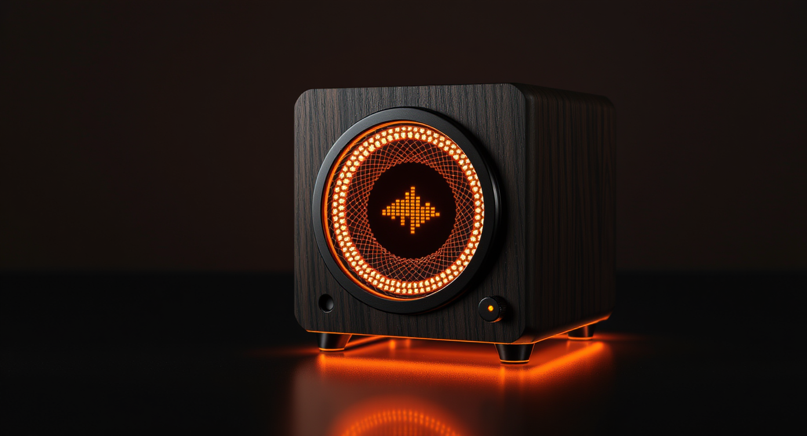

# Roadmap

  

## Phase 1 — Bare board chat + listen ✅ (shipped)

### Firmware
- [x] Custom board adaptation `boards/seeed/xiao_esp32s3_sense/`
- [x] On-board MEMS PDM mic captured at 16 kHz mono PCM (I²S0 RX channel)
- [x] PDM-TX speaker output on a single GPIO (I²S0 TX channel) for the **PAM8002A** analog amp via 270 Ω + 100 nF RC low-pass
- [x] I²C bus reserved for Phase 3 touchscreen (GPIO5 / GPIO6)
- [x] **Status LED skill** — `firmware/lua/status_led.lua` drives the on-board GPIO21 user LED with binary heartbeat patterns (boot flash, idle wink every 2 s, listening, thinking, speaking, SOS)
- [x] CORS `Access-Control-Allow-Origin: *` baked into HTTP responses
- [x] **MiniMax-M2.7** verified end-to-end via OpenAI-compatible custom endpoint
- [x] Wi-Fi provisioning AP fallback (`esp-claw-XXXXXX`)
- [x] Telegram + Web IM gateways
- [x] mDNS at `esp-claw.local`
- [x] MCP server live on `:18791`
- [x] Patched upstream `esp_board_manager` codegen bug — PR open at [espressif/esp-gmf#45](https://github.com/espressif/esp-gmf/pull/45)

### Browser admin
- [x] Single-file vanilla-JS [`dashboard/index.html`](../dashboard/index.html) — three tabs (Cockpit · Flash · Settings)
- [x] Live telemetry tiles + chat with `<think>` parsing + capability index + FATFS browser + live event stream
- [x] **ESP Web Tools** flasher — WebSerial install of merged 7.6 MB firmware bundle, no esptool install
- [x] Settings tab edits any `/api/config` field with diff-only saves + eye-toggle for sensitive values
- [x] Onboarding wizard at [`dashboard/onboard.html`](../dashboard/onboard.html) — 5 steps with 6 LLM presets aligned to firmware schema
- [x] Demo mode (`?demo=1`) that masks SSIDs / IPs / API key for portfolio screenshots
- [x] Battery / Bluetooth / mic-level / camera-snapshot tiles ready for Phase 2/3 endpoints

### Companion apps
- [x] **`android/`** — Kotlin + Jetpack Compose reference companion (Cockpit / Chat / Settings / About). 39 files, mDNS discovery, BLE GATT skeleton, Gemma 4 E4B local-LLM interface stub.
- [x] **ZeroChat × JarvisNano integration PR** — purely additive React Native module + screen + nav toggle in `Ingenious-Digital-LLC/zerochat`. Settings-gated, doesn't disturb existing flows.

### Hardware
- [x] Four parametric OpenSCAD enclosures (`Monolith` / `Cube` / `Egg` / `Radio`) in [`hardware/enclosure/`](../hardware/enclosure/)
- [x] Each ships `enclosure.scad` + mermaid `PLAN.md` + dimensioned `technical-drawing.svg`
- [x] Top-level `COMPARISON.md` picks the Monolith (78 × 68 × 66 mm, 4× M2 brass-insert, ~4.5 h FDM print)
- [x] `assembly-flow.md` documents the build sequence + Phase-3 swap

### Public protocol contract
- [x] [`docs/PROTOCOL.md`](PROTOCOL.md) — HTTP REST + WebSocket + MCP + Phase-2 BLE GATT + Phase-3 on-device Gemma 4 handoff
- [x] BLE service + 4 characteristic UUIDs frozen as `uuidv5`-derived canonicals from a single namespace UUID — clients can't drift

## Phase 2 — Voice replies + battery + BLE bridge

- [ ] Wire **PAM8002A combo module** (50 × 30 × 18 mm, built-in 28 mm 4 Ω dome) per [`docs/HARDWARE.md`](HARDWARE.md): GPIO4 → 270 Ω → 100 nF → PAM8002A IN+, common ground, VCC = USB 5 V rail
- [ ] Confirm clean audio off the RC-filtered PDM-TX
- [ ] Add **TTS** in firmware — call MiniMax-M2.7 / Bailian / OpenAI / ElevenLabs from Lua, stream PCM to I²S0 TX
- [ ] Add **wake-word** path (esp-sr porcupine or on-device VAD)
- [ ] Wire **503450 LiPo** to BAT+ pad — XIAO Sense has on-board USB-C charger; battery cavity in the Monolith is sized
- [ ] Implement firmware HTTP endpoints the dashboard already calls:
  - [ ] `GET /api/battery` → `{mV, pct, state}`
  - [ ] `GET /api/audio/level` → `{rms_db, peak_db, ts}`
  - [ ] `GET /api/camera/snapshot` → JPEG bytes (enables OV2640 in `board_devices.yaml`)
  - [ ] `GET /api/wifi/scan` → list of nearby APs (used by onboarding wizard step 2)
  - [ ] `OPTIONS *` → 204 with CORS headers (drops the `text/plain` workaround)
- [ ] Implement **BLE GATT service** matching the canonical UUIDs in [`PROTOCOL.md`](PROTOCOL.md) — characteristics: `audio_in` (notify, PCM16 mono 16 kHz), `audio_out` (write), `state` (notify, JSON), `control` (write, JSON cmds)
- [ ] Latency target: end of utterance → first audio frame back ≤ 800 ms in cloud mode

## Phase 3 — Touchscreen + Privacy Mode

- [ ] Add 1.28" Seeed Round Display for XIAO (GC9A01 + XPT2046, 39 mm OD)
- [ ] New `spi_display` peripheral entry + `display_lcd` device entry
- [ ] Crib LVGL bringup pattern from `boards/m5stack/m5stack_cores3/`
- [ ] Build a chat-bubble UI matching the dashboard
- [ ] Animated emote face via `espressif2022/esp_emote_expression` (already pulled in build)
- [ ] **Privacy Mode** — phone runs **Gemma 4 E4B** ([model card](https://ai.google.dev/gemma/docs/core)) on-device via llama.cpp Android port + `unsloth/gemma-4-E4B-it-GGUF Q4_K_M` (~3 GB INT4). Native multimodal — audio in, no separate Whisper STT. Hand-off contract documented in [`PROTOCOL.md`](PROTOCOL.md).

## Phase 4 — Vision + identity + community

- [ ] Enable on-board OV2640 DVP camera in `board_devices.yaml`
- [ ] Add `camera` device entry + DVP peripheral
- [ ] Expose vision tools (describe scene, OCR, find object) as MCP tools
- [ ] Release the 3D-printable enclosure as a community remix-friendly drop
- [ ] Optional: 1414 chip on the same enclosure for sub-GHz mesh / LoRa relay

## Phase 5 — Personality + integrations

- [ ] Custom Lua skills for Mac control via MCP (open / type / clipboard / window)
- [ ] FlowTrack / personal CRM hooks
- [ ] Daily briefing on first interaction of the morning
- [ ] Calendar + email summarization through MCP
- [ ] Multi-device mesh — esp-claw nodes already discover each other via MCP; build a routing layer

## Open questions

- BLE audio (LE Audio / A2DP source) for cordless speaker pairing? S3 supports BLE but not classic A2DP — would need an external module.
- Multi-language wake words?
- A "guest mode" that disables long-term memory for shared spaces?
- Whether the open-source Android app should bundle a llama.cpp build (~30 MB) or download on first use.
