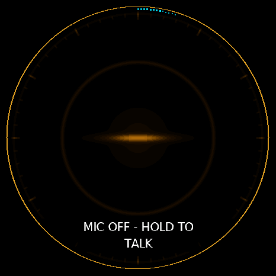
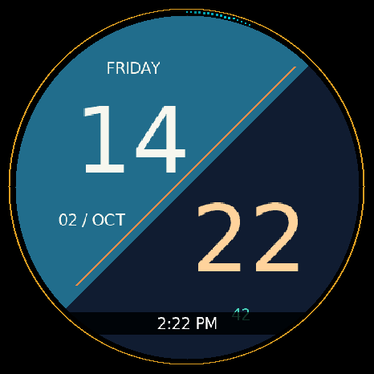

# Current live display evidence — 2026-10-02

These are actual 466×466 display pixels obtained from a running Nano over
paired LAN HTTP, using the existing `scripts/jarvisctl.py` client and the
documented `/api/display/snapshot.ppm` and `/api/display/snapshot.json` routes.
They are a **panel-submission mirror**, not panel readback or camera footage.
The metadata reported `valid=true`, `mirror_fresh=true`, and `test_pattern=off`.

The current display shows a gold slit and privacy rim on the resting face.
The watch peek shows a split teal/navy digital face with day, date, time,
seconds, and the gold privacy rim. Its clock is the device's displayed local
time; the manifests record capture times in UTC.

## Sampled sequences

- [Privacy-muted sequence](JarvisNano_privacy_sampled_20261002.mp4): eight
  captures, seven distinct pixel buffers.
- [Watch peek sequence](JarvisNano_watch_sampled_20261002.mp4): eight captures,
  eight distinct pixel buffers. A documented synthetic horizontal swipe opened
  the transient watch peek; it expired back to the resting face, and a double
  tap returned home. This proves input routing, not physical touch sensing.

Each MP4 holds the captured images for the observed interval between completed
requests. There is no motion interpolation, invented transition, or added audio.
HTTP sampling misses intermediate frames, so these are not full-rate screen
recordings and do not measure display frame rate. The final image holds for
0.4 seconds. Original PPMs, lossless PNG conversions, source metadata, request
timestamps, and SHA-256 hashes are retained beside the clips.

Both sequences started and ended with `phase=Idle`, `privacy_paused=true`,
`capturing=false`, and `ws_connected=false`. No microphone activation, voice
request, firmware flash, reset, settings change, or access change was performed.

## Version and physical acceptance limits

The public source baseline checked for this update was
`63c30a82821751c6098e198db64e2ecefa6d6598`. The clean local source tree matched
that tree. A separate worktree contained uncommitted development changes and
was left untouched. The capture routes did not establish an immutable firmware
revision for the running device, so these images do not prove that the running
binary equals that public commit or the unfinished worktree.

Windows enumerated only Bluetooth COM3/COM4 during this session; an Espressif
USB serial connection was not verified. LAN capture succeeded independently.
No physical panel photography, audible playback, or new hardware acceptance
claim is made by these artifacts. No host address, pairing credential, or
private task content is included in this evidence.
