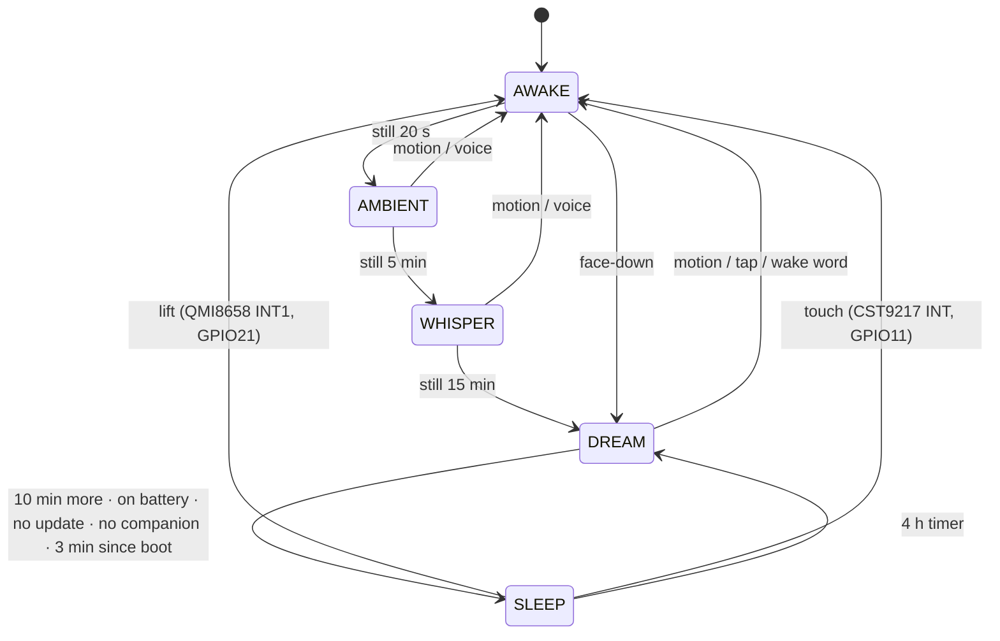

# Power modes on the 1.75C — what the chip offers, what the firmware uses

**Date:** 2026-09-01. **Status:** current; supersedes the "CPU frequency, light
sleep, and PMIC rails remain blocked" line that `docs/HARDWARE.md` carried
until this date.

## What

The ESP32-S3 has four power modes. This page records which ones JarvisNano
drives, how, and what was measured on the way, so the next person does not
rediscover the two gotchas at the bottom.

| Mode | Used | How |
|---|---|---|
| Active | yes | CPU pinned at 240 MHz (`CONFIG_ESP_DEFAULT_CPU_FREQ_MHZ_240`); no `CONFIG_PM_ENABLE`, no `esp_pm` |
| Modem-sleep | yes | `jr_net_set_power_save()` toggles `WIFI_PS_MIN_MODEM` from the mood ladder: realtime while voice is armed, an update is in flight, or a companion holds the device; saving otherwise (`main/main.c`, the mood tick) |
| Light-sleep | no | Automatic light sleep cannot engage: the I²S capture that keeps WakeNet listening holds the APB clock lock the whole time the device is awake. DFS on its own is unmeasurable here — the AXP2101 exposes no current reading (`jr_power_t` has voltage and percent only) |
| Deep-sleep | yes | `enter_deep_sleep()` in `main/main.c`, ten minutes into DREAM on battery |

STATUS reports the modem state on its `RADIO` row (`SAVING` / `REALTIME`) and
the die temperature on `CHIP` (the S3's own thermometer, `esp_driver_tsens`;
43 °C at rest on the cell, `RUNNING HOT` headline from 70 °C).

## How the deep sleep works

- **The rule is pure.** `jr_mood_sleep_due()` (`components/jr_core`) is true
  once the ladder has sat in DREAM for `JR_MOOD_SLEEP_MS` (10 min). The
  composition root adds the world: never on USB (USB holds the ladder AWAKE
  anyway), never while `s_ota_active`, never under an operator lease, never in
  the first `SLEEP_MIN_UPTIME_MS` (3 min) after any boot.
- **The hand-off, in order:** caption `SLEEPING - LIFT TO WAKE`; the IMU
  sampler stops; `jr_imu_arm_wake_on_motion(100)` programs the QMI8658
  Wake-on-Motion engine onto INT1 (recipe in
  [imu-interrupt-routing.md](./imu-interrupt-routing.md)); the render task
  takes the CO5300 through DISPOFF and SLPIN (`jr_display_panel_off_request`,
  applied inside `panel_flush` because that is the only place a panel command
  may be issued); then the wake sources.
- **Wake sources, each armed only if its line is quiet at that moment**, so a
  wrong polarity costs a wake source and never a boot loop: ext0 on GPIO21
  level high (IMU), ext1 on GPIO11 any-low (touch, with the RTC pull-up kept
  on through `ESP_PD_DOMAIN_RTC_PERIPH`), and a timer, always. Both GPIOs are
  RTC-capable (0–21 on the S3). The AXP2101 PWR key cannot wake the S3 from
  deep sleep on this board.
- **RTC memory carries the way back:** whether the mic was live
  (`s_rtc_was_listening`), how many sleeps, and which sources were armed. A
  lifted device boots straight to `LISTENING`; a timer wake resumes the ladder
  at DREAM so the glass stays dark and the chip sleeps again in ten minutes
  unless something happens; a device that was muted stays muted.
- **From a desk:** `GET /api/debug/sleep` → `{"wake":"lift|touch|timer|power",
  "sleeps":n,"armed":{"lift":..,"touch":..},"lift_fail":"none|arm|high"}`.
  `POST /api/debug/sleep?now=1&wake_s=45` forces a sleep with a 45-second
  timer. A wake before the timer means a line was already at its wake level;
  a timer wake means both were quiet.

## Findings

| Date | Finding | Evidence |
|---|---|---|
| 2026-09-01 | Forced sleep at 80 s uptime with a 45 s timer: HTTP gone in 10 s, back in 51 s, `wake: timer`, `armed: lift true, touch true`, IMU sampler live after the wake with fresh samples | PLAN.md N10.4 |
| 2026-09-01 | **A deep sleep during OTA probation rolls the image back.** Deep sleep is a reboot through the bootloader; an image still `PENDING_VERIFY` is treated as a failed boot. The first forced test woke on the previous firmware. Now `enter_deep_sleep()` refuses while the running image is in probation and the debug route answers `409` | `main/main.c` `image_in_probation()` |
| 2026-09-01 | **The QMI8658 on this board never sets `STATUSINT.CmdDone`** for any CTRL9 command, with either `CTRL8` handshake type, over 100 ms of polling. The command still lands (the wake line and the readback agree), so the handshake is logged and not fatal; the engine is cleared at boot with a soft reset (`0x60 = 0xB0`) instead of a command. Revision register reads `0x7C` | `components/jr_imu/src/jr_imu.c` `imu_ctrl9()` |
| 2026-09-01 | Die temperature 43 °C at rest on the cell with Wi-Fi up; the owner's "it is hot" was the enclosure over charging + AMOLED + a 240 MHz core that never scales | STATUS `CHIP` row |

## Open questions

- The lift wake has been proven armed and quiet, not proven by a hand: a
  device off USB, face-down ten minutes, then lifted. Expect `wake: lift`.
  If it reads `timer`, lower `SLEEP_WOM_MG`.
- Real current in each mode is unknown; the PMIC cannot report it. A
  percent-over-time reading across a night on the cell is the practical proxy
  (PLAN.md N10.3 acceptance).
- DFS (`CONFIG_PM_ENABLE` with 80 MHz minimum) would only pay while the CPU is
  genuinely idle, which WakeNet and the render loop rarely allow. Measure before
  enabling; a reconfigure once cost 16 KB of internal RAM and broke voice.

## Sources

- `main/main.c` — `enter_deep_sleep()`, the mood tick's sleep decision,
  `debug_sleep_handler`, boot wake handling in `app_main`.
- `components/jr_core/include/jr_core/mood.h` — the ladder and
  `JR_MOOD_SLEEP_MS`; `host/test_mood.c` pins the rule both ways.
- `components/jr_imu/src/jr_imu.c` — `jr_imu_arm_wake_on_motion()`.
- `components/jr_net/src/jr_net.c` — `jr_net_set_power_save()`,
  `jr_net_power_save_active()`.
- ESP-IDF 5.5.4 `esp_sleep.h` — `esp_sleep_enable_ext0_wakeup`,
  `esp_sleep_enable_ext1_wakeup_io` (`ESP_EXT1_WAKEUP_ANY_LOW` on the S3).

## See also

[imu-interrupt-routing.md](./imu-interrupt-routing.md) · [board-175c.md](./board-175c.md) · `docs/GLASS_DESIGN.md` §F4
