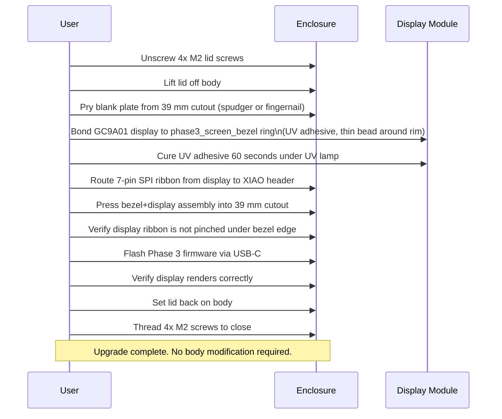

# Assembly Flow — Concept 1: Monolith (Primary Recommendation)

## Tools Required

| Tool | Purpose |
|------|---------|
| Soldering iron with flat tip | Heat-set M2 brass inserts |
| 1.5 mm hex key (Allen wrench) | M2 cap-head screws |
| Flush cutters | Trim wire leads |
| Tweezers | Component placement in cavity |
| Double-sided foam tape 1 mm | XIAO and module retention |
| Multimeter | Polarity verification before sealing |

## Assembly Sequence Flowchart

```mermaid
flowchart TD
    A([Start]) --> B[Print body in matte charcoal PETG/ASA\nOrientation: floor down\nSettings: 4 perimeters, 20% gyroid infill\nEst. print time: 4.5 h]
    B --> C[Print lid flat\nEst. time: 30 min]
    B --> D[Print blank front plate face-down\nEst. time: 15 min]
    C & D --> E[Post-processing\nRemove any stringing\nLight sand front face to 400 grit if desired]
    E --> F{Heat-set inserts}
    F --> G[Press 4x M2 brass inserts into boss pillars\nIron at 220 C, press slowly until flush\nCool 60 seconds each]
    G --> H[Battery installation]
    H --> I[Lay LiPo battery flat on floor between retention ribs\nRoute leads through cable channel toward XIAO position]
    I --> J[Verify battery polarity with multimeter\nBAT+ pad = positive, GND = negative on XIAO underside]
    J --> K{Polarity correct?}
    K -- No --> L([STOP: swap leads before proceeding])
    K -- Yes --> M[Amp and speaker installation]
    M --> N[Slide PAM8002A amp+speaker module into mid-right cavity\nSpeaker dome faces right side wall toward grille holes\nRoute audio wires toward XIAO position]
    N --> O[XIAO installation]
    O --> P[Apply 1 mm foam tape to XIAO underside\nDrop XIAO onto standoffs, align USB-C with front wall slot\nVerify mic port aligns with 1.8 mm acoustic hole in front wall]
    P --> Q[Wire connections]
    Q --> R[Solder battery leads to XIAO BAT+/GND\nConnect audio output to amp input\nConnect amp power from XIAO 3.3V/GND]
    R --> S[Dress wires\nPress wires flat against floor and walls\nEnsure no wire crosses the lid seating surface]
    S --> T[Blank plate installation]
    T --> U[Align blank plate to 39 mm front cutout\nPress until snap-fit clicks into groove\nVerify plate is flush with front face]
    U --> V[Power test]
    V --> W[Connect USB-C to XIAO\nVerify device enumerates on host\nVerify audio output\nVerify mic input]
    W --> X{All systems nominal?}
    X -- No --> Y[Debug with lid off\nRefer to XIAO ESP32-S3 datasheet\nCheck solder joints]
    X -- Yes --> Z[Lid installation]
    Z --> AA[Set lid on body\nAlign lid lip with body opening\nThread 4x M2 x 6 mm cap-head screws finger-tight]
    AA --> AB[Tighten screws with 1.5 mm hex key\nQuarter-turn each, alternating corners\nDo not overtighten — 0.2 Nm max]
    AB --> AC([Complete. Total time: approx 20 minutes])
```

## Assembly Sequence — Written

1. Print body (floor down, matte charcoal PETG or ASA, 4 perimeters, 20% gyroid infill). Estimated 4.5 hours at 0.2 mm layer.
2. Print lid (flat on bed). Estimated 30 minutes.
3. Print blank front plate (face down on smooth PEI sheet for best surface finish). Estimated 15 minutes.
4. Post-process: remove any stringing with flush cutters or brief heat gun pass. Optional: sand front face of body with 400 grit for a matte finish that reduces layer-line visibility.
5. Heat-set inserts: with soldering iron at 220 C and a flat tip, press each M2 brass insert into its boss pillar. Press slowly with light downward pressure. The insert should pull itself in as the plastic melts — do not force. Stop when the insert top is flush with the pillar face. Let each insert cool for 60 seconds before moving on.
6. Battery: lay the LiPo flat on the body floor between the two retention ribs. Route the positive and negative leads upward through the cable channel on the right side of the cavity. Use a multimeter to verify polarity before soldering — incorrect polarity will damage the XIAO instantly.
7. Amp+speaker: slide the PAM8002A module into the mid-right pocket with the speaker dome facing the right side wall (which has the 2 mm grille holes). The module should sit flush on the ribs. Route the audio signal wires toward the XIAO mounting area.
8. XIAO: apply a strip of 1 mm double-sided foam tape to the XIAO underside. Lower the XIAO onto the standoffs, pressing until the tape bonds. Align the USB-C port to the front wall slot and verify the PDM mic pad is directly behind the 1.8 mm acoustic hole.
9. Wire connections: solder battery leads (BAT+/GND), audio signal (GPIO output to amp IN), and amp power (3.3V / GND). Keep solder joints compact — space is limited above the battery.
10. Dress wires flat against the floor and walls. No wire should be raised above the lid seating plane (top rim of the body).
11. Blank plate: align the plate's snap ring to the 39 mm circular cutout on the front face. Press firmly until the snap groove clicks into place. Check that the plate sits flush.
12. Power test with lid off: connect USB-C, verify enumeration, audio, and mic before sealing.
13. Lid: place lid on body, drop the alignment lip into the body opening, thread 4x M2 x 6 mm cap-head screws with a 1.5 mm hex key. Tighten in an alternating-corner pattern. Do not overtighten — finger-tight plus a quarter-turn is sufficient.

## Phase 3 Screen Upgrade Procedure

## Time Estimates

| Phase | Activity | Time |
|-------|----------|------|
| Print | Body + lid + blank plate | 5 h 15 min |
| Post-process | Cleanup + optional sanding | 10 min |
| Heat-set | 4 inserts | 10 min |
| Electronics | Battery + amp + XIAO + wiring | 20 min |
| Mechanical | Plate + lid + screws | 5 min |
| Test | Power-on verification | 5 min |
| **Total** | | **~6 h (mostly unattended print time)** |
| Phase 3 upgrade | Screen swap only | 15 min |
